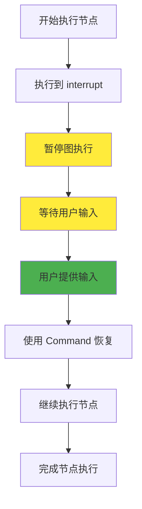
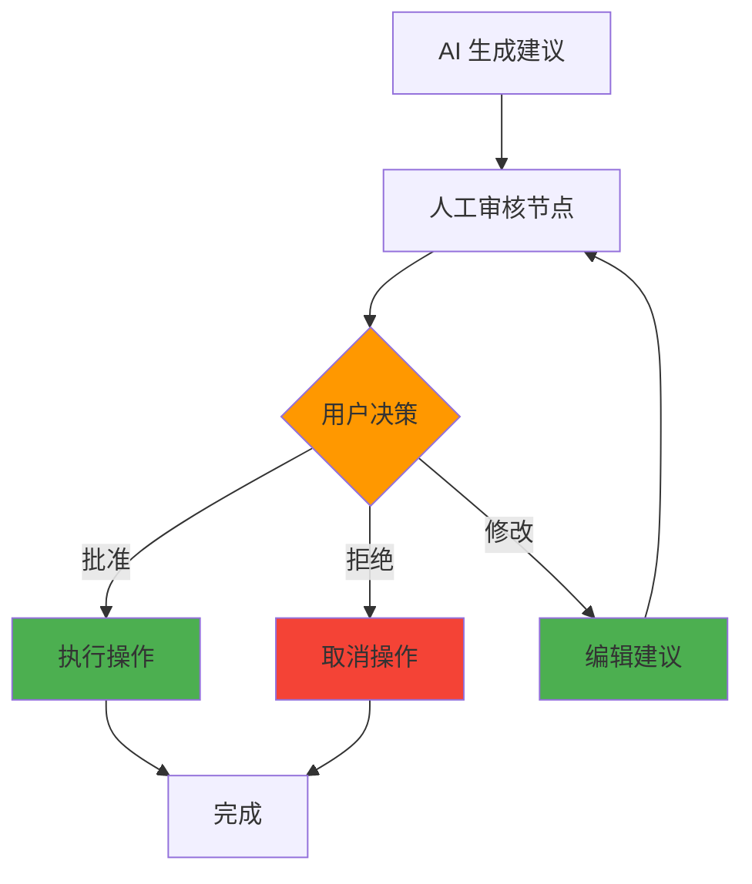
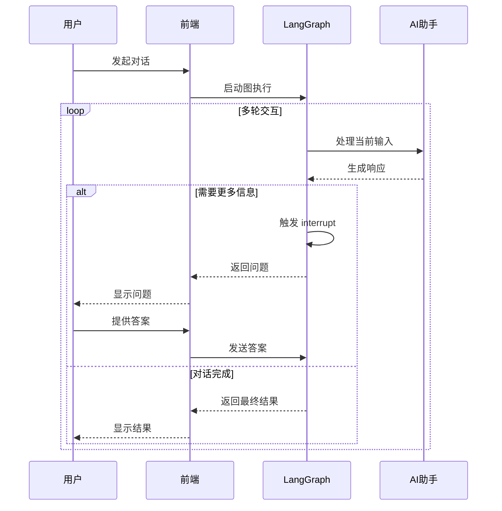

# 🤝 人机交互

在 AI 应用开发中，完全自动化的系统并不总是最佳选择。有时我们需要在关键决策点引入人工干预，确保系统的可靠性和准确性。LangGraphJS 的人机交互功能让你能够在图执行过程中暂停，等待用户输入，然后基于用户的反馈继续执行。

## 引言

人机交互（Human-in-the-Loop）是现代 AI 应用的重要组成部分，特别是在需要高准确性和可控性的场景中。就像前端开发中我们需要处理用户的点击、输入和确认操作一样，AI 应用也需要在适当的时候"询问"用户的意见。

### 为什么需要人机交互？

在前端开发中，我们经常遇到需要用户确认的场景：

- 删除重要数据前的确认对话框
- 表单提交前的数据验证
- 复杂操作的分步引导

同样，在 AI 应用中，人机交互解决了以下问题：

- **准确性保障**：LLM 可能产生不准确的输出，需要人工验证
- **安全性控制**：敏感操作需要人工审批
- **用户体验**：让用户参与决策过程，提高信任度
- **灵活性**：根据具体情况调整执行路径

## 核心概念

### interrupt 函数

`interrupt` 函数是 LangGraphJS 中实现人机交互的核心工具。它的工作原理类似于前端开发中的 `await` 操作，会暂停当前执行流程，等待外部输入。



### 基本使用方式

```typescript
import { Annotation, StateGraph } from "@langchain/langgraph";
import { interrupt, Command } from "@langchain/langgraph";
import { MemorySaver } from "@langchain/langgraph/checkpoint/memory";

// 定义状态
const State = Annotation.Root({
  approved: Annotation<boolean>({ default: () => false }),
});

// 节点：暂停等待用户确认
async function reviewNode(state: typeof State.State) {
  const userInput = await interrupt({ type: "confirm", message: "确认继续？" });
  return { approved: userInput === true };
}

// 构建图
const graph = new StateGraph(State).addNode("review", reviewNode).addEdge("__start__", "review");

// 启用检查点与线程 ID
const checkpointer = new MemorySaver();
const app = graph.compile({ checkpointer });
const thread = { configurable: { thread_id: "demo-thread" } } as const;

// 第一次调用：触发 interrupt 并暂停
await app.invoke({}, thread);

// 收到前端用户输入后恢复执行
await app.invoke(new Command({ resume: true }), thread);
```

### 技术要求

使用 `interrupt` 功能需要满足以下条件：

:::info 必要条件

1. **Checkpointer**：必须配置检查点保存器来保存图状态
2. **Thread ID**：需要使用线程 ID 来标识会话
3. **Command 对象**：使用 `Command` 对象来恢复执行

:::

## 设计模式

### 1. 审批流程模式

这是最常见的人机交互模式，用户需要批准或拒绝某个操作：



```typescript
import { Annotation, StateGraph } from "@langchain/langgraph";
import { interrupt, Command } from "@langchain/langgraph";
import { MemorySaver } from "@langchain/langgraph/checkpoint/memory";

type Decision = "approve" | "reject" | "modify";

const State = Annotation.Root({
  draft: Annotation<string>({ default: () => "AI 生成的建议" }),
  status: Annotation<Decision | null>({ default: () => null }),
});

async function humanGate(state: typeof State.State) {
  const choice = await interrupt({
    type: "choice",
    question: "是否批准此操作？",
    options: [
      { id: "approve", label: "批准" },
      { id: "reject", label: "拒绝" },
      { id: "modify", label: "修改" },
    ],
    context: state.draft,
  });
  return { status: choice as Decision };
}

function applyDecision(state: typeof State.State) {
  if (state.status === "approve") {
    // 执行批准后的动作
  }
  return {};
}

const graph = new StateGraph(State)
  .addNode("humanGate", humanGate)
  .addNode("applyDecision", applyDecision)
  .addEdge("__start__", "humanGate")
  .addEdge("humanGate", "applyDecision");

const app = graph.compile({ checkpointer: new MemorySaver() });
const thread = { configurable: { thread_id: "approval" } } as const;

await app.invoke({}, thread); // 暂停等待用户选择
// 恢复时传入用户选择："approve" | "reject" | "modify"
await app.invoke(new Command({ resume: "approve" }), thread);
```

### 2. 内容编辑模式

允许用户编辑和完善 AI 生成的内容：

```typescript
import { Annotation, StateGraph } from "@langchain/langgraph";
import { interrupt, Command } from "@langchain/langgraph";
import { MemorySaver } from "@langchain/langgraph/checkpoint/memory";

const State = Annotation.Root({
  content: Annotation<string>({ default: () => "初稿内容" }),
});

async function editNode(state: typeof State.State) {
  const edited = await interrupt({
    type: "text_edit",
    label: "请编辑内容",
    value: state.content,
  });
  return { content: String(edited) };
}

const app = new StateGraph(State).addNode("edit", editNode).addEdge("__start__", "edit").compile({
  checkpointer: new MemorySaver(),
});
const thread = { configurable: { thread_id: "edit-flow" } } as const;

await app.invoke({}, thread); // 暂停等待编辑
await app.invoke(new Command({ resume: "修改后的内容" }), thread);
```

### 3. 工具调用审核模式

在执行敏感的工具调用前获得用户确认：

```typescript
import { Annotation, StateGraph } from "@langchain/langgraph";
import { interrupt, Command } from "@langchain/langgraph";
import { MemorySaver } from "@langchain/langgraph/checkpoint/memory";

const State = Annotation.Root({
  toolCall: Annotation<{ name: string; args: unknown } | null>({ default: () => null }),
  allow: Annotation<boolean>({ default: () => false }),
});

async function reviewTool(state: typeof State.State) {
  const decision = await interrupt({
    type: "confirm",
    message: `是否允许调用工具: ${(state.toolCall?.name) ?? "unknown"}?`,
  });
  return { allow: decision === true };
}

function maybeCallTool(state: typeof State.State) {
  if (state.allow && state.toolCall) {
    // 在此处调用实际工具
  }
  return {};
}

const graph = new StateGraph(State)
  .addNode("reviewTool", reviewTool)
  .addNode("maybeCallTool", maybeCallTool)
  .addEdge("__start__", "reviewTool")
  .addEdge("reviewTool", "maybeCallTool");

const app = graph.compile({ checkpointer: new MemorySaver() });
const thread = { configurable: { thread_id: "tool-review" } } as const;

await app.invoke({ toolCall: { name: "deleteUser", args: { id: 1 } } }, thread);
await app.invoke(new Command({ resume: true }), thread);
```

### 4. 多轮对话模式

支持连续的用户交互，构建对话式体验：



```typescript
import { Annotation, StateGraph } from "@langchain/langgraph";
import { interrupt, Command } from "@langchain/langgraph";
import { MemorySaver } from "@langchain/langgraph/checkpoint/memory";

type Msg = { role: "user" | "assistant"; content: string };
const State = Annotation.Root({
  messages: Annotation<Msg[]>({ default: () => [] }),
});

async function assistant(state: typeof State.State) {
  const last = state.messages[state.messages.length - 1];
  if (!last || last.role === "assistant") return {};

  // 假设需要更多信息
  const followup = await interrupt({
    type: "question",
    message: "请提供更多细节以继续",
  });
  return { messages: [{ role: "assistant", content: String(followup) }] } as any;
}

const app = new StateGraph(State).addNode("assistant", assistant).addEdge("__start__", "assistant").compile({
  checkpointer: new MemorySaver(),
});
const thread = { configurable: { thread_id: "multi-turn" } } as const;

await app.invoke({ messages: [{ role: "user", content: "帮我订机票" }] }, thread);
await app.invoke(new Command({ resume: "出发城市是上海" }), thread);
```

## Command 对象详解

`Command` 对象是恢复图执行的关键，它提供了多种控制选项：

### 基本恢复

```typescript
// 简单恢复，传递用户输入
await graph.invoke(
  new Command({ resume: userInput }),
  threadConfig
);
```

### 状态更新

```typescript
// 恢复时同时更新状态
await graph.invoke(
  new Command({ 
    resume: userInput,
    update: { approved: true, timestamp: Date.now() }
  }),
  threadConfig
);
```

### 路径控制

```typescript
// 恢复时指定下一个节点
await graph.invoke(
  new Command({ 
    resume: userInput,
    goto: 'specific_node'
  }),
  threadConfig
);
```

## 实践指导

### 输入验证

在实际应用中，验证用户输入是很重要的：

```typescript
import { Annotation, StateGraph } from "@langchain/langgraph";
import { interrupt, Command } from "@langchain/langgraph";
import { MemorySaver } from "@langchain/langgraph/checkpoint/memory";

const State = Annotation.Root({
  age: Annotation<number | null>({ default: () => null }),
});

async function askAge(state: typeof State.State) {
  const input = await interrupt({ type: "text", label: "请输入年龄" });
  const n = Number(input);
  if (!Number.isInteger(n) || n <= 0) {
    // 再次打断，提示错误并要求重试
    await interrupt({ type: "info", message: "年龄必须为正整数，请重试" });
    return {}; // 下次恢复将从节点开始重新执行
  }
  return { age: n };
}

const app = new StateGraph(State).addNode("askAge", askAge).addEdge("__start__", "askAge").compile({
  checkpointer: new MemorySaver(),
});
const thread = { configurable: { thread_id: "validation" } } as const;

await app.invoke({}, thread); // 第一次：请求输入
await app.invoke(new Command({ resume: "abc" }), thread); // 错误输入
await app.invoke(new Command({ resume: "28" }), thread); // 正确输入
```

### 与前端集成

在 React 应用中集成人机交互功能：

```tsx
import React, { useState } from "react";

type HitlProps = {
  onStart: () => Promise<void>; // 启动图执行（触发 interrupt）
  onResume: (value: unknown) => Promise<void>; // 使用 Command 恢复
};

export function HitlDemo({ onStart, onResume }: HitlProps) {
  const [pending, setPending] = useState(false);
  const [input, setInput] = useState("");

  return (
    <div>
      <button disabled={pending} onClick={async () => { setPending(true); await onStart(); setPending(false); }}>
        启动并等待用户输入
      </button>
      <div style={{ marginTop: 12 }}>
        <input value={input} onChange={(e) => setInput(e.target.value)} placeholder="在此输入恢复值" />
        <button onClick={async () => { await onResume(input); }}>提交恢复</button>
      </div>
    </div>
  );
}
```

## 最佳实践

### 1. 避免副作用重复执行

:::danger 重要提醒

当图从 `interrupt` 恢复时，会重新执行整个节点。因此，有副作用的操作（如 API 调用）应该放在 `interrupt` 之后。

:::

```typescript
// ❌ 错误：副作用在 interrupt 之前
function badNode(state: State) {
  // 这个 API 调用会在恢复时重复执行
  await expensiveApiCall();
  
  const userInput = interrupt("请确认操作");
  return { confirmed: userInput };
}

// ✅ 正确：副作用在 interrupt 之后
function goodNode(state: State) {
  const userInput = interrupt("请确认操作");
  
  if (userInput) {
    // 只有在用户确认后才执行 API 调用
    await expensiveApiCall();
  }
  
  return { confirmed: userInput };
}
```

### 2. 合理设计用户体验

- **清晰的提示信息**：让用户明确知道需要做什么
- **提供上下文**：给用户足够的信息来做决策
- **支持撤销**：允许用户修改之前的决定
- **超时处理**：考虑用户长时间不响应的情况

### 3. 错误处理

```typescript
import { Annotation, StateGraph } from "@langchain/langgraph";
import { interrupt, Command } from "@langchain/langgraph";
import { MemorySaver } from "@langchain/langgraph/checkpoint/memory";

const State = Annotation.Root({
  confirmed: Annotation<boolean>({ default: () => false }),
  error: Annotation<string | null>({ default: () => null }),
});

async function guardedNode(state: typeof State.State) {
  try {
    const ok = await interrupt({ type: "confirm", message: "继续吗？" });
    if (ok !== true) throw new Error("用户未确认");
    return { confirmed: true, error: null };
  } catch (e: any) {
    return { error: String(e?.message ?? e) };
  }
}

const app = new StateGraph(State).addNode("guarded", guardedNode).addEdge("__start__", "guarded").compile({
  checkpointer: new MemorySaver(),
});
const thread = { configurable: { thread_id: "errors" } } as const;

await app.invoke({}, thread);
await app.invoke(new Command({ resume: false }), thread);
```

### 4. 状态管理

合理设计状态结构，记录人机交互的历史：

```typescript
const StateAnnotation = Annotation.Root({
  messages: Annotation<BaseMessage[]>({
    reducer: messagesStateReducer,
    default: () => [],
  }),
  // 记录用户交互历史
  userInteractions: Annotation<UserInteraction[]>({
    reducer: (state, update) => [...state, ...update],
    default: () => [],
  }),
  // 当前等待的用户输入
  pendingUserInput: Annotation<string | null>({
    default: () => null,
  }),
});
```

## 常见问题

### Q: 如何处理用户长时间不响应？

A: 可以在客户端设置超时机制，或者在图中添加超时节点：

```typescript
// 客户端超时处理
const timeout = setTimeout(() => {
  // 发送默认响应或取消操作
  graph.invoke(new Command({ resume: "timeout" }), threadConfig);
}, 300000); // 5分钟超时
```

### Q: 可以在一个节点中使用多个 interrupt 吗？

A: 可以，但需要注意执行顺序。每次恢复时都会从节点开始重新执行，所以要确保 interrupt 的顺序保持一致。

### Q: 如何在 interrupt 中传递复杂数据？

A: `interrupt` 可以接受任何可序列化的 JSON 数据：

```typescript
const userChoice = interrupt({
  type: "choice",
  question: "请选择操作",
  options: [
    { id: "approve", label: "批准", description: "批准此操作" },
    { id: "reject", label: "拒绝", description: "拒绝此操作" },
    { id: "modify", label: "修改", description: "修改后批准" }
  ],
  context: state.currentOperation
});
```

## 小结与延伸

人机交互是构建可靠 AI 应用的重要技术。通过 `interrupt` 函数和 `Command` 对象，我们可以在图执行过程中灵活地引入人工干预，确保系统的准确性和可控性。

关键要点：

- **interrupt 函数**：暂停图执行，等待用户输入
- **Command 对象**：恢复执行并控制后续流程
- **设计模式**：审批、编辑、审核、对话等常见模式
- **最佳实践**：避免副作用重复、合理设计用户体验

在下一节断点调试中，我们将学习如何使用断点功能来调试和优化图的执行过程，这与人机交互功能相辅相成，都是提高开发效率的重要工具。

## 相关资源

- [持久化](./持久化)：了解检查点机制的详细实现
- [流式处理](./流式处理)：学习如何实时获取 interrupt 事件 
