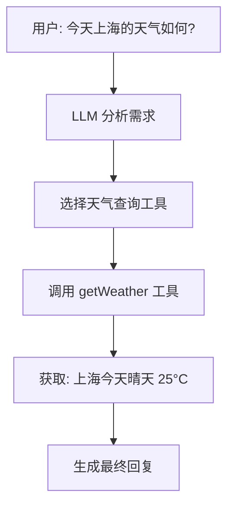
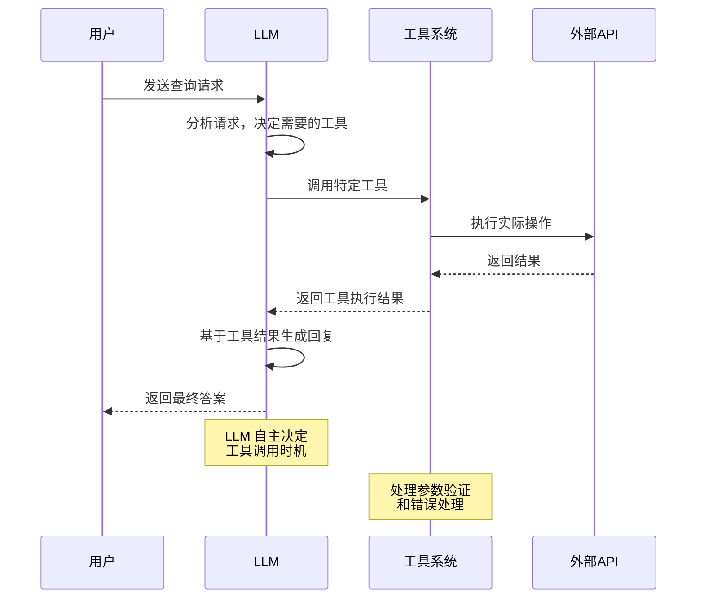

# 🛠️ 工具调用

工具调用是 LangGraphJS 中最强大的功能之一，它让 LLM 能够主动选择和使用外部工具来完成复杂任务。就像前端应用中调用不同的 API 来获取数据一样，智能代理可以调用各种工具来扩展其能力。

## 🎯 什么是工具调用

在传统的前端开发中，我们会根据用户操作调用特定的 API 或函数。而在智能代理中，**LLM 自己决定**何时调用哪个工具，以及传递什么参数。



### 工具调用流程图


 

### 核心概念

- **工具（Tool）**：封装了特定功能的函数，包含输入模式和执行逻辑
- **工具绑定**：将工具与 LLM 关联，让 LLM 知道可以使用哪些工具
- **工具调用**：LLM 决定调用某个工具并传递参数的过程
- **工具结果**：工具执行后返回的数据，会被传回给 LLM


## 📝 基础工具定义

### 创建简单工具

使用 `tool` 函数可以轻松创建工具：

```ts
import { tool } from "@langchain/core/tools";
import { z } from "zod";

// 最小可用：输入城市，返回示例天气（函数优先写法，保留 zod schema）
export const getWeather = tool(
  async (input) => {
    const { city } = input as { city: string };
    return `${city} 今日晴，25°C`;
  },
  {
    name: "getWeather",
    description: "查询城市今日天气（示例）",
    schema: z.object({ city: z.string() }),
  }
);
```

### 工具的组成部分

每个工具包含以下要素：

1. **执行函数**：实际的业务逻辑
2. **名称**：工具的唯一标识符
3. **模式**：定义输入参数的结构和类型
4. **描述**：帮助 LLM 理解工具的用途

:::tip 命名建议
工具名称应该简洁明了，描述应该详细说明工具的功能和使用场景，这有助于 LLM 做出正确的选择。
:::

## 🔗 工具绑定与使用

### 将工具绑定到 LLM

```ts
import { ChatOpenAI } from "@langchain/openai";
// 复用上方 getWeather
const model = new ChatOpenAI({ model: "gpt-4o-mini" }).bindTools([getWeather]);
const out = await model.invoke([{ role: "user", content: "上海天气？" }]);
console.log(out);
```

### 在 LangGraph 中使用工具

```ts
import { ChatOpenAI } from '@langchain/openai'
import { Annotation, StateGraph } from '@langchain/langgraph'
import { ToolNode } from '@langchain/langgraph/prebuilt'
import { AIMessage, BaseMessage, HumanMessage, ToolMessage } from '@langchain/core/messages'
import { tool } from '@langchain/core/tools'
import { z } from "zod";

const llm = new ChatOpenAI({
    model: 'qwen3-max',
})

const getWeather = tool(
    async (input) => {
        const { city } = input as { city: string };
        // 实际开发中此处调用获取天气的API
        return `${city} 今日晴，25°C`;
    },
    {
        name: "getWeather",
        description: "查询指定城市当前天气信息的工具。请提供城市名称。  如： 上海、北京",
        schema: z.object({ city: z.string() }),
    }
);

const StateAnnotation = Annotation.Root({
    messages: Annotation<BaseMessage[]>({
        reducer: (oldState, newState) => {
            return [...oldState, ...newState]
        },
        default: () => []
    }),
})

const llmNode = async (state: typeof StateAnnotation.State) => {
    const llmWithTools = llm.bindTools([getWeather])
    const response = await llmWithTools.invoke(state.messages)
    return {
        messages: [response]
    }
}

// 使用内置的 ToolNode
const toolNode = new ToolNode([getWeather])

// 条件函数：决定是否需要调用工具
const shouldContinue = (state: typeof StateAnnotation.State) => {
    const lastMessage = state.messages[state.messages.length - 1] as AIMessage
    console.log("%c Line:53 🍇 lastMessage.tool_calls", "color:#f5ce50", lastMessage.tool_calls);
    return lastMessage.tool_calls && lastMessage.tool_calls.length > 0 ? 'tools' : 'end'
}

const graph = new StateGraph(StateAnnotation)
    .addNode('llmNode', llmNode)
    .addNode('tools', toolNode)
    .addEdge('__start__', 'llmNode')
    .addConditionalEdges('llmNode', shouldContinue, {
        tools: 'tools',
        end: '__end__'
    })
    .addEdge('tools', 'llmNode')
    .compile()

async function runDemo() {
    try {
        const res = await graph.invoke({
            messages: [
                new HumanMessage('上海今天天气怎么样'),
            ]
        })
        console.log("%c Line:63 🥪 res", "color:#f5ce50", res);
    } catch (error) {
        console.error("错误:", error);
    }
}

runDemo()
```

## 🚀 高级工具功能

### 异步工具调用

大多数实际应用中的工具都需要进行异步操作：

```ts
import { tool } from "@langchain/core/tools";
import { z } from "zod";

export const getStockPrice = tool(
  async (input) => {
    const { symbol } = input as { symbol: string };
    await new Promise((r) => setTimeout(r, 100));
    return { symbol, price: 123.45 };
  },
  {
    name: "getStockPrice",
    description: "查询股票最新价格（示例）",
    schema: z.object({ symbol: z.string() }),
  }
);
```

### 访问运行时状态

工具可以访问当前的状态和配置信息：

```ts
import { tool } from "@langchain/core/tools";
import { z } from "zod";

export const echoWithUser = tool(
  async (input, config) => {
    const { text } = input as { text: string };
    const userId = (config as any)?.configurable?.userId ?? "anonymous";
    return `user:${userId} -> ${text}`;
  },
  {
    name: "echoWithUser",
    description: "回显文本并带上调用者ID（示例）",
    schema: z.object({ text: z.string() }),
  }
);
```

 

### 强制工具使用

直接调用工具：
```ts
getWeather.invoke({ city: '上海' }).then(res => {
    console.log("%c Line:31 🍪 res", "color:#b03734", res);
})
```

在图的首次模型调用中，直接构造 `AIMessage.tool_calls` 来硬编码一次工具调用（适合需要严格控制首次动作的场景）：

```ts
import { AIMessage } from "@langchain/core/messages";

const firstModel = async (state: typeof AgentState.State) => {

  return {
    messages: [
      new AIMessage({
        content: "",
        tool_calls: [
          {
            name: "getWeather",
            args: {
              city: "上海",
            },
            type: "tool_call",
            id: "call_7e0cc43d1a8447eab18dfc42",
          }
        ],
      }),
    ],
  };
};
```

说明：与 `ToolNode`（例如 `new ToolNode([getWeather])`）和条件边（判断 `lastMessage.tool_calls?.length > 0`）配合使用，即可在该步直接执行 `getWeather` 工具；后续再回到 LLM 节点进行归纳与答复。

## 🔧 MCP 集成

MCP 的全称是 Model Context Protocol（模型上下文协议），它是由 Anthropic 公司发起并开源的一项标准，旨在为 大型语言模型（LLM）应用 提供一个 统一、标准化的接口，使其能够安全、动态地连接到外部数据和工具。

简单来说，你可以把 MCP 想象成 AI 世界的通用 USB-C 接口。


### 快速开始：连接到 MCP 服务器并发现工具

```ts
import { MultiServerMCPClient } from "@langchain/mcp-adapters";

const mcp = new MultiServerMCPClient({
  mcpServers: {
    filesystem: {
      transport: "stdio",
      command: "npx",
      args: ["-y", "@modelcontextprotocol/server-filesystem", process.cwd()],
    },
  },
});

// 获取 MCP 工具列表
const mcpTools = await mcp.getTools();

// 查看工具名称与描述
mcpTools.forEach((t) => {
  console.log(`MCP 工具: ${t.name} - ${t.description ?? ""}`);
});
```

### 在 LangGraph 中使用 MCP 工具

```ts


const tools = [...mcpTools]

// 2) 绑定到模型
const llmWithTools = llm.bindTools(tools)

// 3) 构建图，将工具作为节点
const toolNode = new ToolNode(tools);

const shouldContinue = (state: typeof StateAnnotation.State) => {
    const lastMessage = state.messages[state.messages.length - 1] as AIMessage
 
    return lastMessage.tool_calls && lastMessage.tool_calls.length > 0 ? 'tools' : 'end'
}

const graph = new StateGraph(StateAnnotation)
    .addNode('llmNode', llmNode)
    .addNode('tools', toolNode)
    .addEdge('__start__', 'llmNode')
    .addConditionalEdges('llmNode', shouldContinue, {
        tools: 'tools',
        end: '__end__'
    })
    .addEdge('tools', 'llmNode')
    .compile()

// 4) 运行
const res = await graph.invoke({ messages: [ new HumanMessage('当前 文件夹有哪些文件')] });
console.log(res);

```

### 与本地工具混用
`@langchain/mcp-adapters` 抹平了 mcp 和tools 的差别和tools 一样使用mcp即可 
```ts
// 将 MCP 工具与本地工具合并后绑定
const tools = [getWeather, ...mcpTools];

// 2) 绑定到模型
const llmWithTools = llm.bindTools(tools)

// 3) 构建图，将工具作为节点
const toolNode = new ToolNode(tools);
```

 
### MCP 相关网站


- 魔塔社区 MCP 入口页：[ModelScope MCP](https://modelscope.cn/mcp)  
- MCP 生态导航站点：[mcp.so](https://mcp.so/)

## 📋 最佳实践

### 1. 工具设计原则

- **单一职责**：每个工具专注于一个特定功能
- **清晰命名**：使用描述性的名称和详细的描述
- **参数验证**：使用 Zod 模式进行严格的参数验证
- **错误处理**：提供有意义的错误信息

### 2. 性能优化

- **缓存结果**：对于昂贵的操作，考虑实现缓存机制
- **异步处理**：使用异步函数处理 I/O 操作
- **资源管理**：及时释放资源，避免内存泄漏

### 3. 安全考虑

- **输入验证**：严格验证所有输入参数
- **权限控制**：限制工具的访问权限
- **敏感信息**：避免在工具描述中暴露敏感信息

:::warning 安全提醒
在生产环境中，确保工具调用不会执行危险操作，并对所有外部 API 调用进行适当的身份验证和授权。
:::
 
## 📚 小结与延伸

工具调用是构建强大智能代理的关键技术。通过本节学习，你应该掌握了：

- 如何定义和使用基础工具
- 工具绑定和调用的完整流程
- 高级功能如并行控制、错误处理
- MCP 集成的强大能力
- 实际应用中的最佳实践

工具调用与状态管理紧密相关，工具的执行结果会影响代理的状态，而状态信息也可以传递给工具。

:::tip 进阶学习
尝试创建自己的工具集合，比如文件操作工具、数据库查询工具或者特定业务逻辑工具。实践是掌握工具调用的最佳方式！
:::
