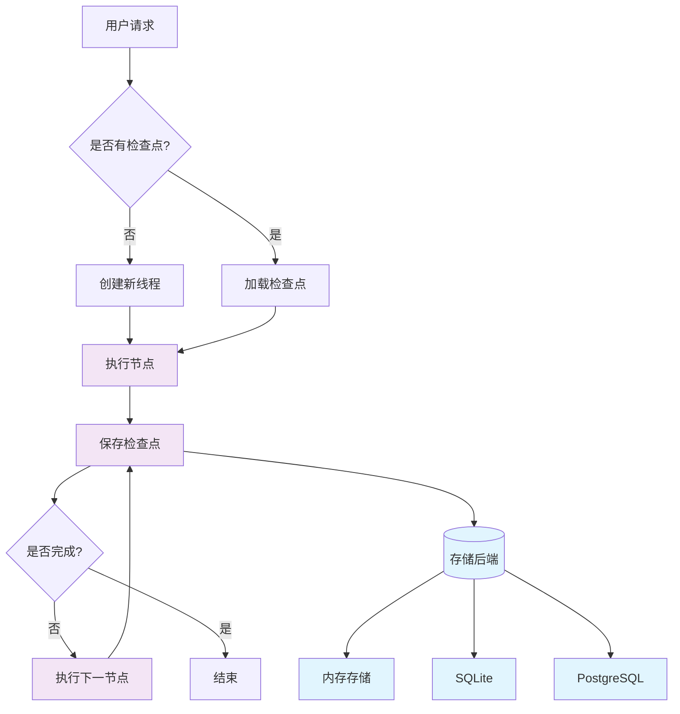
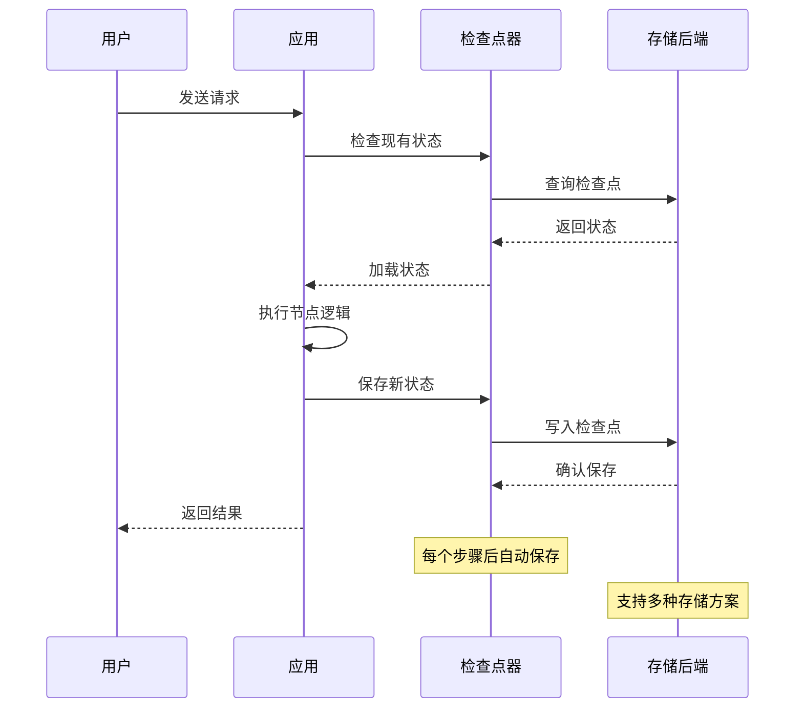

# 💾 持久化

在构建复杂的 AI 应用时，持久化是一个至关重要的功能。就像前端应用需要保存用户数据和应用状态一样，LangGraphJS 应用也需要能够保存和恢复执行状态。LangGraphJS 通过强大的检查点机制提供了完整的持久化解决方案。

## 🎯 持久化概述

从前端开发的角度来理解，LangGraphJS 的持久化机制类似于：

- **检查点** 类似于 Git 的提交记录 - 每个执行步骤都会保存状态快照
- **线程** 类似于浏览器的会话 - 每个对话或执行流程都有唯一标识
- **状态恢复** 类似于页面刷新后的状态恢复 - 应用可以从任意点继续执行
- **时间旅行** 类似于版本控制的回滚 - 可以回到任意历史状态



## 📝 检查点机制

检查点是 LangGraphJS 持久化的核心概念，它在每个步骤后自动保存图的状态快照。

### 核心概念

#### 线程（Thread）

线程是每个检查点的唯一标识符，类似于数据库中的主键。每个线程代表一个独立的执行流程，可以是用户会话、任务实例或任何需要独立状态管理的场景。

```typescript
// 线程管理：为每次对话/流程生成并复用 thread_id
import { randomUUID } from 'node:crypto';

const threadId = randomUUID();

// 调用图时将 thread_id 放入 configurable，确保同一线程可继续执行
const result = await graph.invoke(input, {
  configurable: { thread_id: threadId },
});

// 后续请求继续复用同一个 thread_id，即可在同一状态链上推进
await graph.invoke(nextInput, { configurable: { thread_id: threadId } });
```

#### 检查点（Checkpoint）

检查点包含完整的状态信息和元数据，包括：

- **状态快照**：当前图的完整状态
- **执行位置**：下一个要执行的节点
- **元数据**：时间戳、配置信息等
- **历史记录**：状态变更的完整链条

```typescript
// 检查点管理：为图配置检查点器（持久化后端）
import { MemorySaver } from '@langchain/langgraph';
import { SqliteSaver } from '@langchain/langgraph-checkpoint-sqlite';
import { PostgresSaver } from '@langchain/langgraph-checkpoint-postgres';

// 开发期：内存后端（重启丢失，最快）
const devCheckpointer = new MemorySaver();

// 本地/小型项目：SQLite 文件持久化
const sqliteCheckpointer = new SqliteSaver({ filename: './state.db' });

// 生产：Postgres 持久化
const pgCheckpointer = new PostgresSaver(process.env.DATABASE_URL!);

// 选择一个后端编译工作流
const graph = workflow.compile({ checkpointer: pgCheckpointer });
```

### 状态查询和历史

持久化机制提供了强大的状态查询能力，允许你：

- 获取当前状态快照
- 查看完整的执行历史
- 回溯到任意历史状态
- 分析状态变更轨迹

```typescript
// 状态查询与历史：查询当前状态与历史检查点
const threadId = 'your-thread-id';

// 获取当前状态（示例 API，具体以实际版本为准）
const currentState = await graph.getState({
  configurable: { thread_id: threadId },
});
console.log('values:', currentState.values);
console.log('metadata:', currentState.metadata);

// 列出历史检查点（示例 API）
const checkpoints = await checkpointer.list({ thread_id: threadId });
console.log('history length:', checkpoints.length);
```

## 🗄️ 存储后端选择

LangGraphJS 提供多种存储后端，适用于不同的使用场景。选择合适的存储后端是构建可靠持久化系统的关键。


### 存储后端特性对比

不同存储后端适用于不同的应用场景：

| 存储类型      | 适用场景 | 优点               | 缺点               | 性能 |
| ------------- | -------- | ------------------ | ------------------ | ---- |
| MemorySaver   | 开发测试 | 简单快速，无需配置 | 重启丢失，内存限制 | 极高 |
| SqliteSaver   | 本地应用 | 轻量级，文件存储   | 单机限制，并发有限 | 高   |
| PostgresSaver | 生产环境 | 高性能，高可用     | 配置复杂，资源消耗 | 很高 |


## 🏭 生产环境配置

在生产环境中，需要考虑性能、可靠性和扩展性：

```typescript
// 生产环境持久化配置（示例）
import { PostgresSaver } from '@langchain/langgraph-checkpoint-postgres';

const checkpointer = new PostgresSaver(process.env.DATABASE_URL!, {
  pool: { min: 2, max: 10 },
  statementTimeoutMs: 10_000,
});

const graph = workflow.compile({
  checkpointer
});
```

## 📊 持久化工作流程



 

## 🎯 实践案例：支持持久化的图


```typescript
import { ChatOpenAI } from '@langchain/openai'
import './lib/loadEnv'
import { Annotation, StateGraph } from '@langchain/langgraph'
import { BaseMessage, HumanMessage } from '@langchain/core/messages'
import { randomUUID } from 'node:crypto';
import { MemorySaver } from '@langchain/langgraph';
const devCheckpointer = new MemorySaver();

const llm = new ChatOpenAI({
    model: 'qwen3-max',
})


const StateAnnotation = Annotation.Root({
    messages: Annotation<BaseMessage[]>({
        reducer: (oldState, newState) => {
            return [...oldState, ...newState]
        },
        default: () => []
    }),
})

const llmNode = async (state: typeof StateAnnotation.State) => {
    const response = await llm.invoke(state.messages)
    return {
        messages: [response]
    }
}


const graph = new StateGraph(StateAnnotation)
    .addNode('llmNode', llmNode)
    .addEdge('__start__', 'llmNode')
    .addEdge('llmNode', '__end__')
    .compile({ checkpointer: devCheckpointer })


const logMessages = (messages: BaseMessage[]) => {
    messages.forEach((msg) => {
        console.log(`%c Line:44 🥒 【${msg.getType()}】`, "color:#2eafb0", msg.content);
    });
}

async function runDemo() {
    try {
        const threadId = randomUUID();

        console.log("%c Line:62 🍪==============第一轮对话============", "color:#7f2b82");

        await graph.invoke({
            messages: [
                new HumanMessage('中国首都在哪里'),
            ]
        }, {
            configurable: {
                thread_id: threadId
            }
        }).then(res => {
            logMessages(res.messages)
        })

        console.log("%c Line:62 🍪==============第二轮对话============", "color:#7f2b82");

        await graph.invoke({
            messages: [
                new HumanMessage('上一个问题问的是什么'),
            ]
        }, {
            configurable: {
                thread_id: threadId
            }
        }).then(res => {
            logMessages(res.messages)
        })


    } catch (error) {
        console.error("错误:", error);
    }
}

runDemo()
```
 
## 🔗 相关资源

- [状态管理](../核心组件详解/状态管理) - 了解状态在持久化中的作用
- [记忆管理](./记忆管理) - 学习如何结合记忆和持久化
- [人机交互](./人机交互) - 理解持久化在交互中的重要性

持久化是构建可靠 AI 应用的基础设施。通过合理使用检查点机制，你可以创建出既稳定又灵活的应用，为用户提供无缝的体验。这为实现更复杂的功能如人机交互和流式处理奠定了坚实的基础。
