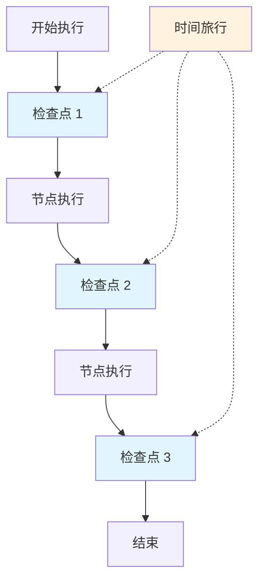
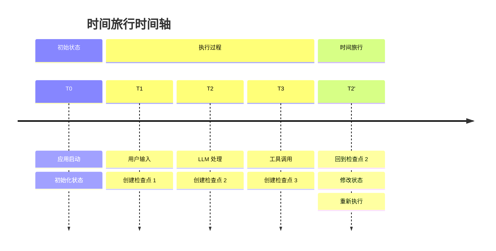
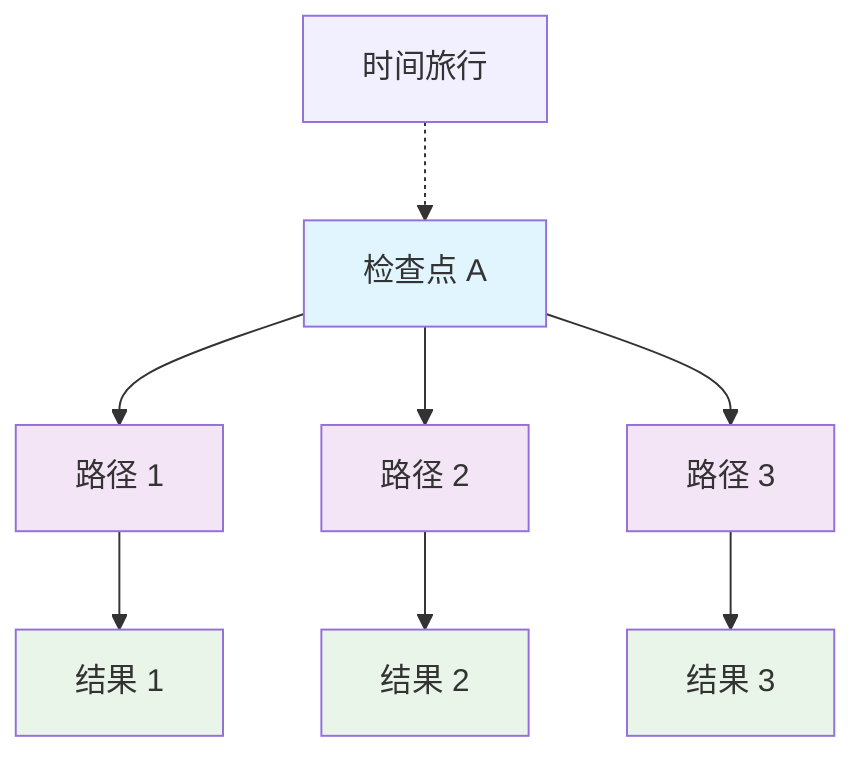
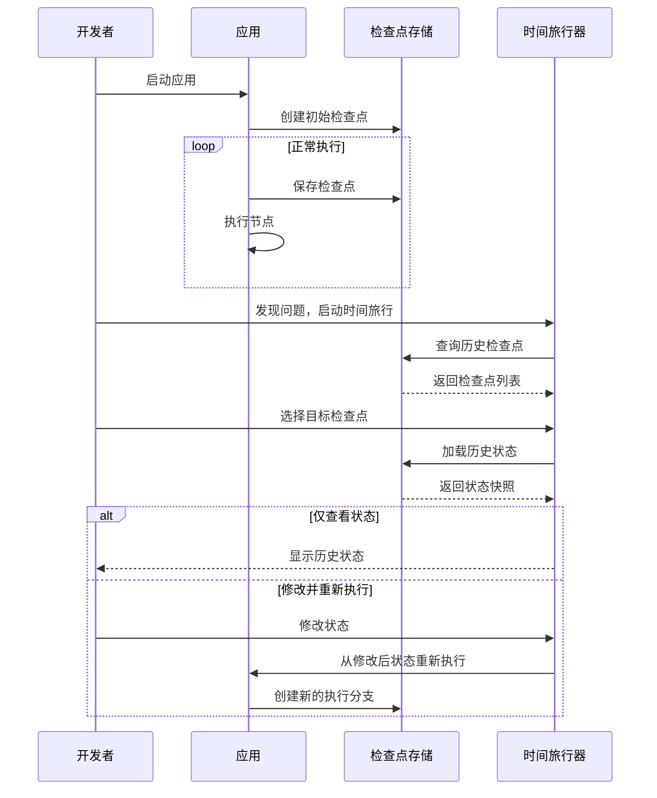

# ⏰ 时间旅行

## 引言

时间旅行（Time Travel）是 LangGraphJS 提供的一项强大调试功能，允许开发者回到应用执行的任何历史状态，查看当时的数据，甚至从那个时间点重新开始执行。这就像是为你的 AI 应用提供了一个"时光机"。

对于前端开发者来说，这个概念类似于：
- **Git 版本控制**：可以查看和回滚到任何历史提交
- **浏览器历史记录**：可以前进和后退到访问过的页面
- **Redux DevTools**：可以查看和重放状态变化
- **Chrome DevTools**：可以查看调用栈和变量状态

时间旅行功能在调试复杂的 AI 应用时特别有用，特别是当你需要理解状态变化的过程或测试不同的执行路径时。

## 核心概念

### 🔍 检查点系统

时间旅行功能基于 LangGraphJS 的检查点（Checkpoint）机制：



### 📸 状态快照

每个检查点都包含完整的状态快照：
- **消息历史**：所有的对话消息
- **变量状态**：所有状态变量的值
- **执行上下文**：当前执行位置和配置
- **时间戳**：检查点创建时间

### 🕐 时间轴概念



## 基础用法

### 📋 查看历史状态

<details>
  <summary>基础时间旅行示例</summary>

```typescript file=../../examples/高级功能/时间旅行/basic-time-travel.ts

```
</details>

### 🔄 状态回滚

<details>
  <summary>状态回滚示例</summary>

```typescript file=../../examples/高级功能/时间旅行/state-rollback.ts

```
</details>

## 高级功能

### ✏️ 状态修改和分支探索

时间旅行不仅可以查看历史状态，还可以修改历史状态后重新执行。通过状态回滚示例中的 `StateRollbackManager` 类，你可以：

- **修改历史状态**：回滚到特定检查点并修改状态
- **创建执行分支**：从同一历史点尝试不同路径
- **比较不同结果**：对比不同分支的执行结果



## 实际应用场景

### 🐛 调试复杂问题

当 AI 应用出现意外行为时，时间旅行可以帮助你快速定位问题。通过查看状态变化历史和回滚到问题发生前的状态，你可以：

- 分析状态变化趋势
- 定位问题发生的具体时间点
- 测试修复方案的有效性

### 🧪 A/B 测试

使用分支功能测试不同的决策路径和参数配置，比较不同方案的效果。

### 🔧 错误恢复

当执行过程中出现错误时，可以回滚到安全状态：

<details>
  <summary>错误恢复示例</summary>

```typescript file=../../examples/高级功能/时间旅行/error-recovery.ts

```
</details>

## 时间旅行工作流

### 🔄 完整的时间旅行流程



### 🛠️ 时间旅行工具类

<details>
  <summary>时间旅行工具类</summary>

```typescript file=../../examples/高级功能/时间旅行/time-travel-toolkit.ts

```
</details>

## 最佳实践

### ✅ 使用建议

:::tip 最佳实践

1. **合理设置检查点频率**
   - 在关键决策点设置检查点
   - 避免过于频繁的检查点影响性能

2. **状态设计考虑**
   - 保持状态结构简洁
   - 避免在状态中存储大量临时数据

3. **调试策略**
   - 先查看状态变化趋势
   - 再定位具体问题点
   - 最后进行修复验证

:::

### ⚠️ 注意事项

:::warning 注意事项

1. **性能影响**
   - 检查点存储会占用额外空间
   - 频繁的状态快照可能影响执行速度

2. **状态一致性**
   - 修改历史状态时要保持数据一致性
   - 注意状态修改对后续执行的影响

3. **并发安全**
   - 多线程环境下要注意检查点的同步
   - 避免同时修改同一个检查点

:::

### 🎯 调试技巧

<details>
  <summary>调试技巧示例</summary>

```typescript file=../../examples/高级功能/时间旅行/debugging-tips.ts

```
</details>

## 与前端开发工具对比

| 功能 | LangGraphJS 时间旅行 | Redux DevTools | Chrome DevTools |
|------|---------------------|----------------|-----------------|
| 状态查看 | ✅ 完整状态快照 | ✅ Action 历史 | ✅ 变量检查 |
| 状态回滚 | ✅ 任意检查点 | ✅ 时间旅行 | ❌ 不支持 |
| 状态修改 | ✅ 修改后重执行 | ✅ 状态编辑 | ✅ 变量修改 |
| 分支探索 | ✅ 多路径测试 | ❌ 单一路径 | ❌ 单一路径 |
| 持久化 | ✅ 数据库存储 | ❌ 会话级别 | ❌ 会话级别 |

## 小结与延伸

时间旅行功能为 LangGraphJS 应用提供了强大的调试和测试能力。通过检查点机制，开发者可以：

- **深入理解**应用的执行过程和状态变化
- **快速定位**复杂问题的根本原因
- **灵活测试**不同的执行路径和参数配置
- **安全恢复**从错误状态中恢复正常执行

掌握时间旅行功能后，你将能够更加自信地开发和调试复杂的 AI 应用。在下一章节中，我们将学习架构模式，了解如何设计和组织大型的 LangGraphJS 应用。

## 相关资源

- [持久化](./持久化) - 了解检查点的存储机制 
- [状态管理](../核心组件详解/状态管理) - 深入理解状态设计
