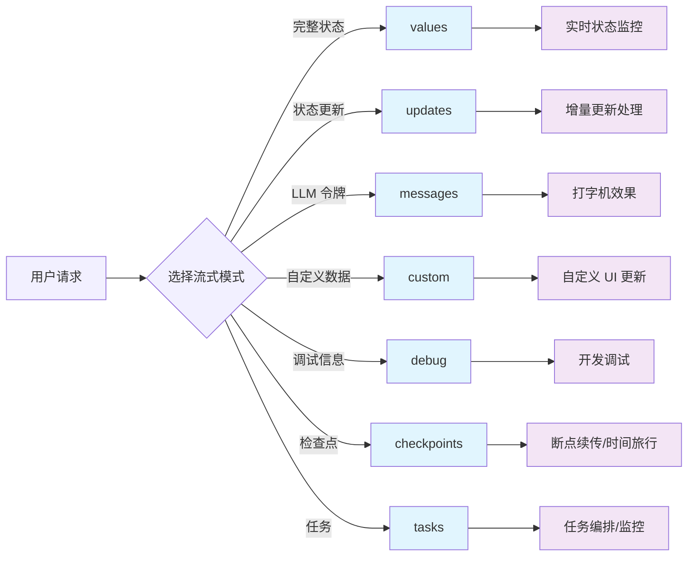

# 🌊 流式处理

流式处理是现代 AI 应用的核心特性之一，它让用户能够实时看到 AI 的思考和响应过程，极大提升了用户体验。

## 为什么要用流式处理？

- 降低感知延迟：先返回 token/片段，用户“立刻有反馈”。
- 提升可用性：长推理/多工具链路可展示进度与关键节点。
- 渐进式呈现：边生成边渲染，打字机/骨架屏更顺滑。
- 可观测与调试：暴露节点事件、重试、错误，定位问题更高效。
- 成本与容错：支持中断、限速、降级；早停无效输出节省开销。


## 🔄 流式处理模式

LangGraphJS 提供了多种流式处理模式，每种都有特定的使用场景：



### 📋 模式对比表（7 种）

| 模式 | 用途 | 数据内容 | 适用场景 |
|------|------|----------|----------|
| `values` | 完整状态流 | 每步后的完整状态 | 状态监控、进度展示 |
| `updates` | 增量更新流 | 每步的状态变化 | 实时更新、差异处理 |
| `messages` | LLM token流 | LLM 生成的token | 打字机效果、实时聊天 |
| `custom` | 自定义数据流 | 节点内自定义数据 | 特殊 UI 更新 |
| `debug` | 调试信息流 | 详细执行信息 | 开发调试、问题排查 |
| `checkpoints` | 检查点流 | 执行过程中的检查点信息 | 断点续传、时间旅行 |
| `tasks` | 任务流 | 节点/子图任务级事件 | 复杂编排、任务监控 |

 

## 🎛️ 七种流式模式详解

### Values 模式 - 完整状态流

适用于需要完整状态信息的场景，如进度条、状态面板等：

```typescript
// Values 模式 - 获取完整状态
for await (const chunk of await graph.stream(input, { 
  streamMode: "values" 
})) {
  console.log("完整状态:", chunk);
  // 更新 UI 状态显示
  updateProgressBar(chunk);
}
```

### Updates 模式 - 增量更新流

适用于只关心变化部分的场景，减少数据传输量：

```typescript
// Updates 模式 - 只获取变化
for await (const chunk of await graph.stream(input, { 
  streamMode: "updates" 
})) {
  console.log("状态更新:", chunk);
  // 只更新变化的部分
  applyIncrementalUpdate(chunk);
}
```

### Messages 模式 - LLM token流

最常用的模式，用于实现打字机效果：

```typescript
async function streamMessages(input: { messages: BaseMessage[] }) {
    console.log("\n[messages] 打字机效果开始");
    for await (const chunk of await graph.stream(input, { streamMode: "messages" })) {
        console.log(chunk?.[0]?.content);
    }
    console.log("\n[messages] 以上为打字机效果");
}

```

### Custom 模式 - 自定义数据流

用于在节点内部主动发送自定义结构的数据（如进度、指标、片段结构化消息），方便前端做特殊 UI 更新：

```typescript
// Custom 模式 - 节点侧需主动发送自定义数据
for await (const data of await graph.stream(input, { streamMode: "custom" })) {
  console.log("自定义数据:", data);
  // 例如: 根据 data.type 分发到不同的 UI 区域
}
```

```ts
const customNode = async (state: typeof StateAnnotation.State, context: any) => {
    // 推送进度类事件
    context?.writer?.('开始自定义事件');

   
    context?.writer?.({type: '自定义事件', data: {}});
    return {  };
};
```


### Debug 模式 - 调试信息流

输出节点进入/退出、输入/输出、重试、错误等详尽的执行信息，适合开发阶段定位问题：

```typescript
// Debug 模式 - 详细调试事件
for await (const dbg of await graph.stream(input, { streamMode: "debug" })) {
  console.log("调试事件:", dbg);
  // 可结合 run_id、node 名称进行过滤与归档
}
```

### Checkpoints 模式 - 检查点流

用于在执行过程中获取检查点信息，便于断点续传或“时间旅行”：

```typescript
// Checkpoints 模式 - 获取检查点事件
for await (const cp of await graph.stream(input, { streamMode: "checkpoints" })) {
  console.log("检查点:", cp);
  // 例如记录 checkpoint_id 以便后续 resume
}
```

### Tasks 模式 - 任务流

用于观察图中任务（节点/子图）级别的开始、结束与状态：

```typescript
// Tasks 模式 - 任务级事件
for await (const task of await graph.stream(input, { streamMode: "tasks" })) {
  console.log("任务事件:", task);
  // 可用于可视化执行进度或任务监控
}
```

 

 

## 🧷 streamEvents 使用详解

`streamEvents` 提供底层事件流（包含 token、节点进出、工具调用、错误与重试等）。适用于：
- 需要“打字机效果”的 token 级展示
- 精细调试与可观测性（Tracing/Telemetry）
- 对节点/模型生命周期事件有依赖的场景

**最小示例**

```typescript
for await (const event of graph.streamEvents(input, { version: "v2" })) {
  if (event.event === "on_chat_model_stream") {
    const token = event.data.chunk.content;
    process.stdout.write(String(token));
  }
  // 还可监听：on_tool_start/end, on_chain_start/end, on_chat_model_start/end 等
}
```


**事件命名与分类说明**

事件名遵循 `on_[runnable_type]_(start|stream|end)`，其中：
- runnable_type 取值包括：
  - `llm`：非聊天模型
  - `chat_model`：聊天模型
  - `prompt`：如 `ChatPromptTemplate`
  - `tool`：LangChain 工具
  - `chain`：大多数 Runnables 属于此类
- 事件阶段（category）：
  - `start`：runnable 开始
  - `stream`：runnable 流式进行中
  - `end`：runnable 结束


常见监听示例：
```typescript
for await (const e of graph.streamEvents(input, { version: "v2" })) {
  switch (e.event) {
    case "on_chat_model_start":
      // e.data.input / metadata
      break;
    case "on_chat_model_stream":
      // e.data.chunk.content 为增量 token
      break;
    case "on_chat_model_end":
      // e.data.output 为模型最终输出
      break;
    case "on_tool_start":
    case "on_tool_end":
    case "on_chain_start":
    case "on_chain_end":
      // 可按需区分处理
      break;
  }
}
```

 

 
**与 messages 模式的区别**

- messages：高层“消息增量”，轻量、稳定、面向 UI 展示
- streamEvents：底层“事件总线”，粒度细、信息全、适合调试与埋点


### 🧪 七种流式模式完整示例

下面的示例先构建同一张 `StateGraph`，然后分别演示 `values`、`updates`、`messages`、`custom`、`debug`、`checkpoints`、`tasks` 七种流式模式的消费方式，便于你在实际项目中快速对比和替换。

```typescript
 import "./lib/loadEnv";
import { BaseMessage, HumanMessage } from "@langchain/core/messages";
import { Annotation, StateGraph } from "@langchain/langgraph";
import { ChatOpenAI } from "@langchain/openai";

// 1) 构建 LLM 与状态状态
const llm = new ChatOpenAI({ model: "qwen3-max" });

const StateAnnotation = Annotation.Root({
    messages: Annotation<BaseMessage[]>(),
    summary: Annotation<string>(),
});

// 2) 定义节点
const llmNode = async (state: typeof StateAnnotation.State) => {
    const res = await llm.invoke(state.messages);
    return { messages: [res] };
};

const summaryNode = async (state: typeof StateAnnotation.State, context: any) => {
    // 推送进度类事件
    context?.writer?.('开始总结');

    const summary = await llm.invoke([
        ...state.messages,
        new HumanMessage("请总结一下前面的对话"),
    ]);

    context?.writer?.('结束总结');
    return { summary: String(summary.content) };
};

// 3) 构建图
const graph = new StateGraph(StateAnnotation)
    .addNode("llmNode", llmNode)
    .addNode("summaryNode", summaryNode)
    .addEdge("__start__", "llmNode")
    .addEdge("llmNode", "summaryNode")
    .addEdge("summaryNode", "__end__")
    .compile();

// 4) 将七种模式封装为可复用函数，便于在下方小节直接引用
async function streamValues(input: { messages: BaseMessage[] }) {
    for await (const chunk of await graph.stream(input, { streamMode: "values" })) {
        console.log("[values] 完整状态:", chunk);
    }
}

async function streamUpdates(input: { messages: BaseMessage[] }) {
    for await (const chunk of await graph.stream(input, { streamMode: "updates" })) {
        console.log("[updates] 状态更新:", chunk);
    }
}

async function streamMessages(input: { messages: BaseMessage[] }) {
    console.log("\n[messages] 打字机效果开始");
    for await (const chunk of await graph.stream(input, { streamMode: "messages" })) {
        console.log(chunk?.[0]?.content);
    }
    console.log("\n[messages] 以上为打字机效果");
}


async function streamCustom(input: { messages: BaseMessage[] }) {
    for await (const custom of await graph.stream(input, { streamMode: "custom" })) {
        console.log("[custom] 自定义数据:", custom);
    }
}

async function streamDebug(input: { messages: BaseMessage[] }) {
    for await (const dbg of await graph.stream(input, { streamMode: "debug" })) {
        console.log("[debug] 事件:", dbg);
    }
}

async function streamCheckpoints(input: { messages: BaseMessage[] }) {
    for await (const cp of await graph.stream(input, { streamMode: "checkpoints" })) {
        console.log("[checkpoints] 检查点:", cp);
    }
}

async function streamTasks(input: { messages: BaseMessage[] }) {
    for await (const task of await graph.stream(input, { streamMode: "tasks" })) {
        console.log("[tasks] 任务事件:", task);
    }
}


async function streamEvents(input: { messages: BaseMessage[] }) {
    for await (const e of graph.streamEvents(input, { version: 'v2' })) {
        console.log("[streamEvents] :", e.event);
    }
}

async function runAll() {
    const input = { messages: [new HumanMessage("你好")] };
    await streamUpdates(input);
    await streamValues(input);
    await streamMessages(input);
    await streamCustom(input);
    await streamDebug(input);
    await streamCheckpoints(input);
    await streamTasks(input);

    await streamEvents(input)
}

runAll();
```


## 🔮 小结

流式处理是 LangGraphJS 的强大特性，它让我们能够构建响应迅速、用户体验优秀的 AI 应用。通过合理选择流式模式、优化性能和处理错误，我们可以创建出专业级的实时 AI 应用。

### 关键要点回顾

1. **选择合适的流式模式**：根据具体需求选择 values、updates、messages 等模式
2. **优化用户体验**：使用缓冲、防抖等技术优化 UI 响应
3. **处理错误情况**：实现重试、降级和恢复机制
4. **监控性能**：跟踪流式处理的性能指标
 

:::tip 实践建议

在实际项目中，建议：
1. 从简单的 messages 模式开始
2. 逐步添加错误处理和性能优化
3. 根据用户反馈调整缓冲和更新策略
4. 使用性能监控工具跟踪流式处理效果

:::
