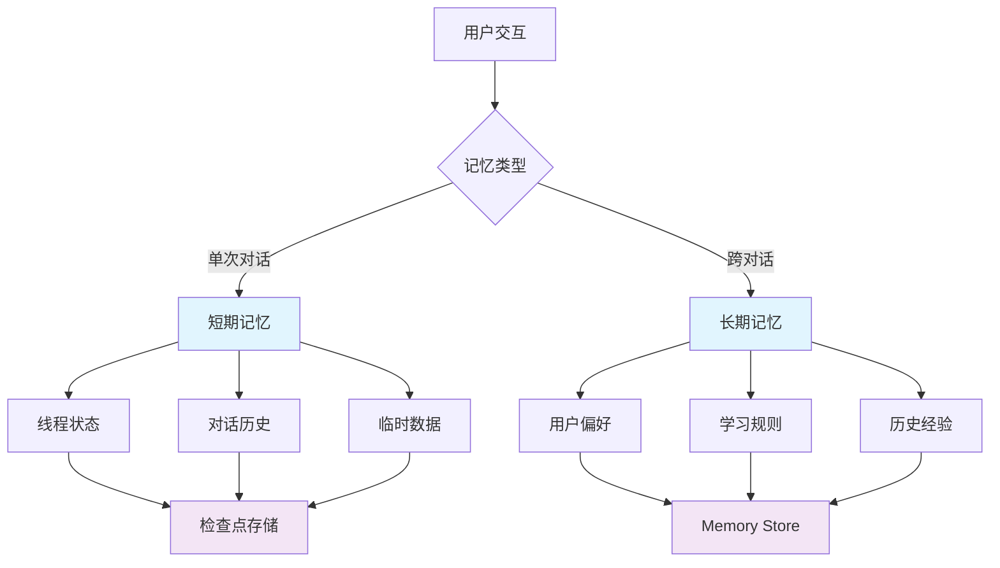
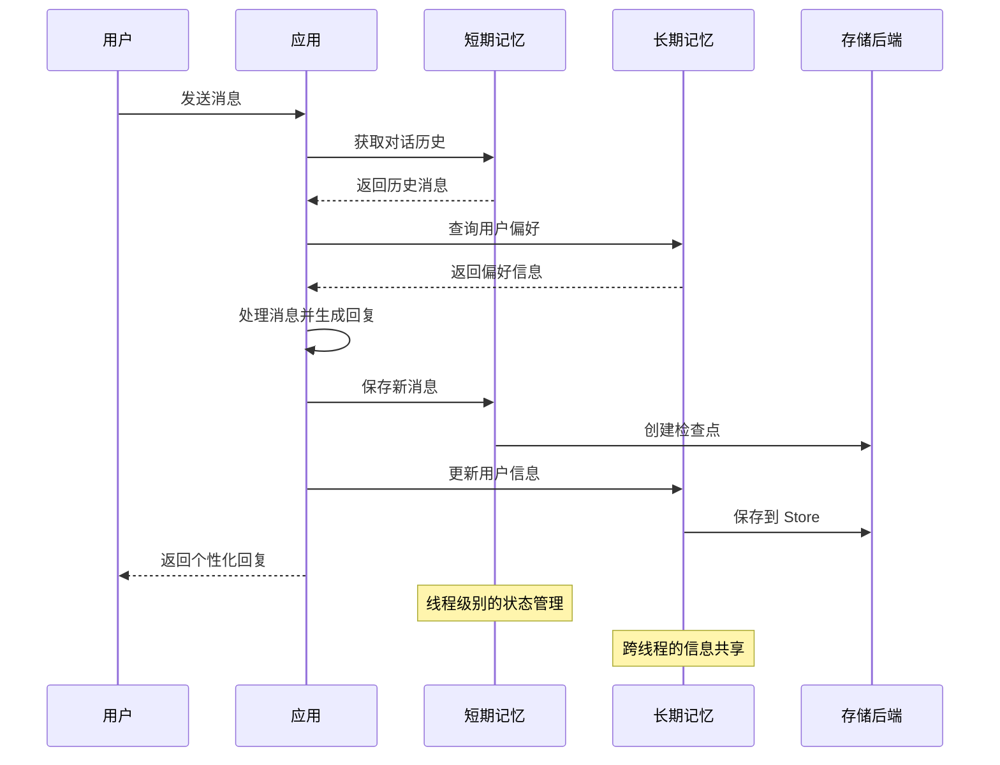

# 🧠 记忆管理

在构建智能应用时，记忆管理是一个至关重要的功能。就像人类能够记住过去的对话和经验一样，AI 应用也需要能够保存和回忆信息。LangGraphJS 提供了强大的记忆管理机制，让你的应用能够在对话中保持上下文，并在不同会话间共享知识。

## 🎯 记忆管理概述

从前端开发的角度来理解，LangGraphJS 的记忆管理类似于浏览器的存储机制：

- **短期记忆** 类似于 `sessionStorage` - 在单次会话中保持数据
- **长期记忆** 类似于 `localStorage` - 跨会话持久化数据
- **检查点机制** 类似于自动保存功能 - 定期保存应用状态



## 📝 短期记忆（Thread-Scoped Memory）

短期记忆是指在单次对话线程中保持的信息。它基于 LangGraphJS 的检查点机制，专注于对话上下文的管理和维护。

### 对话记忆管理

短期记忆主要用于管理对话过程中的上下文信息，包括：

- **对话历史**：保存完整的用户-助手对话记录
- **会话状态**：维护当前对话的状态和进度
- **临时数据**：存储对话过程中的临时信息
- **上下文感知**：基于历史对话提供个性化回复

```typescript
// 对话记忆：基于 thread_id 维持对话上下文与历史
import { randomUUID } from 'node:crypto';

const threadId = randomUUID();

// 用户首条消息
await graph.invoke({ user: '你好' }, { configurable: { thread_id: threadId } });

// 后续消息继续复用同一 thread_id，即可在同一上下文中对话
await graph.invoke({ user: '请帮我推荐一款键盘' }, { configurable: { thread_id: threadId } });

// 在节点内部，你可以将消息追加到状态中（示例）：
// state.messages = [...state.messages, { role: 'user', content }]
```

### 对话历史优化

在长对话中，需要智能管理对话历史以平衡记忆效果和性能：

- **历史裁剪**：保留最重要的对话片段
- **摘要生成**：将长对话压缩为关键信息
- **上下文窗口**：动态调整记忆的范围
- **重要性评分**：识别和保留关键对话内容

```typescript
// 对话历史优化：裁剪与摘要（示意）
type Message = { role: 'user' | 'assistant'; content: string };

function trimHistory(messages: Message[], keepLatest: number = 20): Message[] {
  if (messages.length <= keepLatest) return messages;
  return messages.slice(-keepLatest);
}

async function summarize(messages: Message[]): Promise<Message[]> {
  // 将更早的历史做成一条摘要（真实实现可调用 LLM）
  if (messages.length < 40) return messages;
  const older = messages.slice(0, -20);
  const recent = messages.slice(-20);
  const summary = { role: 'assistant', content: `历史摘要(${older.length}条)` };
  return [summary, ...recent];
}
```

## 🗄️ 长期记忆（Cross-Thread Memory）

长期记忆允许应用在不同对话线程间共享信息，通过 Memory Store 实现跨会话的知识积累和个性化体验。

### Memory Store 核心功能

Memory Store 提供了强大的跨线程数据管理能力：

- **命名空间管理**：使用层次化命名空间组织不同类型的记忆
- **键值存储**：灵活的键值对存储机制
- **数据持久化**：确保记忆在应用重启后仍然可用
- **查询和搜索**：支持复杂的数据查询和检索

```typescript
// Memory Store：跨线程长期记忆（示意 API）
type MemoryStore = {
  put: (ns: string, key: string, value: unknown) => Promise<void>;
  get: (ns: string, key: string) => Promise<unknown | undefined>;
  list: (ns: string, prefix?: string) => Promise<Record<string, unknown>>;
};

const store: MemoryStore = /* 从应用中获取或自行实现 */ (null as any);

// 命名空间建议：app/user/<userId>/prefs
await store.put('app/user/42/prefs', 'keyboardLayout', 'Alice-Like');
const pref = await store.get('app/user/42/prefs', 'keyboardLayout');
```

### 记忆类型和应用场景

长期记忆可以存储多种类型的信息：

#### 用户偏好记忆

- 个人喜好和兴趣
- 交互习惯和模式
- 个性化设置

#### 学习规则记忆

- AI 行为调整规则
- 用户反馈学习
- 动态策略优化

#### 知识库记忆

- 领域专业知识
- 常见问题解答
- 历史经验总结

## 🔧 记忆存储配置

记忆管理依赖于底层的持久化机制。 

记忆管理在不同存储后端上的表现：

- **开发阶段**：使用内存存储进行快速开发和测试
- **本地应用**：使用 SQLite 实现轻量级的记忆持久化
- **生产环境**：使用 PostgreSQL 确保记忆的高可用性和性能

## 🎯 实践案例：智能客服机器人

让我们构建一个具有完整记忆功能的智能客服机器人：

```typescript
// 智能客服机器人（简化）：结合短期记忆与长期记忆
type Ctx = { messages: { role: string; content: string }[]; userId: string };

async function assistant(ctx: Ctx) {
  // 读取长期记忆中的用户偏好（示意）
  const prefs = await store.get(`app/user/${ctx.userId}/prefs`, 'keyboardLayout');

  // 基于对话历史与偏好生成回复（示意）
  const lastUser = ctx.messages.filter(m => m.role === 'user').at(-1)?.content ?? '';
  return `为你推荐基于偏好(${prefs ?? '默认'})的键盘方案：……\n你刚才说：${lastUser}`;
}
```

## 📊 记忆管理可视化



## ⚡ 性能优化策略

### 对话历史裁剪

```typescript
// 智能历史裁剪（轻量策略）：混合裁剪 + 标记重要消息
type Message = { role: 'user' | 'assistant'; content: string; important?: boolean };

function smartTrim(messages: Message[], keep: number = 16): Message[] {
  const important = messages.filter(m => m.important);
  const recent = messages.filter(m => !m.important).slice(-keep);
  // 去重并按时间保序（示意：假设 messages 已按时间排序）
  const merged = [...important, ...recent];
  const seen = new Set<Message>();
  return merged.filter(m => (seen.has(m) ? false : (seen.add(m), true)));
}
```

### 记忆写入策略

```typescript
// 后台记忆写入：在响应后异步落库，降低延迟（示意）
async function writeMemoryInBackground(task: () => Promise<void>) {
  // 真实生产中建议使用队列/任务系统，这里仅示意
  setTimeout(() => {
    task().catch((e) => console.error('memory write failed', e));
  }, 0);
}

// 使用：
writeMemoryInBackground(async () => {
  await store.put('app/user/42/runtime', 'lastSeenAt', Date.now());
});
```

## 🚨 最佳实践

:::tip 记忆管理最佳实践

1. **合理设计命名空间**：使用层次化的命名空间组织记忆
2. **控制记忆大小**：避免存储过大的数据对象
3. **定期清理**：实现记忆的过期和清理机制
4. **错误处理**：妥善处理存储失败的情况
5. **隐私保护**：敏感信息要加密存储

:::

:::warning 注意事项

- 短期记忆依赖检查点机制，详细配置请参考 [持久化文档](./持久化)
- 长期记忆需要合理设计命名空间，避免数据冲突
- 记忆数据可能包含敏感信息，需要考虑加密和隐私保护
- 定期清理过期记忆，避免存储空间无限增长

:::

## 🔗 相关资源

- [状态管理](../核心组件详解/状态管理) - 了解状态在记忆管理中的作用
- [节点](../核心组件详解/节点) - 学习如何在节点中处理记忆
- [图结构](../核心组件详解/图结构) - 理解图结构与记忆的关系

记忆管理是构建智能应用的基础能力。通过合理使用短期记忆和长期记忆，你可以创建出真正智能、个性化的用户体验。这为构建更复杂的 AI 应用奠定了坚实的基础。
