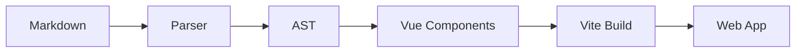
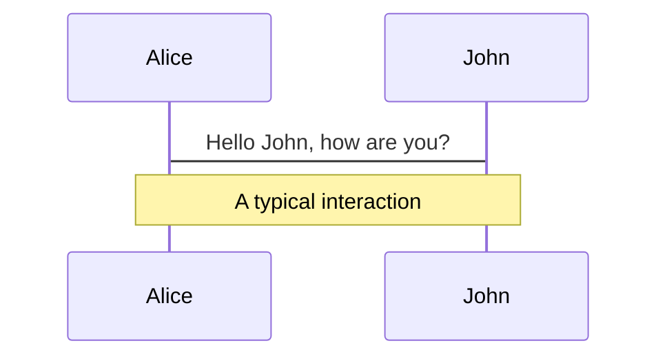
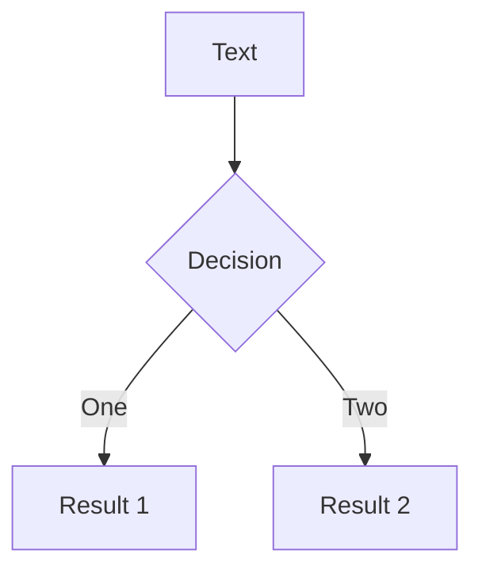
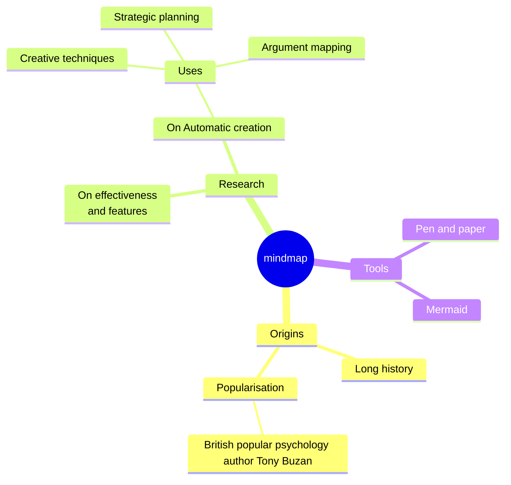
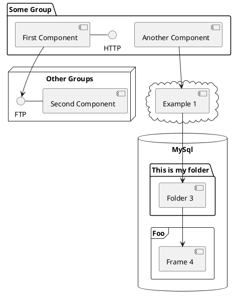

# Slidev 深度解析

## 架构、能力与扩展

<div class="pt-12">
  <span @click="$slidev.nav.next" class="px-2 py-1 rounded cursor-pointer" hover:bg="white hover:bg-opacity-10">
    基于源码分析的完整指南 <carbon:arrow-right class="inline"/>
  </span>
</div>

<div class="abs-br m-6 flex gap-2">
  <button @click="$slidev.nav.openInEditor()" title="Open in Editor" class="text-xl slidev-icon-btn opacity-50 !border-none !hover:text-white">
    <carbon:edit />
  </button>
  <a href="https://github.com/slidevjs/slidev" target="_blank" alt="GitHub" title="Open in GitHub" class="text-xl slidev-icon-btn opacity-50 !border-none !hover:text-white">
    <carbon:logo-github />
  </a>
</div>

<!--
欢迎来到 Slidev 深度解析！本次演示将基于 Slidev 源码，深入讲解其架构设计、核心能力和扩展机制。这将帮助您进行 Slidev 的二次开发和深度定制。
-->

---

## transition: fade-out

# 目录

<Toc maxDepth="1" />

<!--
本次演示包含六个主要部分：首先介绍 Slidev 的整体架构，然后深入分析核心包结构，接着讲解解析器机制，探讨客户端架构，介绍扩展机制，演示自动播放和语音功能的实现，讨论性能优化策略，最后进行总结与展望。
-->

---

layout: two-cols
layoutClass: gap-16

---

# Slidev 整体架构

## 🏗️ 核心设计理念

- **📝 Markdown 驱动** - 内容与样式分离
- **⚡ Vite 构建** - 现代化开发体验
- **🎨 Vue 3 渲染** - 组件化交互能力
- **🔧 插件化架构** - 高度可扩展性

## 🔄 工作流程



::right::

## 📦 包结构分析

```
packages/
├── slidev/          # CLI 主包
├── client/          # 前端客户端
├── parser/          # Markdown 解析器
├── types/           # TypeScript 类型定义
├── create-app/      # 项目脚手架
├── create-theme/    # 主题创建工具
└── vscode/          # VS Code 扩展
```

<div class="mt-8">
  <div class="text-sm opacity-70">
    基于 monorepo 架构，各包职责清晰分离
  </div>
</div>

<!--
Slidev 采用了现代化的架构设计。核心理念是 Markdown 驱动，让开发者专注于内容创作。整个系统基于 Vite 构建，提供快速的开发体验。使用 Vue 3 作为渲染引擎，支持组件化交互。采用插件化架构，具有高度的可扩展性。工作流程是从 Markdown 文件开始，通过解析器生成抽象语法树，然后转换为 Vue 组件，最后通过 Vite 构建成 Web 应用。
-->

---

## level: 2

# CLI 主包架构分析

## 📁 slidev/node 目录结构

```typescript
// packages/slidev/node/index.ts
export { createServer } from './commands/serve';
export * from './options';
export { parser } from './parser';
export { ViteSlidevPlugin } from './vite';
```

<div class="grid grid-cols-2 gap-8 mt-8">

<div>

### 🚀 服务器创建

```typescript
// commands/serve.ts
export async function createServer(
  options: ResolvedSlidevOptions,
  viteConfig: InlineConfig = {},
  serverOptions?: SlidevServerOptions
) {
  process.env.EDITOR = process.env.EDITOR || 'code';

  const inlineConfig = await resolveViteConfigs(
    options,
    viteConfig,
    'serve',
    serverOptions
  );

  return await createViteServer(inlineConfig);
}
```

</div>

<div>

### ⚙️ 核心特性

- **🔧 Vite 集成** - 基于 Vite 的开发服务器
- **📝 编辑器支持** - 默认集成 VS Code
- **🔄 热重载** - 实时预览更新
- **🎯 配置解析** - 灵活的配置系统

</div>

</div>

<!--
CLI 主包是 Slidev 的核心入口。它导出了服务器创建函数、配置选项、解析器和 Vite 插件。服务器创建函数基于 Vite 构建，支持热重载和实时预览。默认集成了 VS Code 编辑器支持。配置系统非常灵活，可以根据不同的使用场景进行定制。
-->

---

## level: 2

# Slidev 核心特性

Slidev 是为开发者设计的幻灯片制作和演示工具，具有以下特性：

- 📝 **基于文本** - 专注于 Markdown 内容创作，后续再进行样式设计
- 🎨 **主题化** - 主题可以作为 npm 包共享和重复使用
- 🧑‍💻 **开发者友好** - 代码高亮、实时编码与自动补全
- 🤹 **交互式** - 嵌入 Vue 组件增强表达能力
- 🎥 **录制功能** - 内置录制和摄像头视图
- 📤 **便携性** - 导出为 PDF、PPTX、PNG 或可托管的 SPA
- 🛠 **可扩展** - 网页上可能的任何功能在 Slidev 中都可以实现
  <br>
  <br>

了解更多 [为什么选择 Slidev？](https://sli.dev/guide/why)

<!--
您可以在 markdown 中使用 `style` 标签来覆盖当前页面的样式。
了解更多：https://sli.dev/features/slide-scope-style
-->

<style>
h1 {
  background-color: #2B90B6;
  background-image: linear-gradient(45deg, #4EC5D4 10%, #146b8c 20%);
  background-size: 100%;
  -webkit-background-clip: text;
  -moz-background-clip: text;
  -webkit-text-fill-color: transparent;
  -moz-text-fill-color: transparent;
}
</style>

<!--
这是另一个注释。
-->

---

transition: slide-up
level: 2

---

# 导航

将鼠标悬停在左下角查看导航控制面板，[了解更多](https://sli.dev/guide/ui#navigation-bar)

## 键盘快捷键

|                                                    |                    |
| -------------------------------------------------- | ------------------ |
| <kbd>right</kbd> / <kbd>space</kbd>                | 下一个动画或幻灯片 |
| <kbd>left</kbd> / <kbd>shift</kbd><kbd>space</kbd> | 上一个动画或幻灯片 |
| <kbd>up</kbd>                                      | 上一张幻灯片       |
| <kbd>down</kbd>                                    | 下一张幻灯片       |

<!-- https://sli.dev/guide/animations.html#click-animation -->


<p v-after class="absolute bottom-23 left-45 opacity-30 transform -rotate-10">Here!</p>

---

layout: two-cols
layoutClass: gap-16

---

# 目录

您可以使用 `Toc` 组件为您的幻灯片生成目录：

```html
<Toc minDepth="1" maxDepth="1" />
```

标题将从您的幻灯片内容中推断，或者您可以在 frontmatter 中使用 `title` 和 `level` 覆盖它。

::right::

<Toc text-sm minDepth="1" maxDepth="2" />

---

layout: image-right
image: https://cover.sli.dev

---

# 代码

使用代码片段并直接获得高亮显示，甚至还有类型悬停！

```ts [filename-example.ts] {all|4|6|6-7|9|all} twoslash
// TwoSlash enables TypeScript hover information
// and errors in markdown code blocks
// More at https://shiki.style/packages/twoslash
import { computed, ref } from 'vue';

const count = ref(0);
const doubled = computed(() => count.value * 2);

doubled.value = 2;
```

<arrow v-click="[4, 5]" x1="350" y1="310" x2="195" y2="342" color="#953" width="2" arrowSize="1" />

<!-- This allow you to embed external code blocks -->

<<< @/snippets/external.ts#snippet

<!-- Footer -->

[Learn more](https://sli.dev/features/line-highlighting)

<!-- Inline style -->
<style>
.footnotes-sep {
  @apply mt-5 opacity-10;
}
.footnotes {
  @apply text-sm opacity-75;
}
.footnote-backref {
  display: none;
}
</style>

<!--
Notes can also sync with clicks

[click] This will be highlighted after the first click

[click] Highlighted with `count = ref(0)`

[click:3] Last click (skip two clicks)
-->

---

## level: 2

# Shiki Magic Move

由 [shiki-magic-move](https://shiki-magic-move.netlify.app/) 提供支持，Slidev 支持跨多个代码片段的动画效果。

添加多个代码块并用 <code>````md magic-move</code>（四个反引号）包装它们以启用魔法移动效果。例如：

````md magic-move {lines: true}
```ts {*|2|*}
// step 1
const author = reactive({
  name: 'John Doe',
  books: [
    'Vue 2 - Advanced Guide',
    'Vue 3 - Basic Guide',
    'Vue 4 - The Mystery',
  ],
});
```

```ts {*|1-2|3-4|3-4,8}
// step 2
export default {
  data() {
    return {
      author: {
        name: 'John Doe',
        books: [
          'Vue 2 - Advanced Guide',
          'Vue 3 - Basic Guide',
          'Vue 4 - The Mystery',
        ],
      },
    };
  },
};
```

```ts
// step 3
export default {
  data: () => ({
    author: {
      name: 'John Doe',
      books: [
        'Vue 2 - Advanced Guide',
        'Vue 3 - Basic Guide',
        'Vue 4 - The Mystery',
      ],
    },
  }),
};
```

非代码块将被忽略。

```vue
<!-- step 4 -->
<script setup>
const author = {
  name: 'John Doe',
  books: [
    'Vue 2 - Advanced Guide',
    'Vue 3 - Basic Guide',
    'Vue 4 - The Mystery',
  ],
};
</script>
```
````

---

# 组件

<div grid="~ cols-2 gap-4">
<div>

您可以在幻灯片中直接使用 Vue 组件。

我们提供了一些内置组件，如 `<Tweet/>` 和 `<Youtube/>`，您可以直接使用。添加自定义组件也非常简单。

```html
<Counter :count="10" />
```

<!-- ./components/Counter.vue -->
<Counter :count="10" m="t-4" />

查看 [指南](https://sli.dev/builtin/components.html) 了解更多。

</div>
<div>

```html
<Tweet id="1390115482657726468" />
```

<Tweet id="1390115482657726468" scale="0.65" />

</div>
</div>

<!--
Presenter note with **bold**, *italic*, and ~~striked~~ text.

Also, HTML elements are valid:
<div class="flex w-full">
  <span style="flex-grow: 1;">Left content</span>
  <span>Right content</span>
</div>
-->

---

## class: px-20

# Themes

Slidev 拥有强大的主题支持。主题可以提供样式、布局、组件，甚至工具的配置。只需在 frontmatter 中进行 **一次编辑** 即可切换主题：

<div grid="~ cols-2 gap-2" m="t-2">

```yaml
---
theme: default
---
```

```yaml
---
theme: seriph
---
```


</div>

了解更多关于 [如何使用主题](https://sli.dev/guide/theme-addon#use-theme) 以及
查看 [精彩主题画廊](https://sli.dev/resources/theme-gallery)。

---

# 点击动画

您可以为元素添加 `v-click` 来添加点击动画。

<div v-click>

点击幻灯片时显示：

```html
<div v-click>点击幻灯片时显示。</div>
```

</div>

<br>

<v-click>

<span v-mark.red="3"><code>v-mark</code> 指令</span>
还允许您添加
<span v-mark.circle.orange="4">内联标记</span>
，由 [Rough Notation](https://roughnotation.com/) 提供支持：

```html
<span v-mark.underline.orange>内联标记</span>
```

</v-click>

<div mt-20 v-click>

[了解更多](https://sli.dev/guide/animations#click-animation)

</div>

---

# 动画

动画效果由 [@vueuse/motion](https://motion.vueuse.org/) 提供支持，通过 `v-motion` 指令触发。

```html
<div
  v-motion
  :initial="{ x: -80 }"
  :enter="{ x: 0 }"
  :click-3="{ x: 80 }"
  :leave="{ x: 1000 }"
>
  Slidev
</div>
```

<div class="w-60 relative">
  <div class="relative w-40 h-40">
    
    
    
  </div>

  <div
    class="text-5xl absolute top-14 left-40 text-[#2B90B6] -z-1"
    v-motion
    :initial="{ x: -80, opacity: 0}"
    :enter="{ x: 0, opacity: 1, transition: { delay: 2000, duration: 1000 } }">
    Slidev
  </div>
</div>

<!-- vue script setup scripts can be directly used in markdown, and will only affects current page -->
<script setup lang="ts">
const final = {
  x: 0,
  y: 0,
  rotate: 0,
  scale: 1,
  transition: {
    type: 'spring',
    damping: 10,
    stiffness: 20,
    mass: 2
  }
}
</script>

<div
  v-motion
  :initial="{ x:35, y: 30, opacity: 0}"
  :enter="{ y: 0, opacity: 1, transition: { delay: 3500 } }">

[了解更多](https://sli.dev/guide/animations.html#motion)

</div>

---

# LaTeX

LaTeX 开箱即用。由 [KaTeX](https://katex.org/) 提供支持。

<div h-3 />

Inline $\sqrt{3x-1}+(1+x)^2$

Block

$$
{1|3|all}
\begin{aligned}
\nabla \cdot \vec{E} &= \frac{\rho}{\varepsilon_0} \\
\nabla \cdot \vec{B} &= 0 \\
\nabla \times \vec{E} &= -\frac{\partial\vec{B}}{\partial t} \\
\nabla \times \vec{B} &= \mu_0\vec{J} + \mu_0\varepsilon_0\frac{\partial\vec{E}}{\partial t}
\end{aligned}
$$

[了解更多](https://sli.dev/features/latex)

<!--
adni
-->

---

# 图表

您可以从文本描述直接在 Markdown 中创建图表/图形。

<div class="grid grid-cols-4 gap-5 pt-4 -mb-6">









</div>

了解更多：[Mermaid 图表](https://sli.dev/features/mermaid) 和 [PlantUML 图表](https://sli.dev/features/plantuml)

---

foo: bar
dragPos:
square: 691,32,167,\_,-16

---

dragPos:
square: 0,0,0,0

---

dragPos:
square: -13,-105,0,0

---

dragPos:
square: 0,0,0,0

---

dragPos:
square: -13,-105,0,0

---

dragPos:
square: 0,0,0,0

---
dragPos:
  square: 0,-84,0,0
---

# 可拖拽元素

双击可拖拽元素来编辑它们的位置。

<br>

###### Directive Usage

```md

```

<br>

###### Component Usage

```md
<v-drag text-3xl>
  <div class="i-carbon:arrow-up" />
  使用 `v-drag` 组件来创建可拖拽的容器！
</v-drag>
```

<v-drag pos="551,205,261,_,-15">
  <div text-center text-3xl border border-main rounded>
    双击我！
  </div>
</v-drag>


###### Draggable Arrow

```md
<v-drag-arrow two-way />
```

<v-drag-arrow pos="130,458,406,-23" two-way op70 />

---

src: ./pages/imported-slides.md
hide: false

---


---

# Monaco 编辑器

Slidev 提供内置的 Monaco 编辑器支持。

将 `{monaco}` 添加到代码块中以将其转换为编辑器：

```ts {monaco}
import { ref } from 'vue';
import { emptyArray } from './external';

const arr = ref(emptyArray(10));
```

使用 `{monaco-run}` 创建一个可以在幻灯片中直接执行代码的编辑器：

```ts {monaco-run}
import { version } from 'vue';
import { emptyArray, sayHello } from './external';

sayHello();
console.log(`vue ${version}`);
console.log(
  emptyArray<number>(10).reduce(
    (fib) => [...fib, fib.at(-1)! + fib.at(-2)!],
    [1, 1]
  )
);
```

---

layout: two-cols
layoutClass: gap-16

---

# 目录

您可以使用 `Toc` 组件为您的幻灯片生成目录：

```html
<Toc minDepth="1" maxDepth="1" />
```

---

# 🎨 Slidev 插件演示

## 已安装的插件展示

本演示展示了三个实用的 Slidev 插件：

- **slidev-addon-card** - 精美卡片组件
- **slidev-addon-watermark** - 水印功能
- **slidev-addon-demotime** - 演示时间管理

让我们逐一体验这些插件的功能！

<div class="mt-8">
  <span @click="$slidev.nav.next" class="px-2 py-1 rounded cursor-pointer" hover:bg="white hover:bg-opacity-10">
    开始插件演示 <carbon:arrow-right class="inline"/>
  </span>
</div>

---

src: ./pages/工具调用.md
