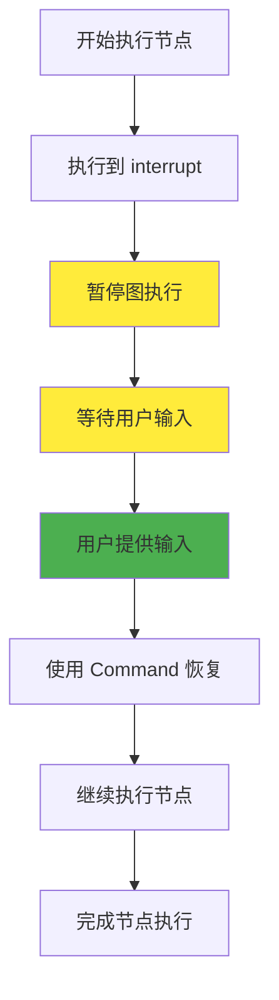
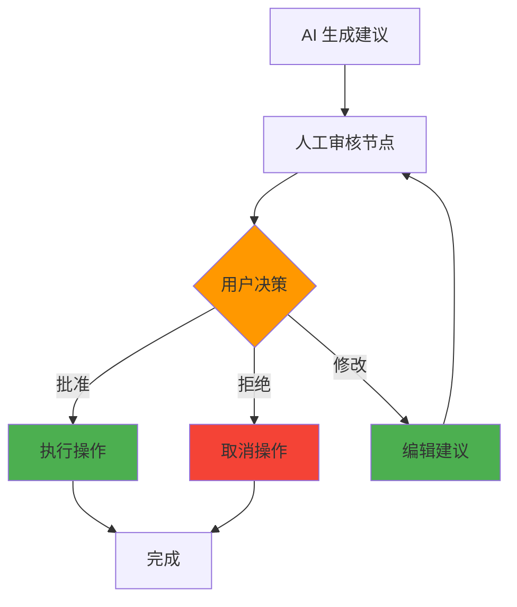
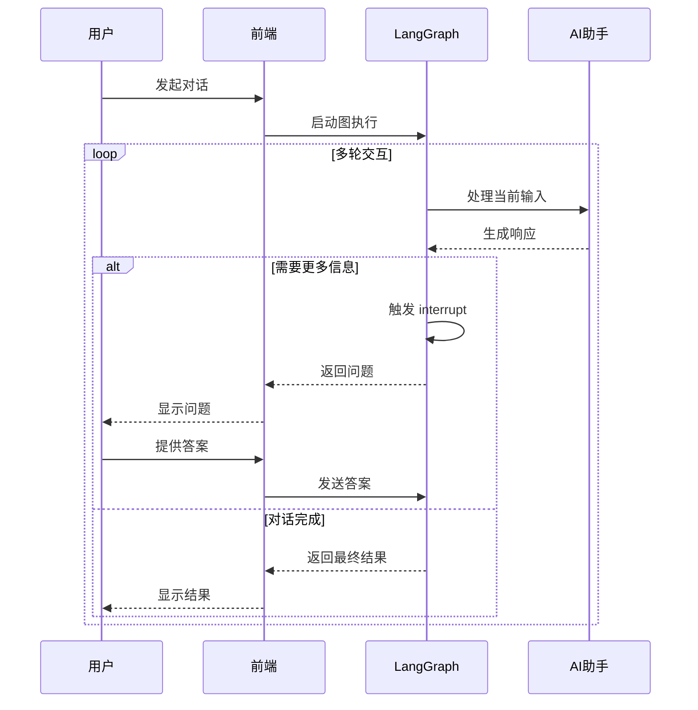

# 🤝 人机交互

## LangGraphJS 中的 Human-in-the-Loop 技术

<div class="pt-12">
  <span class="px-2 py-1 rounded bg-teal-600 text-white">
    构建可靠的 AI 应用
  </span>
</div>

<!--
大家好，我是程哥。
欢迎大家来到今天的 LangGraphJS 技术分享会。

今天我要和大家分享的主题是：
人机交互技术。
在 AI 应用开发中，这是一个非常重要的话题。

我们先来思考一个问题：
为什么我们需要人机交互呢？
在现代 AI 应用开发中，
我们经常会遇到一个关键挑战。

完全自动化的系统并不总是最佳选择。

为什么呢？
因为在很多实际应用场景中，
我们都需要在关键决策点引入人工干预。

这样才能确保系统的可靠性，
还有操作的准确性。

这就是为什么我们需要学习 Human-in-the-Loop 技术。
它将帮助我们构建更加可靠的 AI 应用。

通过今天的学习，大家会掌握这项核心技术的使用方法，
让我们开始今天的精彩内容。
-->

---
layout: default
---

# 📋 目录

## 本次分享内容

1. **人机交互引言** - 为什么需要人工干预
2. **核心概念** - interrupt 函数的工作原理
3. **四种设计模式** - 审批、编辑、审核、对话
4. **Command 对象** - 恢复执行的关键技术
5. **实践指导** - 输入验证与前端集成
6. **最佳实践** - 避免陷阱，提升体验
7. **常见问题** - 实际应用中的挑战

<div v-click class="mt-8 p-4 bg-blue-100 rounded-lg">
  <p>💡 <strong>目标：</strong>掌握在 AI 应用中合理引入人机交互的技术</p>
</div>

<!--

接下来，让我为大家介绍一下今天分享的整体结构。

今天的内容设计得非常系统，
我们会从最基础的概念开始，
逐步深入到实际的代码实现和应用场景。

首先我们会了解人机交互的引言，
探讨为什么我们需要人工干预这个话题。

这部分内容会帮助我们建立对技术的整体认知。

然后我们会深入核心概念，
学习 interrupt 函数的工作原理。
这是整个技术的基础。

接着，我会向大家介绍四种核心的设计模式：
审批、编辑、审核和对话。

这些模式都是实际开发中最常用的解决方案。

之后我们会学习 Command 对象技术，
这是恢复执行的关键技术。

掌握了它，我们就能真正实现复杂的人机交互逻辑。

最后，我们会探讨实践指导、最佳实践和常见问题。
这些内容会帮助大家在项目中少走弯路。

通过今天的学习，我希望大家能够掌握，
在 AI 应用中合理引入人机交互的核心技术。

从而构建出更加可靠和可控的 AI 应用系统。

我们的目标是：让大家听完就能用，用了就有效。
-->

---
layout: default
---

# 🎯 引言：为什么需要人机交互？

## 现实场景中的挑战

<div grid="~ cols-2 gap-4">
<div>

### 前端开发的启示
- 删除数据前的确认对话框 ✅
- 表单提交前的数据验证 ✅
- 复杂操作的分步引导 ✅

</div>
<div>

### AI 应用的需求
- **准确性保障** - LLM 输出需要验证
- **安全性控制** - 敏感操作需要审批
- **用户体验** - 参与决策提高信任
- **灵活性** - 根据情况调整路径

</div>
</div>

<div v-click class="mt-6 p-4 bg-yellow-100 rounded-lg">
  <p>⚠️ <strong>核心问题：</strong>完全自动化的 AI 系统在关键决策点上可能产生不可靠的结果</p>
</div>

<!--

让我们先思考一个很基础的问题：
为什么我们需要人机交互？

其实在我们日常的前端开发中，
早就习惯了各种确认和验证机制，对吧？

比如删除数据前的确认对话框，
比如表单提交前的数据验证，
比如复杂操作的分步引导。

这些都是我们习以为常的用户体验设计。


那当这些概念应用到 AI 应用中时，
人机交互就解决了四个关键问题：

首先是准确性保障，
LLM 的输出确实需要人来验证。
AI 可能会出错，人的判断很重要。

其次是安全性控制，
敏感操作必须要有审批环节。
这就像银行转账需要确认一样。

然后是用户体验，
让用户参与决策过程能提高信任度。
用户会更相信自己有控制权的系统。

最后是灵活性，
根据实际情况动态调整执行路径。
世界是复杂的，AI 需要人的指导。

核心问题是：
完全自动化的 AI 系统，
在关键决策点上，
可能产生我们无法预料的不可靠结果。

这就是为什么我们需要人机交互技术。
它不是倒退，而是为了更好的前进。
-->

---
layout: center
---

# 🔧 核心概念：interrupt 函数

<div class="text-6xl mt-8">
  <span class="text-blue-600">interrupt</span>
  <span class="text-gray-400 mx-2">+</span>
  <span class="text-green-600">Command</span>
</div>

<div v-click class="mt-8 text-xl">
  <p>暂停图执行 → 等待用户输入 → 恢复继续执行</p>
</div>

<!--

现在让我们深入了解人机交互的核心机制。

这里的核心就是两个关键概念：
interrupt 函数和 Command 对象。

大家可以把 interrupt 函数，
想象成我们非常熟悉的 await 操作。

它能够在图执行的过程中，
暂停当前的执行流程，
等待外部输入之后再继续执行。

这种机制给了我们精确的控制能力，
让我们在最需要的时候引入人工干预。

而 Command 对象呢，
则是我们恢复执行的关键工具，
它不仅能够传递用户输入，
还能控制执行流程。

这两个概念的组合，
就是 LangGraphJS 人机交互的技术基础。

简单来说：
interrupt 负责暂停，
Command 负责恢复。

一个负责"等一等"，
一个负责"继续走"。

这就是人机交互最核心的工作原理。
-->

---
layout: default
---

# 🔄 interrupt 工作流程

## 执行过程可视化



<div v-click class="mt-4 text-center">
  <p class="text-lg">🟡 暂停状态 → 🟢 用户输入 → 🔵 继续执行</p>
</div>


<!--

这个流程图很直观地展示了 interrupt 的完整工作过程。

让我来给大家详细讲解一下：

首先，图开始执行节点，
这是正常的工作流程。

当执行到 interrupt 函数时，
神奇的事情发生了：
图会自动暂停执行。


这时候系统进入了等待状态，
就像我们程序中的 await 一样，
等待着外部输入。

用户在前端界面上提供了输入之后，
我们使用 Command 对象来恢复执行。

恢复之后，图会继续执行当前节点的剩余部分，
然后完成这个节点的执行。


整个过程可以用三个阶段来概括：
黄色表示暂停状态，
绿色表示用户输入，
蓝色表示继续执行。

这是一个非常直观和可控的机制，
对吧？

它让我们能够在最合适的时机，
插入人工判断和决策。

这就是人机交互的核心优势：
暂停、等待、继续，完美控制。
-->

---
layout: default
---

# 📝 基本使用方式

## 核心代码示例

```typescript {monaco-run}
import { Annotation, StateGraph } from "@langchain/langgraph";
import { interrupt, Command } from "@langchain/langgraph";
import { MemorySaver } from "@langchain/langgraph/checkpoint/memory";

// 定义状态
const State = Annotation.Root({
  approved: Annotation<boolean>({ default: () => false }),
});

// 节点：暂停等待用户确认
async function reviewNode(state: typeof State.State) {
  const userInput = await interrupt({
    type: "confirm",
    message: "确认继续？"
  });
  return { approved: userInput === true };
}

// 构建图
const graph = new StateGraph(State)
  .addNode("review", reviewNode)
  .addEdge("__start__", "review");

// 启用检查点与线程 ID
const checkpointer = new MemorySaver();
const app = graph.compile({ checkpointer });
const thread = { configurable: { thread_id: "demo-thread" } };

// 第一次调用：触发 interrupt 并暂停
await app.invoke({}, thread);

// 收到前端用户输入后恢复执行
await app.invoke(new Command({ resume: true }), thread);
```


<!--

现在让我们看看 interrupt 的基本使用方式。

这段代码展示了一个完整的工作流程，
我会逐行为大家讲解：

首先，我们导入了必要的模块，
包括 Annotation、StateGraph、interrupt 和 Command。

然后我们定义了状态，
这里只有一个 approved 字段，
用来记录用户是否确认。

接下来是核心的 reviewNode 节点：
我们使用 interrupt 函数创建了一个确认对话框，
询问用户是否继续操作。


注意这里的类型是 "confirm"，
这会让前端显示一个确认框而不是输入框。

用户的选择会作为返回值，
我们根据返回值设置 approved 状态。

然后我们构建图，
添加 reviewNode 节点并连接到开始。

最重要的部分在这里：
我们必须配置 checkpointer 检查点保存器，
这是 interrupt 功能正常工作的前提。

同时还需要提供线程 ID 来标识会话。

最后是调用的两个步骤：
第一次调用会触发 interrupt 并暂停，
第二次调用使用 Command 对象恢复执行。


这就是人机交互的基础模式。
大家记住这个模式：
触发 interrupt，等待用户输入，用 Command 恢复。

掌握了这个模式，就能开始构建更复杂的应用了。
-->

---
layout: default
---

# ⚙️ 技术要求

## 必要条件

<div class="grid grid-cols-3 gap-4 mt-6">
  <div v-click class="p-4 bg-blue-100 rounded-lg text-center">
    <div class="text-3xl mb-2">💾</div>
    <h3 class="font-bold">Checkpointer</h3>
    <p class="text-sm mt-2">必须配置检查点保存器来保存图状态</p>
  </div>

  <div v-click class="p-4 bg-green-100 rounded-lg text-center">
    <div class="text-3xl mb-2">🧵</div>
    <h3 class="font-bold">Thread ID</h3>
    <p class="text-sm mt-2">需要使用线程 ID 来标识会话</p>
  </div>

  <div v-click class="p-4 bg-purple-100 rounded-lg text-center">
    <div class="text-3xl mb-2">🎮</div>
    <h3 class="font-bold">Command 对象</h3>
    <p class="text-sm mt-2">使用 Command 对象来恢复执行</p>
  </div>
</div>

<div v-click class="mt-6 p-4 bg-red-100 rounded-lg">
  <p>⚠️ <strong>重要：</strong>缺少任何一个条件，interrupt 功能都无法正常工作</p>
</div>


<!--

使用 interrupt 功能需要满足三个必要条件，
缺一不可，这一点非常重要！

第一个必要条件是 Checkpointer 检查点保存器。

它负责保存图的状态，
包括节点的执行情况、变量的值等等。

当图暂停时，所有状态都会被保存，
这样恢复时才能从正确的位置继续执行。

第二个必要条件是 Thread ID 线程 ID。

线程 ID 用来标识不同的会话，
想象一下，如果多个用户同时使用同一个应用，
我们需要区分不同用户的状态，对吧？

线程 ID 就是用来做这个区分的。

第三个必要条件是 Command 对象。

这是我们用来恢复执行的关键工具，
它能传递用户的输入给暂停的图。

这三个组件必须协同工作，
确保状态的正确保存和恢复。


缺少任何一个，interrupt 功能都无法正常工作。

所以在实际开发中，一定要记得检查这三个条件是否都满足了。

记住这个口诀：
检查点要配好，线程ID不能少，Command对象传信息。
-->

---
layout: default
---

# 🎨 设计模式 1：审批流程

## 最常见的人机交互模式



<div v-click class="mt-4">
  <p class="text-lg">💡 <strong>适用场景：</strong>重要操作前的审核确认</p>
</div>


<!--

接下来我们要介绍第一种，也是最常见的设计模式：
审批流程。

审批流程在现实生活中随处可见，
从公司的报销审批到银行的贷款审批，
都是这种模式的应用。

在我们的 AI 应用中，审批流程的工作原理是这样的：

首先，AI 会生成一些建议或方案。
这可能是数据分析的结果，
也可能是自动生成的文档草稿。

然后，这些建议会进入人工审核节点。
在这个节点中，系统会暂停执行，
等待人工干预。


用户有三种选择：
批准、拒绝或者修改。

如果用户选择批准，
系统就会执行相应的操作。

如果用户选择拒绝，
操作就会被取消。

如果用户选择修改，
用户可以编辑建议的内容，
然后再次进入审核环节。

这种模式最大的优点是：
它确保了重要操作的准确性和安全性。

特别适合那些需要严格控制的场景，
比如金融交易、内容发布、数据删除等操作。

记住：关键操作必须有人审核，
这样既能发挥 AI 的效率，又能保证人工的准确性。
-->

---
layout: two-cols
---

# 📝 审批流程实现

```typescript {monaco}
import { Annotation, StateGraph } from "@langchain/langgraph";
import { interrupt, Command } from "@langchain/langgraph";
import { MemorySaver } from "@langchain/langgraph/checkpoint/memory";

type Decision = "approve" | "reject" | "modify";

const State = Annotation.Root({
  draft: Annotation<string>({ default: () => "AI 生成的建议" }),
  status: Annotation<Decision | null>({ default: () => null }),
});

async function humanGate(state: typeof State.State) {
  const choice = await interrupt({
    type: "choice",
    question: "是否批准此操作？",
    options: [
      { id: "approve", label: "批准" },
      { id: "reject", label: "拒绝" },
      { id: "modify", label: "修改" },
    ],
    context: state.draft,
  });
  return { status: choice as Decision };
}

function applyDecision(state: typeof State.State) {
  if (state.status === "approve") {
    // 执行批准后的动作
  }
  return {};
}

const graph = new StateGraph(State)
  .addNode("humanGate", humanGate)
  .addNode("applyDecision", applyDecision)
  .addEdge("__start__", "humanGate")
  .addEdge("humanGate", "applyDecision");

const app = graph.compile({ checkpointer: new MemorySaver() });
const thread = { configurable: { thread_id: "approval" } };

await app.invoke({}, thread); // 暂停等待用户选择
await app.invoke(new Command({ resume: "approve" }), thread);
```

::right::

<div v-click class="p-4 bg-blue-100 rounded-lg mt-8">
  <h3 class="font-bold mb-2">🎯 关键特性</h3>
  <ul>
    <li>多种选择选项</li>
    <li>上下文信息展示</li>
    <li>状态跟踪</li>
    <li>条件分支执行</li>
  </ul>
</div>

<div v-click class="p-4 bg-green-100 rounded-lg mt-4">
  <h3 class="font-bold mb-2">✅ 最佳实践</h3>
  <ul>
    <li>提供清晰的操作说明</li>
    <li>显示相关上下文信息</li>
    <li>支持撤销和修改</li>
  </ul>
</div>


<!--

现在我们来看审批流程的具体实现。

左边的代码展示了完整的实现过程，
让我重点讲解几个关键部分：

首先，我们定义了 Decision 类型，
包含 approve、reject、modify 三种选择。

状态中包含了 draft 草稿内容，
还有 status 状态来记录用户的选择。


核心的 humanGate 节点使用了 interrupt，
类型是 "choice"，这会显示一个选择界面。

注意我们传递了 options 数组，
里面包含了每个选项的 id 和 label。

还包含了 context 参数，
这样用户在做决定时能看到相关的背景信息。


右边的特性总结提到了这种模式的优势：

多种选择选项让用户有更大的灵活性，
上下文信息展示帮助用户做出明智决定，
状态跟踪让我们了解每个步骤的执行情况，
条件分支执行确保不同选择有不同的处理逻辑。

最佳实践也很重要：
提供清晰的操作说明，
显示相关的上下文信息，
支持撤销和修改功能。

这些实践能显著提升用户体验。


通过 interrupt，我们确实可以创建非常灵活的审批机制，
让用户在关键决策点上发挥重要作用。

这就是技术与用户体验的完美结合。
-->

---
layout: default
---

# ✏️ 设计模式 2：内容编辑

## 允许用户完善 AI 生成的内容

```typescript {monaco}
import { Annotation, StateGraph } from "@langchain/langgraph";
import { interrupt, Command } from "@langchain/langgraph";
import { MemorySaver } from "@langchain/langgraph/checkpoint/memory";

const State = Annotation.Root({
  content: Annotation<string>({ default: () => "初稿内容" }),
});

async function editNode(state: typeof State.State) {
  const edited = await interrupt({
    type: "text_edit",
    label: "请编辑内容",
    value: state.content,
  });
  return { content: String(edited) };
}

const app = new StateGraph(State)
  .addNode("edit", editNode)
  .addEdge("__start__", "edit")
  .compile({
    checkpointer: new MemorySaver(),
  });

const thread = { configurable: { thread_id: "edit-flow" } };

await app.invoke({}, thread); // 暂停等待编辑
await app.invoke(new Command({ resume: "修改后的内容" }), thread);
```

<div v-click class="mt-4 p-4 bg-yellow-100 rounded-lg">
  <p>💡 <strong>使用场景：</strong>文档编辑、代码优化、内容润色</p>
</div>


<!--

接下来是第二种设计模式：内容编辑。

这种模式非常实用，特别是在内容创作领域。

内容编辑模式的核心思想是：
让用户可以直接修改和完善 AI 生成的内容。

想象一下这样的场景：
AI 帮你写了一份报告初稿，
但可能有些地方需要调整，
或者 AI 生成了代码，但需要优化某些部分。

这时候，内容编辑模式就派上用场了。


我们来看代码实现：

状态结构很简单，只有一个 content 字段，
用来存储编辑的内容。

editNode 节点使用了 interrupt，
类型是 "text_edit"，
这会让前端显示一个可编辑的文本框。

注意这里传递了 value 参数，
里面是 AI 生成的初稿内容。

用户编辑完成后，
修改后的内容会通过 Command 对象传回来。


这种模式特别适合需要人工精细调整的场景：

比如文档编辑，
AI 可能写出了基本框架，
但需要人工润色语言风格。

比如代码优化，
AI 生成了基础实现，
但需要人工优化性能或可读性。

比如内容润色，
AI 提供了初稿，
但需要人工调整语调和表达方式。


通过 interrupt，我们实现了完美的编辑流程：
暂停执行 → 用户编辑 → 恢复执行，
整个过程流畅自然。

AI 负责初稿，人工负责优化，
这就是最佳的内容创作模式。
-->

---
layout: default
---

# 🔍 设计模式 3：工具调用审核

## 在执行敏感操作前获得确认

```typescript {monaco}
import { Annotation, StateGraph } from "@langchain/langgraph";
import { interrupt, Command } from "@langchain/langgraph";
import { MemorySaver } from "@langchain/langgraph/checkpoint/memory";

const State = Annotation.Root({
  toolCall: Annotation<{ name: string; args: unknown } | null>({ default: () => null }),
  allow: Annotation<boolean>({ default: () => false }),
});

async function reviewTool(state: typeof State.State) {
  const decision = await interrupt({
    type: "confirm",
    message: `是否允许调用工具: ${(state.toolCall?.name) ?? "unknown"}?`,
  });
  return { allow: decision === true };
}

function maybeCallTool(state: typeof State.State) {
  if (state.allow && state.toolCall) {
    // 在此处调用实际工具
    console.log(`执行工具: ${state.toolCall.name}`);
  }
  return {};
}

const graph = new StateGraph(State)
  .addNode("reviewTool", reviewTool)
  .addNode("maybeCallTool", maybeCallTool)
  .addEdge("__start__", "reviewTool")
  .addEdge("reviewTool", "maybeCallTool");

const app = graph.compile({ checkpointer: new MemorySaver() });
const thread = { configurable: { thread_id: "tool-review" } };

await app.invoke({
  toolCall: { name: "deleteUser", args: { id: 1 } }
}, thread);
await app.invoke(new Command({ resume: true }), thread);
```


<!--

第三种设计模式是工具调用审核，
这是一个非常重要的安全机制。

工具调用审核模式确保了敏感操作的安全性。

想象一下这个场景：
AI 助手决定要调用一个删除用户的工具，
或者修改系统权限的工具，
这些操作都是不可逆的。

如果让 AI 自动执行这些操作，
可能会造成严重的后果。


所以我们需要在执行这些工具之前，
引入人工审核环节。

我们来看代码实现：

状态中包含 toolCall 信息，
记录要调用的工具名称和参数，
还有 allow 字段记录用户是否允许。

reviewTool 节点使用 interrupt 显示确认对话框，
消息中包含了要调用的工具名称，
让用户明确知道将要执行什么操作。

maybeCallTool 节点检查 allow 字段，
只有在用户允许的情况下才会真正调用工具。


这种模式的工作流程是：
1. AI 决定调用某个工具
2. 系统暂停并显示工具信息
3. 用户确认是否允许
4. 根据用户决定执行或取消

这种模式特别适合涉及以下操作的场景：

数据修改操作：
比如删除记录、修改数据等

权限变更操作：
比如修改用户权限、分配资源等

系统配置操作：
比如更改系统设置、启用功能等


通过这个审核机制，
我们可以有效防止 AI 误操作，
确保系统的安全性和稳定性。

记住：权限再小也要审核，
操作再简单也要确认。
-->

---
layout: default
---

# 💬 设计模式 4：多轮对话

## 构建连续的交互式体验




<!--

第四种设计模式是多轮对话，
这是最能体现 AI 智能交互能力的模式。

多轮对话模式支持连续的用户交互，
构建真正的对话式体验。

想象一下你在和客服助手对话的场景：
你说："帮我订一张机票"
助手问："好的，请问出发城市是哪里？"
你说："上海"
助手又问："目的地是哪里？"
你回答："北京"

这种一来一回的对话，
就是多轮交互的典型例子。


在 AI 应用中，
当 AI 需要更多信息才能完成任务时，
可以通过 interrupt 向用户提问。

用户回答后，对话会继续进行，
直到任务完成。


流程图展示了这种模式的工作机制：

用户发起对话，前端启动图执行。
AI 处理当前输入并生成响应。

如果需要更多信息，AI 会触发 interrupt，
向前端返回问题。
前端显示问题，等待用户回答。

用户提供答案后，前端发送给 LangGraph，
AI 继续处理对话。

如果对话完成，返回最终结果。

这种模式特别适合以下场景：

客服机器人：
需要逐步了解用户的问题，
提供有针对性的解决方案。

任务助手：
帮助用户完成复杂任务，
需要收集多个参数和信息。

信息收集：
在表单填写过程中逐步收集信息，
比一次性填写所有字段更友好。

引导式操作：
像向导一样引导用户完成操作，
降低学习成本和使用门槛。


通过 interrupt 实现的多轮对话，
让 AI 能够像人类助手一样，
与用户进行自然流畅的交流。

这就是真正的智能对话体验！
-->

---
layout: two-cols
---

# 💬 多轮对话实现

```typescript {monaco}
import { Annotation, StateGraph } from "@langchain/langgraph";
import { interrupt, Command } from "@langchain/langgraph";
import { MemorySaver } from "@langchain/langgraph/checkpoint/memory";

type Msg = { role: "user" | "assistant"; content: string };

const State = Annotation.Root({
  messages: Annotation<Msg[]>({ default: () => [] }),
});

async function assistant(state: typeof State.State) {
  const last = state.messages[state.messages.length - 1];
  if (!last || last.role === "assistant") return {};

  // 假设需要更多信息
  const followup = await interrupt({
    type: "question",
    message: "请提供更多细节以继续",
  });

  return {
    messages: [{ role: "assistant", content: String(followup) }]
  } as any;
}

const app = new StateGraph(State)
  .addNode("assistant", assistant)
  .addEdge("__start__", "assistant")
  .compile({
    checkpointer: new MemorySaver(),
  });

const thread = { configurable: { thread_id: "multi-turn" } };

await app.invoke({
  messages: [{ role: "user", content: "帮我订机票" }]
}, thread);
await app.invoke(new Command({ resume: "出发城市是上海" }), thread);
```

::right::

<div v-click class="p-4 bg-purple-100 rounded-lg mt-8">
  <h3 class="font-bold mb-2">🎯 应用场景</h3>
  <ul>
    <li>客服机器人</li>
    <li>任务助手</li>
    <li>信息收集</li>
    <li>引导式操作</li>
  </ul>
</div>

<div v-click class="p-4 bg-orange-100 rounded-lg mt-4">
  <h3 class="font-bold mb-2">💡 核心优势</h3>
  <ul>
    <li>自然对话流程</li>
    <li>上下文保持</li>
    <li>渐进式信息收集</li>
    <li>用户友好体验</li>
  </ul>
</div>

<!--

现在我们来看多轮对话的具体代码实现。

左边的代码展示了核心逻辑：

首先定义了消息类型 Msg，
包含 role 和 content 字段。

状态中的 messages 数组存储对话历史，
这样可以保持上下文的连续性。


assistant 节点是处理对话的核心：

它先检查最后一条消息，
如果不是用户消息就返回。

然后使用 interrupt 类型 "question"
向用户提出需要更多信息的问题。

用户的回答会作为助手的消息添加到对话历史中。


右边的应用场景和优势很有价值：

应用场景包括：
客服机器人需要逐步了解问题，
任务助手需要收集多个参数，
信息收集让填写过程更友好，
引导式操作降低使用门槛。

核心优势更值得强调：

自然对话流程让交互更加人性化，
上下文保持让对话更加连贯，
渐进式信息收集减少了用户压力，
用户友好体验提高了满意度。


这种模式通过 interrupt 实现了真正的对话式交互，
让 AI 能够像人类助手一样，
与用户进行多轮自然交流。

关键在于理解：
interrupt 不仅仅是暂停，
更是创造了一个对话的机会，
让 AI 能够主动提问，用户能够自然回答。

这就是智能对话的技术基础。
-->

---
layout: default
---

# 🎮 Command 对象详解

## 恢复执行的关键技术

<div class="grid grid-cols-3 gap-4 mt-6">
  <div v-click class="p-4 bg-blue-100 rounded-lg">
    <h3 class="font-bold mb-2">🔄 基本恢复</h3>
    <pre><code class="text-sm">await graph.invoke(
  new Command({ resume: userInput }),
  threadConfig
);</code></pre>
  </div>

  <div v-click class="p-4 bg-green-100 rounded-lg">
    <h3 class="font-bold mb-2">📝 状态更新</h3>
    <pre><code class="text-sm">await graph.invoke(
  new Command({
    resume: userInput,
    update: {
      approved: true,
      timestamp: Date.now()
    }
  }),
  threadConfig
);</code></pre>
  </div>

  <div v-click class="p-4 bg-purple-100 rounded-lg">
    <h3 class="font-bold mb-2">🎯 路径控制</h3>
    <pre><code class="text-sm">await graph.invoke(
  new Command({
    resume: userInput,
    goto: 'specific_node'
  }),
  threadConfig
);</code></pre>
  </div>
</div>

<div v-click class="mt-6 p-4 bg-yellow-100 rounded-lg">
  <p>🔑 <strong>关键点：</strong>Command 对象不仅可以恢复执行，还能控制执行流程和更新状态</p>
</div>

<!--

现在我们来深入了解 Command 对象，
这是恢复执行的关键技术。

Command 对象不仅仅是传递用户输入的容器，
它提供了三种强大的功能：

首先是指向基本恢复功能。
这是最基础的用法，
通过 new Command({ resume: userInput })，
我们可以将用户的输入传递给暂停的图。

这个功能看起来简单，但很关键，
它是人机交互的基础。


其次是状态更新功能。
这是一个非常实用的特性。

通过 update 参数，
我们可以在恢复执行的同时更新图的状态。

比如设置 approved 为 true，
或者添加 timestamp 时间戳，
这样就不需要额外的节点来处理这些状态变更。


第三个是路径控制功能。
这是最强大但也需要谨慎使用的特性。

通过 goto 参数，
我们可以指定恢复后要跳转到哪个节点。

这种能力让我们能够实现复杂的条件分支，
根据用户选择跳转到不同的处理流程。


通过灵活运用这些功能，
我们可以实现非常复杂的交互逻辑，
而不仅仅是简单的暂停和恢复。

比如用户选择"修改"选项，
我们可以跳转到编辑节点，
如果选择"批准"选项，
就可以跳转到执行节点。


这种设计让我们的图结构更加清晰，
逻辑更加直观。

记住：Command 对象是连接人机交互的桥梁，
掌握它就是掌握了流程控制的关键。
-->

---
layout: default
---

# 🔍 实践指导：输入验证

## 确保用户输入的有效性

```typescript {monaco}
import { Annotation, StateGraph } from "@langchain/langgraph";
import { interrupt, Command } from "@langchain/langgraph";
import { MemorySaver } from "@langchain/langgraph/checkpoint/memory";

const State = Annotation.Root({
  age: Annotation<number | null>({ default: () => null }),
  validationError: Annotation<string | null>({ default: () => null }),
});

async function askAge(state: typeof State.State) {
  const input = await interrupt({
    type: "text",
    label: "请输入年龄"
  });

  const n = Number(input);
  if (!Number.isInteger(n) || n <= 0) {
    // 再次打断，提示错误并要求重试
    await interrupt({
      type: "info",
      message: "年龄必须为正整数，请重试"
    });
    return {
      validationError: "无效的年龄输入"
    };
  }

  return {
    age: n,
    validationError: null
  };
}

const app = new StateGraph(State)
  .addNode("askAge", askAge)
  .addEdge("__start__", "askAge")
  .compile({
    checkpointer: new MemorySaver(),
  });

const thread = { configurable: { thread_id: "validation" } };

await app.invoke({}, thread); // 第一次：请求输入
await app.invoke(new Command({ resume: "abc" }), thread); // 错误输入
await app.invoke(new Command({ resume: "28" }), thread); // 正确输入
```

<!--

在实际应用中，验证用户输入是非常重要的。

这段代码展示了如何实现输入验证和错误处理。

我们来看代码的实现逻辑：

状态定义了 age、validationError 两个字段，
分别用来存储用户输入和验证错误信息。

askAge 节点使用了 interrupt 询问用户年龄，
然后对输入进行验证。

验证逻辑很简单：检查输入是否为正整数。

如果验证失败，我们会再次调用 interrupt，
这次显示错误信息并要求重新输入。

这就是关键技巧：
通过多次 interrupt 实现验证循环。

这种模式确保只有有效的输入才会被接受，
让我们的应用更加健壮和可靠。

记住：永远不要相信用户输入，
验证是必须的，用户体验也会更好。
-->

---
layout: default
---

# 🌐 前端集成实践

## 在 React 应用中集成人机交互

```typescript {monaco}
import React, { useState } from "react";

type HitlProps = {
  onStart: () => Promise<void>; // 启动图执行
  onResume: (value: unknown) => Promise<void>; // 使用 Command 恢复
};

export function HitlDemo({ onStart, onResume }: HitlProps) {
  const [pending, setPending] = useState(false);
  const [input, setInput] = useState("");
  const [isWaiting, setIsWaiting] = useState(false);

  const handleStart = async () => {
    setPending(true);
    try {
      await onStart();
      setIsWaiting(true);
    } catch (error) {
      console.error("启动失败:", error);
    } finally {
      setPending(false);
    }
  };

  const handleResume = async () => {
    if (!input.trim()) return;

    setPending(true);
    try {
      await onResume(input);
      setInput("");
      setIsWaiting(false);
    } catch (error) {
      console.error("恢复失败:", error);
    } finally {
      setPending(false);
    }
  };

  return (
    <div className="p-6 max-w-md mx-auto">
      <div className="space-y-4">
        <button
          disabled={pending || isWaiting}
          onClick={handleStart}
          className="w-full px-4 py-2 bg-blue-600 text-white rounded hover:bg-blue-700 disabled:opacity-50"
        >
          {pending ? "处理中..." : "启动并等待用户输入"}
        </button>

        {isWaiting && (
          <div className="space-y-2">
            <input
              value={input}
              onChange={(e) => setInput(e.target.value)}
              placeholder="在此输入恢复值"
              className="w-full px-3 py-2 border rounded focus:outline-none focus:ring-2 focus:ring-blue-500"
            />
            <button
              disabled={pending || !input.trim()}
              onClick={handleResume}
              className="w-full px-4 py-2 bg-green-600 text-white rounded hover:bg-green-700 disabled:opacity-50"
            >
              {pending ? "提交中..." : "提交恢复"}
            </button>
          </div>
        )}
      </div>
    </div>
  );
}
```

<!--

这是一个人机交互的前端集成示例。

通过 React 组件，我们可以创建直观的用户界面，
让用户能够方便地与 interrupt 机制交互。

组件的设计非常简洁明了：

主要有三个状态：pending、input、isWaiting，
分别管理处理状态、用户输入和等待状态。

handleStart 函数负责启动图执行，
这会触发后端的 interrupt，
然后前端进入等待状态。

handleResume 函数处理用户输入，
使用 Command 对象恢复执行，
并重置界面状态。

界面设计也很贴心：

只有当系统等待用户输入时，
才会显示输入框和提交按钮。

按钮的禁用状态处理得当，
避免重复提交和无效操作。

这种前端集成模式提供了良好的用户体验，
让技术无缝地服务于用户。

记住：好的前端设计能让复杂的技术变得简单易用。
-->

---
layout: default
---

# ⚠️ 最佳实践 1：避免副作用重复执行

## 重要：理解节点重新执行机制

<div class="grid grid-cols-2 gap-6 mt-6">
  <div v-click class="p-4 bg-red-100 rounded-lg">
    <h3 class="font-bold text-red-700 mb-3">❌ 错误做法</h3>
    <pre><code class="text-sm">function badNode(state: State) {
  // 这个 API 调用会在恢复时重复执行
  await expensiveApiCall();

  const userInput = interrupt("请确认操作");
  return { confirmed: userInput };
}</code></pre>
    <p class="text-sm mt-2 text-red-600">💔 问题：副作用在 interrupt 之前，会重复执行</p>
  </div>

  <div v-click class="p-4 bg-green-100 rounded-lg">
    <h3 class="font-bold text-green-700 mb-3">✅ 正确做法</h3>
    <pre><code class="text-sm">function goodNode(state: State) {
  const userInput = interrupt("请确认操作");

  if (userInput) {
    // 只有在用户确认后才执行 API 调用
    await expensiveApiCall();
  }

  return { confirmed: userInput };
}</code></pre>
    <p class="text-sm mt-2 text-green-600">✅ 优势：副作用在 interrupt 之后，避免重复</p>
  </div>
</div>

<div v-click class="mt-6 p-4 bg-yellow-100 rounded-lg">
  <p>⚠️ <strong>关键提醒：</strong>当图从 interrupt 恢复时，会重新执行整个节点</p>
</div>

<!--

这是最重要的最佳实践：避免副作用重复执行。

因为恢复时会重新执行整个节点，
所以有副作用的操作应该放在 interrupt 之后。

这个细节非常关键，很多开发者都会在这里犯错。


让我详细解释一下这个机制：

当图从 interrupt 恢复执行时，
会重新执行整个节点的代码，
从函数开头开始到结束。

这意味着如果在 interrupt 之前有副作用操作，
比如 API 调用、数据库写入等，
这些操作会被重复执行。


左边的错误做法中，
expensiveApiCall 在 interrupt 之前，
所以每次恢复都会重复调用。

右边的正确做法中，
只有在用户确认后才执行 API 调用，
避免了重复执行的问题。


记住这个黄金法则：
有副作用的操作一定要放在 interrupt 之后。

副作用包括：
API 调用、数据库操作、文件读写、
消息发送、支付处理等等。

这个原则虽然简单，但极其重要。
掌握了它，你就能避免很多常见的陷阱。
-->

---
layout: default
---

# 🎨 最佳实践 2：合理设计用户体验

## 构建友好的人机交互界面

<div class="grid grid-cols-2 gap-4 mt-6">
  <div v-click class="p-4 bg-blue-100 rounded-lg">
    <h3 class="font-bold mb-2">💡 清晰的提示信息</h3>
    <ul>
      <li>让用户明确知道需要做什么</li>
      <li>使用简单明了的语言</li>
      <li>提供操作指引</li>
    </ul>
  </div>

  <div v-click class="p-4 bg-green-100 rounded-lg">
    <h3 class="font-bold mb-2">📋 提供上下文</h3>
    <ul>
      <li>显示相关的背景信息</li>
      <li>展示操作的后果</li>
      <li>提供足够的信息支撑决策</li>
    </ul>
  </div>

  <div v-click class="p-4 bg-purple-100 rounded-lg">
    <h3 class="font-bold mb-2">↩️ 支持撤销</h3>
    <ul>
      <li>允许用户修改之前的决定</li>
      <li>提供返回上一步的选项</li>
      <li>保存操作历史</li>
    </ul>
  </div>

  <div v-click class="p-4 bg-orange-100 rounded-lg">
    <h3 class="font-bold mb-2">⏰ 超时处理</h3>
    <ul>
      <li>考虑用户长时间不响应</li>
      <li>设置合理的超时时间</li>
      <li>提供默认选项或取消机制</li>
    </ul>
  </div>
</div>

<div v-click class="mt-6 p-4 bg-gray-100 rounded-lg">
  <p>🎯 <strong>目标：</strong>让用户感到舒适、安全和掌控感</p>
</div>

<!--

良好的用户体验设计是人机交互成功的关键。

我们需要从提示信息、上下文提供、撤销支持和超时处理等多个维度来考虑，
确保用户在整个交互过程中感到舒适和安全。


首先是清晰的提示信息。
用户需要明确知道现在需要做什么，
我们使用简单明了的语言，
并提供必要的操作指引。

其次是提供上下文信息。
让用户了解操作的背景和后果，
这样才能做出明智的决策。

第三是支持撤销操作。
用户应该能够修改之前的决定，
我们有返回上一步的选项，
并保存完整的操作历史。

最后是处理超时情况。
用户可能长时间不响应，
我们设置合理的超时时间，
并提供默认选项或取消机制。


这些设计原则的共同目标是：
让用户感到舒适、安全和有掌控感。

记住：技术再先进，
如果用户体验不好，
也是失败的产品。

好的用户体验应该让人感觉不到技术复杂性，
只有流畅自然的交互体验。
-->

---
layout: default
---

# 🛡️ 最佳实践 3：错误处理

## 构建健壮的错误处理机制

```typescript {monaco}
import { Annotation, StateGraph } from "@langchain/langgraph";
import { interrupt, Command } from "@langchain/langgraph";
import { MemorySaver } from "@langchain/langgraph/checkpoint/memory";

const State = Annotation.Root({
  confirmed: Annotation<boolean>({ default: () => false }),
  error: Annotation<string | null>({ default: () => null }),
  retryCount: Annotation<number>({ default: () => 0 }),
});

async function guardedNode(state: typeof State.State) {
  try {
    const ok = await interrupt({
      type: "confirm",
      message: "继续吗？"
    });

    if (ok !== true) {
      throw new Error("用户未确认");
    }

    return {
      confirmed: true,
      error: null,
      retryCount: 0
    };
  } catch (e: any) {
    const errorMessage = String(e?.message ?? e);
    const newRetryCount = state.retryCount + 1;

    if (newRetryCount >= 3) {
      return {
        error: `重试次数过多: ${errorMessage}`,
        retryCount: newRetryCount
      };
    }

    return {
      error: errorMessage,
      retryCount: newRetryCount
    };
  }
}

async function errorHandler(state: typeof State.State) {
  if (state.error && state.retryCount < 3) {
    await interrupt({
      type: "info",
      message: `发生错误: ${state.error}。是否重试？ (${state.retryCount}/3)`
    });
  }
  return {};
}

const app = new StateGraph(State)
  .addNode("guarded", guardedNode)
  .addNode("errorHandler", errorHandler)
  .addEdge("__start__", "guarded")
  .addConditionalEdges(
    "guarded",
    (state) => state.error ? "errorHandler" : "__end__"
  )
  .addEdge("errorHandler", "guarded")
  .compile({
    checkpointer: new MemorySaver(),
  });

const thread = { configurable: { thread_id: "error-handling" } };
```

<!--

健壮的错误处理是人机交互系统不可或缺的部分。

这段代码展示了如何实现错误捕获、重试机制和错误恢复。

通过合理的错误处理，我们可以提高系统的可靠性和用户体验。


状态设计很全面：
confirmed 字段记录确认状态，
error 字段保存错误信息，
retryCount 字段跟踪重试次数。

guardedNode 节点使用了 try-catch 结构，
这是标准的错误处理模式。

在 catch 块中，我们检查重试次数：
如果超过最大重试次数，就返回错误状态，
否则返回错误信息和增加重试计数。

errorHandler 节点提供重试选项，
让用户决定是否继续重试。


这种错误处理机制有几个重要优势：

首先，它能区分临时错误和永久错误，
避免无限重试。

其次，它给用户选择权，
让用户决定是否重试。

第三，它提供了完整的错误信息，
帮助用户理解问题所在。


记住错误处理的基本原则：
总是要捕获异常，提供有意义的错误信息，
限制重试次数，给用户选择权。

好的错误处理不是隐藏错误，
而是优雅地处理错误，
让系统在出错时依然可用。
-->

---
layout: default
---

# 📊 最佳实践 4：状态管理

## 合理设计状态结构

```typescript {monaco}
import { Annotation } from "@langchain/langgraph";

interface UserInteraction {
  id: string;
  type: "confirm" | "text" | "choice" | "text_edit";
  question: string;
  userResponse: unknown;
  timestamp: number;
  node: string;
}

const StateAnnotation = Annotation.Root({
  // 消息历史
  messages: Annotation<BaseMessage[]>({
    reducer: messagesStateReducer,
    default: () => [],
  }),

  // 记录用户交互历史
  userInteractions: Annotation<UserInteraction[]>({
    reducer: (state, update) => [...state, ...update],
    default: () => [],
  }),

  // 当前等待的用户输入
  pendingUserInput: Annotation<{
    type: string;
    question: string;
    options?: any[];
    context?: any;
  } | null>({
    default: () => null,
  }),

  // 系统状态
  systemStatus: Annotation<"idle" | "waiting" | "processing" | "error">({
    default: () => "idle",
  }),

  // 错误信息
  lastError: Annotation<{
    message: string;
    timestamp: number;
    retryable: boolean;
  } | null>({
    default: () => null,
  }),

  // 配置信息
  config: Annotation<{
    maxRetries: number;
    timeout: number;
    autoResume: boolean;
  }>({
    default: () => ({
      maxRetries: 3,
      timeout: 300000, // 5分钟
      autoResume: false,
    }),
  }),
});

// 状态管理的辅助函数
function addInteraction(state: any, interaction: Omit<UserInteraction, 'id' | 'timestamp'>) {
  return {
    userInteractions: [{
      ...interaction,
      id: `interaction_${Date.now()}_${Math.random().toString(36).substr(2, 9)}`,
      timestamp: Date.now(),
    }]
  };
}

function setPendingInput(state: any, input: any) {
  return {
    pendingUserInput: input,
    systemStatus: "waiting" as const,
  };
}

function clearPendingInput(state: any) {
  return {
    pendingUserInput: null,
    systemStatus: "processing" as const,
  };
}
```

<!--

良好的状态管理是人机交互系统的基础。

这段代码展示了如何设计完整的状态结构，
包括交互历史、待处理输入、系统状态、错误信息和配置参数。

通过合理的状态设计，我们可以更好地管理复杂的交互流程。


这个状态设计非常全面和系统化：

首先是消息历史 messages，
使用标准的消息格式存储对话历史。

其次是用户交互历史 userInteractions，
记录所有的人机交互事件，
包括类型、问题、响应和时间戳。

第三是待处理输入 pendingUserInput，
记录当前等待的用户输入详情。

然后是系统状态 systemStatus，
跟踪系统当前的整体状态。

还有错误信息 lastError，
保存最新的错误详情。

最后是配置信息 config，
包含各种可配置的参数。


代码还提供了辅助函数：
addInteraction 负责添加交互记录，
setPendingInput 设置待处理输入，
clearPendingInput 清除待处理输入。

这些函数封装了状态操作的复杂性，
让代码更加清晰和可维护。

这种状态设计的优势是：
完整、可追踪、可配置。

完整：涵盖了人机交互的所有方面。
可追踪：每一步操作都有记录。
可配置：可以根据需求调整行为。

记住：好的状态管理是复杂系统成功的关键。
-->

---
layout: default
---

# ❓ 常见问题解答

## 实际应用中的挑战与解决方案

<div class="space-y-4 mt-6">
  <div v-click class="p-4 bg-blue-100 rounded-lg">
    <h3 class="font-bold mb-2">Q: 如何处理用户长时间不响应？</h3>
    <p class="mb-2"><strong>A:</strong> 可以在客户端设置超时机制，或者在图中添加超时节点：</p>
    <pre><code class="text-sm">// 客户端超时处理
const timeout = setTimeout(() => {
  // 发送默认响应或取消操作
  graph.invoke(new Command({ resume: "timeout" }), threadConfig);
}, 300000); // 5分钟超时</code></pre>
  </div>

  <div v-click class="p-4 bg-green-100 rounded-lg">
    <h3 class="font-bold mb-2">Q: 可以在一个节点中使用多个 interrupt 吗？</h3>
    <p><strong>A:</strong> 可以，但需要注意执行顺序。每次恢复时都会从节点开始重新执行，所以要确保 interrupt 的顺序保持一致。</p>
  </div>

  <div v-click class="p-4 bg-purple-100 rounded-lg">
    <h3 class="font-bold mb-2">Q: 如何在 interrupt 中传递复杂数据？</h3>
    <p class="mb-2"><strong>A:</strong> interrupt 可以接受任何可序列化的 JSON 数据：</p>
    <pre><code class="text-sm">const userChoice = interrupt({
  type: "choice",
  question: "请选择操作",
  options: [
    { id: "approve", label: "批准", description: "批准此操作" },
    { id: "reject", label: "拒绝", description: "拒绝此操作" },
    { id: "modify", label: "修改", description: "修改后批准" }
  ],
  context: state.currentOperation
});</code></pre>
  </div>
</div>

<!--

在实际应用中，我们经常会遇到各种问题和挑战。

这一节解答了三个最常见的问题：超时处理、多个 interrupt 的使用和复杂数据传递。

了解这些问题的解决方案，可以帮助我们更好地应对实际开发中的挑战。

第一个问题是：如何处理用户长时间不响应？

这是个很实际的问题。
用户可能被其他事情打断，
或者忘记了正在进行的操作。

解决方案是在客户端设置超时机制，
或者在图中添加超时节点。

代码示例展示了客户端超时处理的实现：
使用 setTimeout 设置超时时间，
超时后发送默认响应或取消操作。

第二个问题是：可以在一个节点中使用多个 interrupt 吗？

答案是肯定的，但需要注意执行顺序。
每次恢复时都会从节点开始重新执行，
所以要确保 interrupt 的顺序保持一致。

这个问题的关键在于理解恢复机制，
确保多次 interrupt 的逻辑是合理的。

第三个问题是：如何在 interrupt 中传递复杂数据？

interrupt 可以接受任何可序列化的 JSON 数据。

这意味着我们不仅可以传递简单的字符串或数字，
还可以传递复杂的对象结构。

代码示例展示了如何传递带有多个选项的复杂选择对象，
包括每个选项的 id、label 和描述信息。

这些常见问题的解答非常有用，
因为它们都来自实际开发经验。

掌握了这些解决方案，
你就能更从容地应对实际项目中的各种挑战。

记住：优秀的开发者不仅要了解技术原理，
还要知道如何解决实际问题。
-->

---
layout: center
---

# 🎯 总结与延伸

## 人机交互的核心价值

<div v-click class="mt-8">
  <div class="grid grid-cols-2 gap-6 max-w-4xl mx-auto">
    <div class="p-6 bg-blue-100 rounded-lg text-center">
      <div class="text-4xl mb-4">🔧</div>
      <h3 class="font-bold text-xl mb-2">技术核心</h3>
      <p>interrupt 函数 + Command 对象</p>
    </div>

    <div class="p-6 bg-green-100 rounded-lg text-center">
      <div class="text-4xl mb-4">🎨</div>
      <h3 class="font-bold text-xl mb-2">设计模式</h3>
      <p>审批、编辑、审核、对话</p>
    </div>

    <div class="p-6 bg-purple-100 rounded-lg text-center">
      <div class="text-4xl mb-4">💡</div>
      <h3 class="font-bold text-xl mb-2">最佳实践</h3>
      <p>避免副作用、优化体验</p>
    </div>

    <div class="p-6 bg-orange-100 rounded-lg text-center">
      <div class="text-4xl mb-4">🚀</div>
      <h3 class="font-bold text-xl mb-2">应用价值</h3>
      <p>可靠性、安全性、可控性</p>
    </div>
  </div>
</div>

<div v-click class="mt-8 p-4 bg-gray-100 rounded-lg">
  <p class="text-lg text-center">
    <strong>人机交互是构建可靠 AI 应用的重要技术桥梁</strong><br>
    让 AI 在自动化和人工控制之间找到最佳平衡点
  </p>
</div>

<!--

今天我们系统地学习了 LangGraphJS 的人机交互功能。

从技术核心到设计模式，从最佳实践到应用价值，
人机交互为我们提供了一种在自动化和人工控制之间找到平衡的有效方法。

通过合理运用这些技术，我们可以构建更加可靠、安全和用户友好的 AI 应用。

让我们回顾一下今天的核心要点：

技术核心是 interrupt 函数和 Command 对象，
这是整个技术的基础。

四种设计模式涵盖了主要的应用场景：
审批、编辑、审核、对话，
每种模式都有其特定的用途和优势。

最佳实践帮助避免常见陷阱，
确保系统稳定可靠。

人机交互的核心价值在于：
它让我们能够精确控制 AI 的行为，
在需要时引入人工判断，
在不需要时保持自动化效率。

这种平衡是构建可靠 AI 应用的关键。

随着 AI 技术的不断发展，
人机交互会变得越来越重要。

它不仅是技术问题，更是用户体验问题。
好的 AI 应用应该让人感觉自然和可控。

通过今天的学习，希望大家能够：
掌握核心技术，理解设计模式，
应用最佳实践，构建优秀产品。

让我们一起构建更加智能和可靠的 AI 应用！
-->

---
layout: default
---

# 🔗 相关资源

## 继续学习

<div class="grid grid-cols-2 gap-6 mt-6">
  <div class="p-4 bg-blue-100 rounded-lg">
    <h3 class="font-bold mb-3">📚 相关文档</h3>
    <ul>
      <li>📖 <strong>持久化</strong> - 检查点机制详细实现</li>
      <li>🌊 <strong>流式处理</strong> - 实时获取 interrupt 事件</li>
      <li>🐛 <strong>断点调试</strong> - 调试和优化图执行过程</li>
    </ul>
  </div>

  <div class="p-4 bg-green-100 rounded-lg">
    <h3 class="font-bold mb-3">🛠️ 实践资源</h3>
    <ul>
      <li>💻 <strong>示例代码</strong> - GitHub 仓库中的完整示例</li>
      <li>🎯 <strong>最佳实践指南</strong> - 更多设计模式和技巧</li>
      <li>🤝 <strong>社区讨论</strong> - 与其他开发者交流经验</li>
    </ul>
  </div>
</div>

<div v-click class="mt-6 p-4 bg-yellow-100 rounded-lg">
  <h3 class="font-bold mb-2">🎯 下一步建议</h3>
  <ol>
    <li>在自己的项目中尝试简单的人机交互功能</li>
    <li>深入学习持久化和流式处理机制</li>
    <li>探索更复杂的多轮对话和状态管理模式</li>
    <li>关注社区动态，学习新的最佳实践</li>
  </ol>
</div>

<div v-click class="mt-4 text-center">
  <p class="text-lg">🚀 <strong>开始构建更加智能和可靠的 AI 应用吧！</strong></p>
</div>

<!--

最后，为大家提供了一些相关的学习资源。

建议大家在掌握基础概念后，通过实际项目来加深理解，
并持续关注社区的最新发展和最佳实践。

首先是相关文档部分：

持久化文档会详细介绍检查点机制，
这是理解 interrupt 工作原理的关键。

流式处理文档展示如何实时获取 interrupt 事件，
让你能够构建更加响应式的应用。

断点调试文档帮助调试和优化图执行过程，
让开发更加高效。

其次是实践资源：

GitHub 仓库中的完整示例代码，
可以直接运行和学习。

最佳实践指南包含更多设计模式和技巧，
帮助你构建更好的应用。

社区讨论让你与其他开发者交流经验，
学习他们的解决方案和心得。

最后是下一步建议：

我建议大家在掌握基础后，
先在自己的项目中尝试简单的人机交互功能。

然后深入学习持久化和流式处理机制，
探索更复杂的多轮对话和状态管理模式。

同时要关注社区动态，
学习新的最佳实践和技术发展。

记住：技术的价值在于应用，
只有通过实践才能真正掌握这些知识。

感谢大家的参与和关注！
现在就开始构建更加智能和可靠的 AI 应用吧！

期待看到大家创造出优秀的产品！
-->