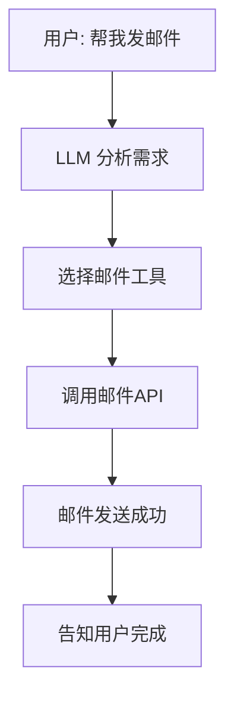
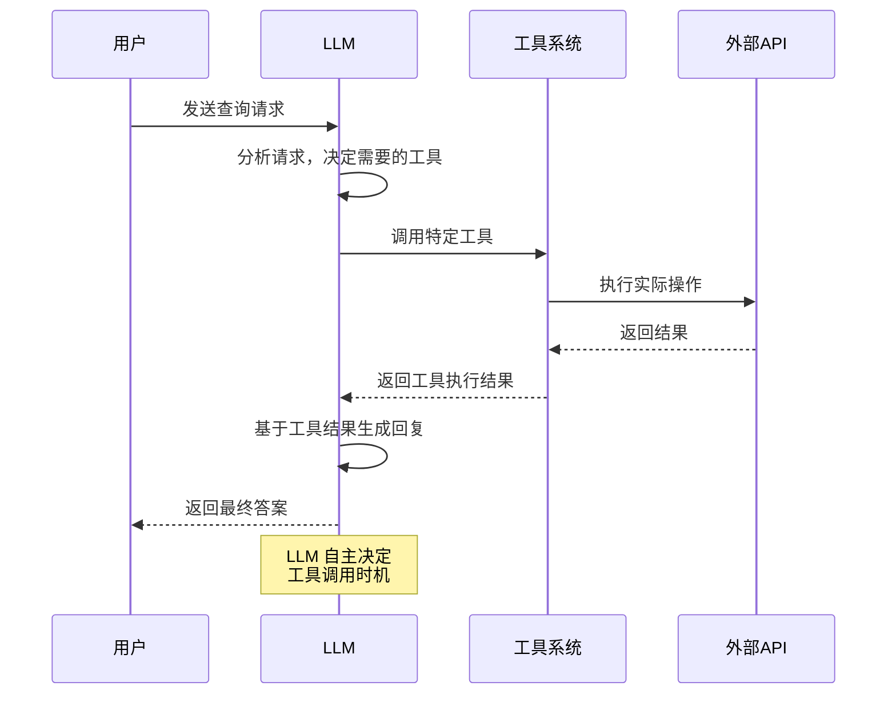

# 🛠️ 工具调用

## 让AI从思考者变成行动者

<div class="pt-12">
  <span @click="$slidev.nav.next" class="px-2 py-1 rounded cursor-pointer" hover:bg="white hover:bg-opacity-10">
    开启AI的无限可能 <carbon:arrow-right class="inline"/>
  </span>
</div>

<!--
你想过吗？要是AI不光能聊天儿，还能直接帮你办事儿。比如订个机票或者跑个数据分析，甚至直接帮你写代码执行代码，听起来是不是很酷？今天咱们就来聊聊实现一切背后那个超厉害的技术工具调用。
-->

---

# 目录

<Toc maxDepth="1" />

<!--
好，那咱们今天就分几步走。首先看看AI到底缺了点啥，然后搞明白工具调用到底是怎么一回事。接着我会带你看看怎么自己动手做一个，怎么把它连到一个更大的工具世界里。当然最后也是最重要的，怎么保证这一切玩得转又不出问题。
-->


---

# 🧠 瓶中之脑的困境

## AI面临的根本问题

<div v-click>

### 传统AI的局限
- **只能想只能说** - 被关在瓶子里的大脑
- **动不了** - 无法与外部世界交互
- **依赖预设** - 所有行为都需要预先编程

</div>

## 🔄 思维的颠覆

<div v-click>

从**发号施令者**到**自主决策者**
- 用户：告诉AI想要什么
- AI：自主选择工具和方法
- 开发者：提供工具库

</div>

::right::

## 🌟 解决方案

<div class="mt-8">

<div v-click>

### 给大脑安上手脚
- 📞 **万能工具箱** - 随时取用各种工具
- 🌐 **世界电话** - 连接外部系统
- 🤖 **自主决策** - AI决定何时使用何种工具

</div>

<div v-click class="mt-8">



</div>

</div>

<!--
行，第一部分我们先来聊一个所有大模型都面临的根本问题，很多人把它叫做瓶中之脑的困境，这个比喻真的特别形象。你看现在这些大模型语言能力是真的强，什么都能聊。但说到底他们就像一个被关在瓶子里特别聪明的大脑，只能想只能说，但是动不了。那你想想，要是我们给这个大脑安上一双手一双脚，让他不光会说还能真的动手去做，那世界会变成什么？这可不只是个小升级，这完全是一种思维上的颠覆。
-->

---

# 🔄 工具调用的神奇四步

## 简单却强大的闭环

<div class="grid grid-cols-4 gap-4 mt-8">

<div v-click class="text-center p-4 border rounded-lg bg-blue-50">
  <div class="text-2xl mb-2">1️⃣</div>
  <div class="font-bold">AI做决定</div>
  <div class="text-sm mt-2">分析需求，选择合适工具</div>
</div>

<div v-click class="text-center p-4 border rounded-lg bg-green-50">
  <div class="text-2xl mb-2">2️⃣</div>
  <div class="font-bold">调用工具</div>
  <div class="text-sm mt-2">传递参数，执行工具</div>
</div>

<div v-click class="text-center p-4 border rounded-lg bg-yellow-50">
  <div class="text-2xl mb-2">3️⃣</div>
  <div class="font-bold">获取结果</div>
  <div class="text-sm mt-2">工具执行，返回数据</div>
</div>

<div v-click class="text-center p-4 border rounded-lg bg-purple-50">
  <div class="text-2xl mb-2">4️⃣</div>
  <div class="font-bold">生成回复</div>
  <div class="text-sm mt-2">基于结果，回答用户</div>
</div>

</div>

<div v-click class="mt-12 text-center">



</div>

<!--
那问题来了，这背后到底是怎么实现的？听起来跟变魔术一样，AI到底是怎么从听懂我们说话一步步到真正去调用一个外部工具的呢？咱们这就来把它拆开看看。说白了工具调用干的事儿就是给你的语言模型配上了一个万能工具箱，外加一部能打给全世界的电话。这么一来，他就不再是个只会背书的书呆子了，只能靠脑子里那点存货。他能随时从工具箱里拿出家伙去网上查查最新的天气，或者打个电话给公司的系统下一个订单。
-->

---

# 🛠️ 创建工具的四大要素

## 听起来复杂，实际简单

<div class="grid grid-cols-2 gap-8 mt-8">

<div>

### 🔧 工具的组成

<div v-click>

1. **执行函数** - 真正干活的代码
2. **名称** - 独一无二的大名
3. **模式** - 参数规定和验证
4. **描述** - **最重要的**使用说明书

</div>

<div v-click class="mt-6 p-4 bg-blue-50 rounded-lg">

**💡 关键洞察**
描述是写给AI看的使用说明书！
描述越清楚，AI越聪明。

</div>

</div>

<div>

<div v-click>

### 📝 最小可用工具

```ts {1|2-7|8-14}
import { tool } from "@langchain/core/tools";
import { z } from "zod";

// 天气查询工具
export const getWeather = tool(
  async (input) => {
    const { city } = input as { city: string };
    return `${city} 今日晴，25°C`;
  },
  {
    name: "getWeather",
    description: "查询城市今日天气（示例）",
    schema: z.object({ city: z.string() }),
  }
);
```

</div>

</div>

</div>

<!--
听到这儿你可能觉得这东西挺高级的，挺复杂的那你猜怎么着？创建一个工具，它底层的逻辑其实简单到不行。真的别怕，咱们就来看一看一个工具到底是由哪几块拼起来的。你看一个工具掰开揉碎了看，就这么四个东西。函数就是真正干活的那些代码名称，就是它的大名得独一无二模式就是规定了你要用它得给我传什么参数。但是这里面最重要的我给你讲是这个描述，这个描述你得把它当成是给AI写的使用说明书。
-->

---

# 🌐 MCP - AI世界的USB-C

## 终结接口混乱的时代

<div class="grid grid-cols-2 gap-8 mt-8">

<div>

### 😱 过去的混乱

<div v-click>

- **苹果接口** - 只能连苹果设备
- **安卓接口** - 只能连安卓设备
- **老诺基亚** - 自己一套标准
- **结果** - 谁也连不上谁

</div>

<div v-click class="mt-6 p-4 bg-red-50 rounded-lg">

**🚫 问题**
每个模型、每个工具都有自己的接口
- 无法互操作
- 重复开发
- 生态碎片化

</div>

</div>

<div>

### ✨ MCP的解决方案

<div v-click>

**MCP = Model Context Protocol**
- **开源标准** - Anthropic牵头
- **统一接口** - 即插即用
- **生态共享** - 巨大工具库

</div>

<div v-click class="mt-6 p-4 bg-green-50 rounded-lg">

**🎯 意义**
你再也不用什么都自己从头干了！
直接连接巨大的共享工具库。

</div>

</div>

</div>

<div v-click class="mt-8 text-center">

```ts
// MCP工具使用示例
import { MultiServerMCPClient } from "@langchain/mcp-adapters";

const mcp = new MultiServerMCPClient({
  mcpServers: {
    filesystem: {
      transport: "stdio",
      command: "npx",
      args: ["-y", "@modelcontextprotocol/server-filesystem", process.cwd()],
    },
  },
});

// 获取工具并使用
const mcpTools = await mcp.getTools();
const tools = [getWeather, ...mcpTools]; // 混合使用
```

</div>

<!--
行，等你把这个工具的四个部分都定义好了，就剩下最后一步了。超级简单，就是绑定。你可以想象成你打造好了一把新武器，然后咔一声把它挂到了AI的武器库里。从这一刻起，AI就知道我多了这么个家伙，需要的时候随时都能拿出来用。OK到现在为止，我们已经会自己打造兵器了，但这还只是单打独斗。你想想如果你的AI不光能用你给他的几把小刀，还能直接连上一个巨大的军火库，里面有成千上万线程的工具，就像一个AI的应用商店，那得有多爽。
-->

---

# 🛡️ 安全第一

## 能力越大，责任越大

<div class="grid grid-cols-3 gap-6 mt-8">

<div v-click class="p-4 border rounded-lg bg-blue-50">
  <div class="text-xl font-bold mb-2">🎯 单一职责</div>
  <div class="text-sm">一个工具只干一件事</div>
  <div class="text-xs mt-2 opacity-70">避免权力过大</div>
</div>

<div v-click class="p-4 border rounded-lg bg-green-50">
  <div class="text-xl font-bold mb-2">✅ 参数验证</div>
  <div class="text-sm">严格检查所有输入</div>
  <div class="text-xs mt-2 opacity-70">第一道防火墙</div>
</div>

<div v-click class="p-4 border rounded-lg bg-yellow-50">
  <div class="text-xl font-bold mb-2">🔐 权限控制</div>
  <div class="text-sm">限制工具访问权限</div>
  <div class="text-xs mt-2 opacity-70">防止滥用</div>
</div>

</div>

<div v-click class="mt-8 p-6 bg-red-50 border-2 border-red-200 rounded-lg">

## ⚠️ 安全铁律

**永远永远不要相信模型给你的任何输入！**

把每个AI请求都当作来自**不怀好意的用户**一样对待：
- 🔍 严格过滤每个参数
- 🛂 做好身份验证和授权
- 🚫 确保不会执行危险操作

</div>

<!--
好，我们给了爱爱这么大的能力，让她能动手做事了。但能力越大，责任就越大。安全问题绝对是头等大事，是重中之重。因为只要有一个地方没做好，后果可能就非常严重。所以咱们必须得讲规矩，遵守一些基本法则。
-->

---

# 🚀 实战演示

## 看看工具调用实际怎么工作

<div class="grid grid-cols-2 gap-8 mt-8">

<div>

### 📝 定义工具

<div v-click>

```ts {1|2-8|9-15}
import { tool } from "@langchain/core/tools";
import { z } from "zod";

const sendEmail = tool(
  async (input) => {
    const { to, subject, body } = input;
    // 实际发送邮件逻辑
    await emailService.send({ to, subject, body });
    return `邮件已发送至 ${to}`;
  },
  {
    name: "sendEmail",
    description: "发送邮件给指定收件人",
    schema: z.object({
      to: z.string().email(),
      subject: z.string(),
      body: z.string()
    }),
  }
);
```

</div>

</div>

<div>

### 🤖 AI使用工具

<div v-click>

```ts {1|2-4|5-10}
// 绑定工具到LLM
const llmWithTools = llm.bindTools([sendEmail]);

// AI自动调用工具
const response = await llmWithTools.invoke([
  new HumanMessage("帮我发邮件提醒明天开会")
]);

// AI会自动：
// 1. 识别需要发送邮件
// 2. 调用sendEmail工具
// 3. 传递正确的参数
// 4. 基于结果回复用户
```

</div>

</div>

</div>

<div v-click class="mt-8 p-4 bg-green-50 rounded-lg text-center">

**✨ 魔法时刻**
AI自己决定了需要发送邮件，自己调用了工具，自己传递了参数！

</div>

<!--
现在让我们看看实际代码是怎么工作的。这里我们定义了一个发送邮件的工具，然后AI会根据用户的请求自动决定是否使用这个工具。
-->

---

# 🌟 最佳实践总结

## 让你的工具调用更成功

<div class="grid grid-cols-2 gap-8 mt-8">

<div>

### ✅ 推荐做法

<div v-click>

- 🎯 **清晰命名** - 工具名要一目了然
- 📝 **详细描述** - 当作AI的使用说明书
- 🔍 **严格验证** - 用Zod做参数检查
- 🛡️ **错误处理** - 提供有意义的错误信息
- 📊 **日志记录** - 记录工具调用情况

</div>

</div>

<div>

### ❌ 避免陷阱

<div v-click>

- 🚫 **功能过载** - 一个工具做太多事
- 🚫 **描述模糊** - AI不知道何时使用
- 🚫 **忽略验证** - 信任所有输入
- 🚫 **暴露敏感信息** - 在描述中泄露机密
- 🚫 **缺少错误处理** - 异常时系统崩溃

</div>

</div>

</div>

<div v-click class="mt-8 p-6 bg-gradient-to-r from-blue-50 to-purple-50 rounded-lg">

## 💡 核心思想转变

**从写给人看 → 写给AI看**

- 以前的注释：给团队工程师看
- 现在的描述：给AI决策用

> 你的描述写的有多清楚，你的AI就有多聪明！

</div>

<!--
最后关于安全记住一条铁律，这是底线。永远永远不要相信模型给你的任何输入，你要把它当成任何一个来自外部的不怀好意的用户请求一样对待。每一个参数都得严格检查过滤器，而且必须做好身份验证和授权，确保你的工具绝对不会干出格的事儿，绝对不会执行任何危险的操作。
-->

---

# 🎯 总结与展望

## 工具调用的力量

<div class="grid grid-cols-3 gap-6 mt-8">

<div v-click class="text-center p-4 border rounded-lg bg-gradient-to-br from-blue-50 to-blue-100">
  <div class="text-3xl mb-2">🧠</div>
  <div class="font-bold">思考者</div>
  <div class="text-sm mt-2">传统AI只能想</div>
</div>

<div v-click class="text-center p-4 border rounded-lg bg-gradient-to-br from-green-50 to-green-100">
  <div class="text-3xl mb-2">🛠️</div>
  <div class="font-bold">行动者</div>
  <div class="text-sm mt-2">工具调用能做事</div>
</div>

<div v-click class="text-center p-4 border rounded-lg bg-gradient-to-br from-purple-50 to-purple-100">
  <div class="text-3xl mb-2">🚀</div>
  <div class="font-bold">创造者</div>
  <div class="text-sm mt-2">未来无限可能</div>
</div>

</div>

<div v-click class="mt-12">

## 🌟 开启新纪元

工具调用技术打开了AI应用的新大门：

- 🏢 **自动化办公** - 自动处理日常工作
- 🎨 **创意应用** - 以前想都不敢想的功能
- 🔬 **科研加速** - 自动化数据分析
- 🌍 **连接世界** - 打通AI与各种系统

</div>

<div v-click class="mt-8 p-6 bg-gradient-to-r from-yellow-50 to-orange-50 rounded-lg text-center">

## 🤔 你的第一个工具调用应用？

**现在这个能力就在你手里了**
你准备拿它来做的第一件事儿是什么呢？

</div>

<!--
好，咱们来快速总结一下，今天我们聊的核心就是工具调用。它让AI从一个只能想的思考者变成了一个能做的行动者。我们发现创建一个工具其实很简单，就那四个部分。而且像MCIP这样的标准，正在让整个生态变得越来越方便。但贯穿始终最重要的一点就是你的设计必须得清晰，而且安全永远是第一位的。这项技术真的打开了一扇全新的大门，无论是自动处理那些烦人的日常工作，还是创造出我们以前想都不敢想的新应用，都变得可能了。现在这个能力就在你手里了。所以真正的问题是你准备拿它来做的第一件事儿是什么呢？
-->

---

layout: center
class: text-center
---
# 🙏 谢谢大家！

## 让AI从思考者变成行动者

<div class="mt-8">

**工具调用 - 开启AI的无限可能**

</div>

<div class="mt-12">

<span @click="$slidev.nav.openInEditor()" class="px-2 py-1 rounded cursor-pointer" hover:bg="white hover:bg-opacity-10">
  <carbon:edit class="inline"/> 编辑幻灯片
</span>

</div>

<!--
感谢大家的聆听！希望这次分享能帮助你理解工具调用的强大能力，开始创造属于自己的AI应用。
-->
