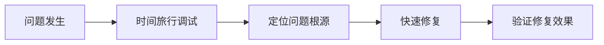
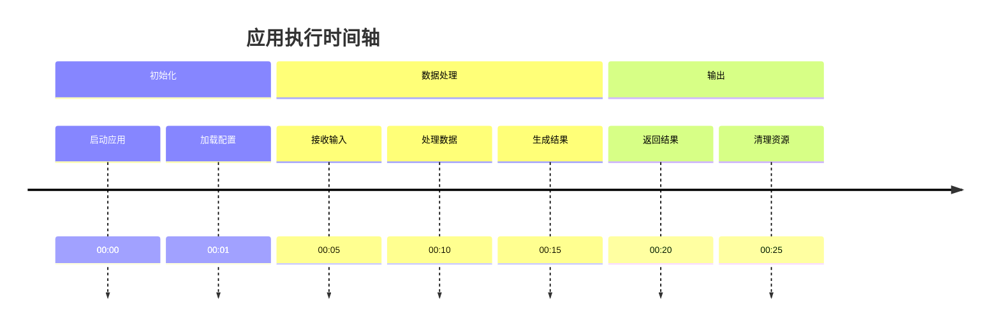
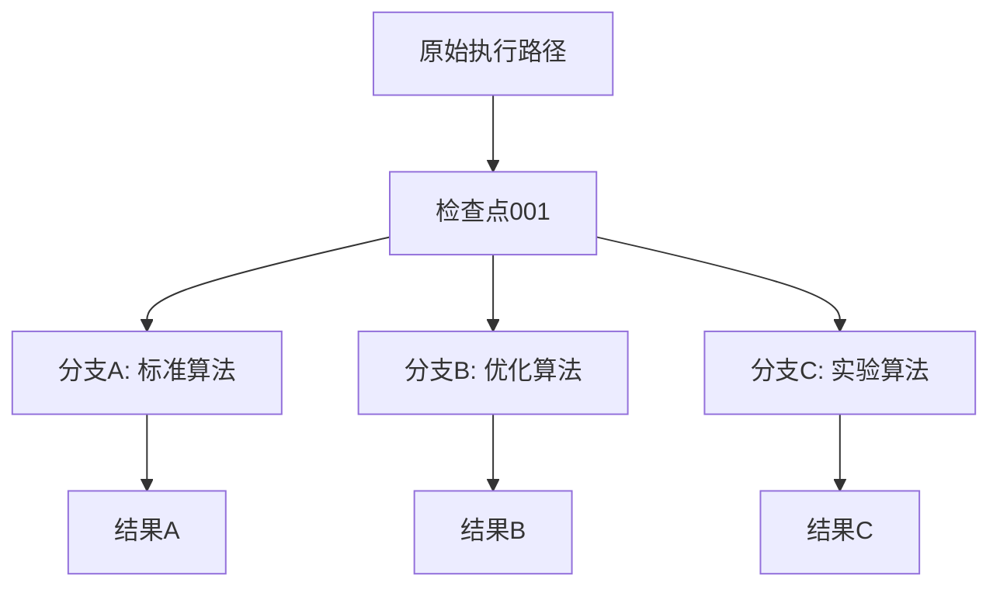
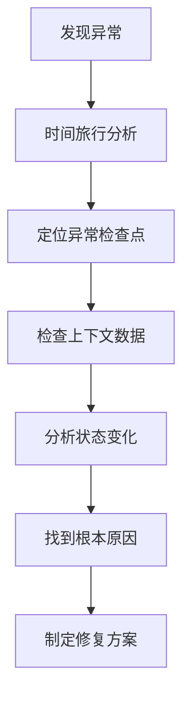
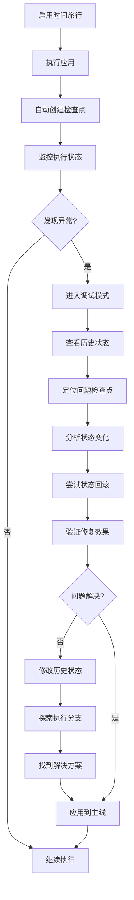

# 时间旅行

## Time Travel in LangGraphJS

<div class="pt-12">
  <span @click="$slidev.nav.next" class="px-2 py-1 rounded cursor-pointer" hover:bg="white hover:bg-opacity-10">
    探索 LangGraphJS 的强大调试功能 <carbon:arrow-right class="inline"/>
  </span>
</div>

<div class="abs-br m-6 flex gap-2">
  <button @click="$slidev.nav.openInEditor()" title="Open in Editor" class="text-xl slidev-icon-btn opacity-50 !border-none !hover:text-white">
    <carbon:edit />
  </button>
</div>

<!--
大家好，我是程哥。
今天，我将带大家深入了解 LangGraphJS 的时间旅行功能。
这是一个革命性的调试工具，就像给应用装上了时光机。
让我们一起探索这个强大的调试功能吧
-->

---
layout: two-cols
layoutClass: gap-16
---

# 引言 - 时间旅行概念

## 🕐 什么是时间旅行？

时间旅行是一种**调试技术**，允许开发者：
- **回溯**到应用的任意历史状态
- **查看**特定时间点的完整状态快照
- **修改**历史状态并观察影响
- **探索**不同的执行分支

## 🎯 核心价值

<div v-click>



</div>

::right::

## 💡 传统调试 vs 时间旅行

| 特性 | 传统调试 | 时间旅行 |
|------|----------|----------|
| **状态查看** | 仅当前状态 | 任意历史状态 |
| **回滚能力** | ❌ 不可回滚 | ✅ 自由回滚 |
| **分支探索** | ❌ 单一执行路径 | ✅ 多分支探索 |
| **问题定位** | 被动发现 | 主动追溯 |

<div v-click class="mt-8 p-4 bg-blue-500 bg-opacity-20 rounded-lg">
  <p class="text-sm">🚀 时间旅行让调试从"被动响应"变为"主动探索"</p>
</div>

<!--
首先，让我们理解什么是时间旅行概念。
时间旅行是一种强大的调试技术，它允许开发者自由回溯到应用的任意历史状态。
这就像是在时间的河流中逆流而上，重新审视每一个决策点。
相比之下，传统调试就像是只能看到河流的当前状态。
而时间旅行让我们能够看到整条河流的完整流向。
时间旅行让调试从被动响应，变成了主动探索。
-->

---

# 核心概念 - 检查点系统

## 🔄 检查点（Checkpoint）机制

<div v-click>

检查点是时间旅行的基础，它在关键执行节点保存状态快照：

```typescript
// LangGraphJS 中的检查点示例
import { Checkpointer } from "@langchain/langgraph";

const checkpointer = new Checkpointer({
  // 自动保存每个节点的执行状态
  saveCheckpoint: true,
  // 保存输入输出数据
  saveData: true,
  // 保存执行时间戳
  saveTimestamp: true
});
```

</div>

## 📊 状态快照结构

<div v-click>

每个检查点包含：
- **执行状态**：节点执行结果
- **时间戳**：精确的执行时间
- **输入数据**：节点的输入参数
- **输出数据**：节点的返回结果
- **元数据**：执行上下文信息

</div>

<div v-click class="mt-8 grid grid-cols-2 gap-4">
  <div class="p-4 bg-green-500 bg-opacity-20 rounded-lg">
    <h4 class="font-bold">✅ 优势</h4>
    <ul class="text-sm mt-2">
      <li>自动保存，无需手动干预</li>
      <li>轻量级，性能影响小</li>
      <li>完整捕获执行上下文</li>
    </ul>
  </div>
  <div class="p-4 bg-orange-500 bg-opacity-20 rounded-lg">
    <h4 class="font-bold">⚠️ 注意</h4>
    <ul class="text-sm mt-2">
      <li>需要合理设置检查点频率</li>
      <li>存储空间会随时间增长</li>
      <li>敏感数据需要特殊处理</li>
    </ul>
  </div>
</div>

<!--
接下来，让我们了解时间旅行的核心基础 - 检查点系统。
检查点是时间旅行的基石，它在关键执行节点保存状态快照。
这就像是电影拍摄中的每一个镜头，记录了应用执行过程中的关键时刻。
每个检查点都包含执行状态、时间戳、输入输出数据等完整信息。
通过这些精心设计的检查点，我们能够完整地重现应用的执行历程。
使用检查点有很多优势：自动保存无需手动干预，轻量级性能影响小，完整捕获执行上下文。
但也要注意合理设置检查点频率，考虑存储空间限制，以及敏感数据的处理。
-->

---
layout: image-right
image: https://source.unsplash.com/collection/94734566/800x600
---

# 核心概念 - 状态快照与时间轴

## 📸 状态快照（State Snapshot）

状态快照是检查点保存的完整数据结构：

```typescript
interface StateSnapshot {
  id: string;           // 唯一标识符
  timestamp: Date;      // 时间戳
  state: {              // 应用状态
    variables: Record<string, any>;
    context: Record<string, any>;
  };
  metadata: {           // 元数据
    nodeId: string;
    executionTime: number;
    input: any;
    output: any;
  };
}
```

## ⏰ 时间轴（Timeline）概念

<div v-click>

时间轴将所有状态快照按时间顺序组织：



</div>

<div v-click class="mt-6 p-4 bg-purple-500 bg-opacity-20 rounded-lg">
  <p>💡 时间轴让我们能够像看电影回放一样查看应用执行过程</p>
</div>

<!--
状态快照和时间轴构成了时间旅行的时空坐标系。
状态快照是空间中的每一个点，包含完整的数据结构和元数据。
而时间轴则是连接这些点的线，按时间顺序组织所有状态快照。
通过这个坐标系，我们能够精确定位和分析应用的每一个执行瞬间。
时间轴让我们能够像看电影回放一样查看应用执行过程。
这种结构化的设计让时间旅行变得既强大又直观123。
-->

---

# 基础用法 - 查看历史状态

## 🔍 历史状态查看

使用时间旅行 API 查看任意历史状态：

```typescript
import { TimeTravelAPI } from "@langchain/langgraph";

const timeTravel = new TimeTravelAPI(checkpointer);

// 获取所有历史状态
const history = await timeTravel.getHistory();

// 按时间戳筛选
const recentStates = await timeTravel.getHistory({
  from: new Date('2024-01-01'),
  to: new Date('2024-01-31')
});

// 按节点筛选
const nodeStates = await timeTravel.getHistory({
  nodeId: "data_processor"
});
```

## 📊 状态可视化

<div v-click>

```typescript
// 可视化状态变化
const stateChart = timeTravel.visualizeStates({
  metric: "processing_time",
  chart: "line"
});

// 状态差异对比
const diff = timeTravel.compareStates(
  "snapshot_001",
  "snapshot_002"
);
```

</div>

<div v-click class="mt-8 grid grid-cols-3 gap-4">
  <div class="text-center p-4 bg-blue-500 bg-opacity-20 rounded">
    <div class="text-2xl mb-2">📈</div>
    <div class="text-sm">趋势分析</div>
  </div>
  <div class="text-center p-4 bg-green-500 bg-opacity-20 rounded">
    <div class="text-2xl mb-2">🔍</div>
    <div class="text-sm">细节查看</div>
  </div>
  <div class="text-center p-4 bg-purple-500 bg-opacity-20 rounded">
    <div class="text-2xl mb-2">📊</div>
    <div class="text-sm">数据对比</div>
  </div>
</div>

<!--
现在，让我们学习时间旅行的基础用法 - 查看历史状态。
这是时间旅行最基本也是最常用的功能。
就像翻阅历史相册一样，我们可以随时回顾应用的每一个执行瞬间。
通过时间旅行API，我们可以获取所有历史状态，按时间戳筛选，或者按节点筛选。
不仅如此，我们还可以进行状态可视化，包括趋势分析、细节查看和数据对比。
这些功能让我们能够深入洞察状态变化的规律和趋势。
-->

---

# 基础用法 - 状态回滚

## ⏪ 状态回滚操作

将应用状态回滚到任意历史检查点：

```typescript
// 回滚到指定检查点
await timeTravel.rollback("checkpoint_001");

// 回滚到特定时间点
await timeTravel.rollbackToTime(new Date('2024-01-15T10:30:00'));

// 回滚到指定节点执行后
await timeTravel.rollbackToNode("data_processor", "after");
```

## 🎯 回滚策略

<div v-click>

### 安全回滚
<div class="p-4 bg-green-500 bg-opacity-20 rounded-lg mb-4">

```typescript
// 创建回滚前的备份
const backup = await timeTravel.createCheckpoint();

// 安全回滚
try {
  await timeTravel.rollback("target_checkpoint");
  // 验证回滚结果
  await validateState();
} catch (error) {
  // 如果回滚失败，恢复到备份状态
  await timeTravel.restore(backup.id);
}
```

</div>

</div>

<div v-click>

### 增量回滚
<div class="p-4 bg-blue-500 bg-opacity-20 rounded-lg">

```typescript
// 部分状态回滚
await timeTravel.partialRollback("checkpoint_001", {
  variables: true,    // 回滚变量
  context: false,     // 保留上下文
  metadata: false     // 保留元数据
});
```

</div>

</div>

<!--
接下来，我们学习状态回滚操作。
这是时间旅行最强大的功能之一，让我们能够穿越回任何一个历史节点。
我们可以回滚到指定检查点、特定时间点，或者指定节点执行后。
但更重要的是，我们需要谨慎地使用这个能力，确保回滚操作的安全性和可控性。
我们可以采用安全回滚策略，创建回滚前的备份，在回滚失败时能够快速恢复。
也可以使用增量回滚，只回滚部分状态，保留其他重要信息。
这样的设计让状态回滚既强大又安全。
-->

---

# 高级功能 - 状态修改

## ✏️ 历史状态修改

<div v-click>

时间旅行不仅允许查看历史，还可以修改历史状态：

```typescript
// 修改历史检查点
await timeTravel.modifyCheckpoint("checkpoint_001", {
  state: {
    variables: {
      ...originalState.variables,
      processing_result: "modified_value"
    }
  }
});

// 批量修改多个检查点
await timeTravel.batchModify([
  {
    id: "checkpoint_001",
    modifications: { output: "new_output_1" }
  },
  {
    id: "checkpoint_002",
    modifications: { output: "new_output_2" }
  }
]);
```

</div>

## 🌊 连锁反应处理

<div v-click>

修改历史状态会触发连锁反应：


```typescript
// 自动处理连锁反应
const result = await timeTravel.modifyWithPropagation(
  "checkpoint_001",
  modifications,
  {
    autoRecalculate: true,    // 自动重新计算
    validateConsistency: true, // 验证一致性
    createNewTimeline: true   // 创建新时间线
  }
);
```

</div>

<div v-click class="mt-6 p-4 bg-yellow-500 bg-opacity-20 rounded-lg">
  <p>⚠️ 修改历史状态是强大功能，但需要谨慎使用，确保理解其影响范围</p>
</div>

<!--
现在，我们进入高级功能 - 历史状态修改。
时间旅行不仅允许查看历史，还可以修改历史状态。
这就像是科幻电影中的时空悖论，它不仅改变了过去，还会影响未来。
我们可以修改单个检查点，也可以批量修改多个检查点。
修改历史状态会触发连锁反应，需要重新计算后续状态，更新依赖数据。
LangGraphJS 提供了完善的连锁反应处理机制，确保修改后的时间线保持一致性和完整性。
但请记住，修改历史状态是强大功能，但需要谨慎使用，确保理解其影响范围。
-->

---

# 高级功能 - 分支探索

## 🌳 执行分支探索

从任意检查点创建新的执行分支：

```typescript
// 从历史检查点创建新分支
const branch = await timeTravel.createBranch(
  "checkpoint_001",
  "alternative_execution"
);

// 在分支中修改输入
await branch.modifyInput({
  algorithm: "enhanced_algorithm",
  parameters: { precision: 0.001 }
});

// 执行新的分支路径
const result = await branch.execute();
```

## 🔄 分支对比

<div v-click>

```typescript
// 对比不同分支的执行结果
const comparison = await timeTravel.compareBranches([
  "main_branch",
  "alternative_execution",
  "experimental_approach"
], {
  metrics: ["accuracy", "performance", "resource_usage"],
  visualization: "radar_chart"
});
```

</div>

<div v-click class="mt-8">



</div>

<!--
分支探索是另一个强大的高级功能。
它就像是平行宇宙的概念，让我们能够探索"如果当时选择不同的路径会怎样"。
我们可以从任意检查点创建新的执行分支，在分支中修改输入或算法。
这对于算法优化、参数调优和方案对比非常有价值。
通过分支对比功能，我们可以分析不同分支的执行结果，选择最优方案。
这种能力让我们的决策更加科学和数据驱动。
-->

---

# 实际应用场景 - 调试复杂问题

## 🐛 复杂问题调试

### 问题定位流程
<div v-click>



</div>

### 实际案例
<div v-click>

<div class="p-4 bg-red-500 bg-opacity-20 rounded-lg mb-4">
<h4>🔥 案例：数据处理异常</h4>
<p class="text-sm mt-2">问题：处理大量数据时出现内存溢出</p>
</div>

```typescript
// 使用时间旅行定位问题
const memoryIssues = await timeTravel.findAnomalies({
  metric: "memory_usage",
  threshold: 0.9,  // 90% 内存使用率
  timeWindow: "1h"
});

// 分析问题发生前的状态变化
const context = await timeTravel.analyzeContext(
  memoryIssues[0].checkpointId,
  { lookBack: 10 }  // 回溯10个检查点
);
```

</div>

<div v-click class="p-4 bg-green-500 bg-opacity-20 rounded-lg">
<p>✅ 通过时间旅行，我们发现在第5个检查点时内存使用开始异常增长，最终定位到数据分批处理的逻辑问题</p>
</div>

<!--
现在，让我们看看时间旅行在实际应用场景中的价值。
首先是调试复杂问题，这是时间旅行最直接的应用场景。
在复杂的系统调试中，时间旅行就像是福尔摩斯的放大镜，帮助我们细致入微地观察问题。
通过时间旅行分析，我们可以定位异常检查点，检查上下文数据，分析状态变化。
比如在数据处理异常的案例中，通过时间旅行我们能够精确定位到内存使用开始异常增长的具体时间点。
这种能力让我们能够找到隐藏在深处的根本原因，而不仅仅是表面现象。
-->

---

# 实际应用场景 - A/B测试

## 🧪 A/B测试支持

使用时间旅行进行高效的A/B测试：

```typescript
// 创建测试分支
const branchA = await timeTravel.createBranch(
  "baseline_checkpoint",
  "algorithm_a_test"
);

const branchB = await timeTravel.createBranch(
  "baseline_checkpoint",
  "algorithm_b_test"
);

// 在不同分支中应用不同算法
await branchA.applyAlgorithm("enhanced_sort_v1");
await branchB.applyAlgorithm("enhanced_sort_v2");

// 并行执行测试
const results = await Promise.all([
  branchA.executeWithMetrics(),
  branchB.executeWithMetrics()
]);
```

## 📊 测试结果分析

<div v-click>

```typescript
// 自动化结果对比
const analysis = await timeTravel.analyzeABTest(results, {
  metrics: [
    { name: "accuracy", weight: 0.4 },
    { name: "performance", weight: 0.3 },
    { name: "memory_usage", weight: 0.2 },
    { name: "scalability", weight: 0.1 }
  ],
  significance: 0.05  // 95% 置信度
});

// 生成可视化报告
const report = await timeTravel.generateReport(analysis, {
  format: "html",
  charts: ["bar", "line", "radar"],
  includeRecommendations: true
});
```

</div>

<div v-click class="mt-8 grid grid-cols-2 gap-4">
  <div class="p-4 bg-blue-500 bg-opacity-20 rounded">
    <h4 class="font-bold">🎯 优势</h4>
    <ul class="text-sm mt-2">
      <li>完全一致的初始条件</li>
      <li>可重复的测试环境</li>
      <li>详细的对比数据</li>
    </ul>
  </div>
  <div class="p-4 bg-purple-500 bg-opacity-20 rounded">
    <h4 class="font-bold">📈 应用</h4>
    <ul class="text-sm mt-2">
      <li>算法优化验证</li>
      <li>参数调优</li>
      <li>架构决策支持</li>
    </ul>
  </div>
</div>

<!--
另一个重要的应用场景是A/B测试。
时间旅行为A/B测试提供了完美的实验环境。
它确保了不同测试分支在完全一致的初始条件下开始，消除了环境因素的干扰。
我们可以创建测试分支，在不同分支中应用不同算法，然后并行执行测试。
通过自动化的结果对比，我们可以获得详细的分析报告，包括准确度、性能、内存使用等多个指标。
时间旅行的优势在于：完全一致的初始条件、可重复的测试环境、详细的对比数据。
这特别适用于算法优化验证、参数调优和架构决策支持。
-->

---

# 实际应用场景 - 错误恢复

## 🛡️ 错误恢复机制

### 自动错误检测与恢复
<div v-click>

```typescript
// 监控异常状态
const monitor = timeTravel.createMonitor({
  anomalies: {
    error_rate: { threshold: 0.05, window: "5m" },
    response_time: { threshold: 2000, window: "1m" },
    memory_usage: { threshold: 0.8, window: "10m" }
  },
  actions: {
    onAnomaly: "auto_recover"
  }
});

// 自动恢复策略
monitor.setRecoveryStrategy({
  maxRollbackAttempts: 3,
  rollbackWindow: "30m",
  validateAfterRollback: true
});
```

</div>

### 智能恢复选择
<div v-click>

```typescript
// 智能选择最佳恢复点
const recoveryCandidates = await timeTravel.findRecoveryPoints({
  criteria: {
    stable: true,           // 状态稳定
    performance: "good",    // 性能良好
    recent: "30m"          // 最近30分钟内
  },
  exclude: {
    hasErrors: true,       // 排除有错误的点
    highMemory: true       // 排除高内存使用点
  }
});

// 选择最优恢复点
const bestRecoveryPoint = timeTravel.selectOptimalRecovery(
  recoveryCandidates,
  "balanced"  // 平衡稳定性和时间近度
);
```

</div>

<!--
时间旅行在错误恢复方面也发挥着重要作用。
错误恢复就像是时间旅行的安全网，当系统出现问题时提供保护。
我们可以设置自动错误检测与恢复机制，监控异常状态并自动触发恢复策略。
系统还能智能选择最佳恢复点，基于稳定性、性能和时间近度等标准。
这种智能恢复机制让系统能够快速回到正常状态，大大提高了系统的可靠性和可用性。
这对于生产环境的稳定运行至关重要。
-->

---

# 时间旅行工作流 - 完整流程

## 🔄 标准工作流程

<div v-click>



</div>

## ⚡ 快速调试流程

<div v-click>

```typescript
// 一键快速调试
const quickDebug = async (issueDescription: string) => {
  // 1. 自动分析问题
  const analysis = await timeTravel.analyzeIssue(issueDescription);

  // 2. 推荐调试步骤
  const steps = timeTravel.getDebuggingSteps(analysis);

  // 3. 执行调试流程
  for (const step of steps) {
    const result = await timeTravel.executeStep(step);
    if (result.success) {
      console.log(`✅ ${step.description}`);
    } else {
      console.log(`❌ ${step.description}: ${result.error}`);
    }
  }
};
```

</div>

<!--
现在，让我们了解完整的时间旅行工作流程。
掌握完整的工作流程，就像是拥有了一套完整的时空操作手册。
标准工作流程包括：启用时间旅行、执行应用、自动创建检查点、监控执行状态。
如果发现异常，就进入调试模式，查看历史状态，定位问题检查点，分析状态变化。
然后尝试状态回滚，验证修复效果。
如果问题还没解决，就修改历史状态，探索执行分支，找到解决方案并应用到主线。
我们还可以使用一键快速调试功能，自动分析问题并推荐调试步骤。
这种系统化的流程让调试过程变得高效而规范。
-->

---

# 最佳实践 - 使用建议

## 💡 核心使用建议

### 🎯 合理设置检查点频率
<div class="grid grid-cols-2 gap-4 mt-4">
  <div class="p-4 bg-green-500 bg-opacity-20 rounded">
    <h4 class="font-bold">✅ 推荐</h4>
    <ul class="text-sm mt-2">
      <li>关键节点必设检查点</li>
      <li>根据执行频率动态调整</li>
      <li>考虑存储空间限制</li>
    </ul>
  </div>
  <div class="p-4 bg-red-500 bg-opacity-20 rounded">
    <h4 class="font-bold">❌ 避免</h4>
    <ul class="text-sm mt-2">
      <li>过于频繁的检查点</li>
      <li>忽略性能影响</li>
      <li>无限期保存历史</li>
    </ul>
  </div>
</div>

### 📊 性能优化策略
<div v-click>

```typescript
// 智能检查点策略
const smartStrategy = {
  // 动态调整频率
  adaptive: true,
  // 基于重要性分级
  importanceBased: {
    critical: "always",      // 关键节点总是保存
    important: "1s",         // 重要节点每秒保存
    normal: "5s",           // 普通节点每5秒保存
    minimal: "30s"          // 最小化节点每30秒保存
  },
  // 清理策略
  cleanup: {
    olderThan: "7d",        // 7天后自动清理
    keepImportant: "30d",   // 重要检查点保留30天
    maxStorage: "1GB"       // 最大存储1GB
  }
};
```

</div>

## 🔧 调试技巧

<div v-click class="mt-8">
<div class="grid grid-cols-3 gap-4">
  <div class="text-center p-4 bg-blue-500 bg-opacity-20 rounded">
    <div class="text-2xl mb-2">🎯</div>
    <div class="font-bold">精准定位</div>
    <div class="text-sm mt-2">使用过滤器快速找到相关检查点</div>
  </div>
  <div class="text-center p-4 bg-purple-500 bg-opacity-20 rounded">
    <div class="text-2xl mb-2">🔍</div>
    <div class="font-bold">对比分析</div>
    <div class="text-sm mt-2">对比正常和异常状态的差异</div>
  </div>
  <div class="text-center p-4 bg-green-500 bg-opacity-20 rounded">
    <div class="text-2xl mb-2">🚀</div>
    <div class="font-bold">快速验证</div>
    <div class="text-sm mt-2">在分支中测试修复方案</div>
  </div>
</div>
</div>

<!--
接下来，让我们分享一些最佳实践和使用建议。
最佳实践就像是经验丰富的探险家分享的生存指南。
首先，要合理设置检查点频率：关键节点必设检查点，根据执行频率动态调整，考虑存储空间限制。
避免过于频繁的检查点，忽略性能影响，或者无限期保存历史。
在性能优化方面，可以采用智能检查点策略，动态调整频率，基于重要性分级，设置合理的清理策略。
在调试技巧方面，要学会精准定位，使用过滤器快速找到相关检查点。
进行对比分析，对比正常和异常状态的差异。
以及在分支中快速验证修复方案。
这些实践能帮助我们获得最大收益，避免常见问题。
-->

---

# 最佳实践 - 注意事项

## ⚠️ 重要注意事项

### 🔒 安全考虑
<div class="p-4 bg-yellow-500 bg-opacity-20 rounded-lg mb-4">

```typescript
// 敏感数据处理
const secureConfig = {
  // 加密敏感数据
  encryption: {
    enabled: true,
    algorithm: "AES-256",
    keyRotation: "7d"
  },
  // 访问控制
  accessControl: {
    authentication: true,
    authorization: "role-based",
    auditLog: true
  },
  // 数据脱敏
  dataMasking: {
    pii: true,              // 个人信息
    credentials: true,       // 凭证信息
    secrets: true           // 机密信息
  }
};
```

</div>

### 🚨 避免常见陷阱
<div v-click>

| 陷阱类型 | 描述 | 解决方案 |
|----------|------|----------|
| **过度依赖** | 过分依赖时间旅行而忽视预防性编程 | 平衡使用，提高代码质量 |
| **性能影响** | 检查点过于频繁影响性能 | 合理设置检查点策略 |
| **存储爆炸** | 历史数据无限增长 | 定期清理和归档 |
| **状态污染** | 频繁修改历史导致混乱 | 使用分支探索替代直接修改 |

</div>

<div v-click class="mt-8 p-4 bg-red-500 bg-opacity-20 rounded-lg">
  <p>⚠️ 时间旅行是调试工具，不应作为常规的业务逻辑控制机制</p>
</div>

<!--
在使用时间旅行时，还有一些重要的注意事项需要注意。
这些注意事项就像是时空旅行的安全守则。
首先是安全考虑：要对敏感数据进行加密处理，设置访问控制和审计日志，对个人信息、凭证信息等进行数据脱敏。
还要避免常见的陷阱：不要过度依赖时间旅行而忽视预防性编程，要注意性能影响，避免存储爆炸，避免状态污染。
时间旅行是调试工具，不应作为常规的业务逻辑控制机制。
记住这些安全守则，让我们在享受强大功能的同时，也能避免潜在的风险。
-->

---
layout: two-cols
layoutClass: gap-16
---

# 与前端开发工具对比

## 🛠️ 工具对比矩阵

| 功能特性 | LangGraphJS时间旅行 | Redux DevTools | Vue DevTools |
|----------|-------------------|---------------|-------------|
| **状态历史** | ✅ 完整执行历史 | ✅ Action历史 | ✅ 组件状态 |
| **时间回溯** | ✅ 任意时间点 | ✅ Action级别 | ✅ 组件级别 |
| **状态修改** | ✅ 历史状态修改 | ❌ 只能修改当前 | ❌ 只能修改当前 |
| **分支探索** | ✅ 多分支并行 | ❌ 单一线性 | ❌ 单一线性 |
| **执行重现** | ✅ 完整重现 | ✅ Action重放 | ✅ 状态重放 |
| **性能监控** | ✅ 内置性能指标 | ❌ 需要额外工具 | ❌ 需要额外工具 |

::right::

## 🎯 适用场景对比

### LangGraphJS 时间旅行
<div class="p-4 bg-blue-500 bg-opacity-20 rounded mb-4">
<h4 class="font-bold">🔧 后端/复杂系统</h4>
<ul class="text-sm mt-2">
  <li>AI/ML工作流调试</li>
  <li>复杂业务流程分析</li>
  <li>异步任务链追踪</li>
  <li>分布式系统协调</li>
</ul>
</div>

### Redux/Vue DevTools
<div class="p-4 bg-green-500 bg-opacity-20 rounded mb-4">
<h4 class="font-bold">🎨 前端状态管理</h4>
<ul class="text-sm mt-2">
  <li>UI状态调试</li>
  <li>用户交互分析</li>
  <li>组件状态追踪</li>
  <li>性能优化分析</li>
</ul>
</div>

<div v-click class="mt-6 p-4 bg-purple-500 bg-opacity-20 rounded">
  <p>💡 各工具都有其适用场景，选择合适的工具才能发挥最大价值</p>
</div>

<!--
让我们将LangGraphJS时间旅行与前端开发工具进行对比。
通过对比我们发现，LangGraphJS在复杂系统调试方面具有独特优势。
在功能特性方面，LangGraphJS支持完整执行历史、任意时间点回溯、历史状态修改、多分支并行探索等。
而Redux DevTools和Vue DevTools主要专注于前端状态管理，在历史状态修改和分支探索方面能力有限。
LangGraphJS时间旅行更适用于后端复杂系统、AI/ML工作流调试、复杂业务流程分析等场景。
而Redux/Vue DevTools更适合前端状态管理、UI状态调试、用户交互分析等。
各工具都有其适用场景，选择合适的工具才能发挥最大价值。
-->

---

# 小结与延伸

## 🎯 核心价值回顾

<div v-click class="grid grid-cols-2 gap-6 mt-8">

<div class="p-6 bg-gradient-to-br from-blue-500 to-blue-600 text-white rounded-lg">
  <h3 class="text-xl font-bold mb-4">🔍 调试能力革命</h3>
  <ul class="space-y-2 text-sm">
    <li>✅ 从被动响应到主动探索</li>
    <li>✅ 从单点调试到全局分析</li>
    <li>✅ 从线性执行到分支探索</li>
  </ul>
</div>

<div class="p-6 bg-gradient-to-br from-purple-500 to-purple-600 text-white rounded-lg">
  <h3 class="text-xl font-bold mb-4">🚀 开发效率提升</h3>
  <ul class="space-y-2 text-sm">
    <li>✅ 快速定位问题根源</li>
    <li>✅ 安全测试修复方案</li>
    <li>✅ 智能错误恢复机制</li>
  </ul>
</div>

</div>

## 🌟 延伸学习

<div v-click>

### 推荐学习路径
1. **基础概念** → 掌握检查点和时间轴概念
2. **实践操作** → 在项目中实际应用时间旅行
3. **高级技巧** → 学习分支探索和状态修改
4. **性能优化** → 优化检查点策略和存储管理
5. **最佳实践** → 掌握安全和性能注意事项

### 相关技术
- **分布式追踪** - Jaeger, Zipkin
- **事件溯源** - Event Sourcing模式
- **CQRS** - 命令查询责任分离
- **版本控制** - Git分支管理思想

</div>

## 🎬 结语

<div v-click class="mt-12 text-center p-8 bg-gradient-to-r from-indigo-500 to-purple-600 text-white rounded-lg">
  <h2 class="text-2xl font-bold mb-4">时间旅行的未来</h2>
  <p class="text-lg">时间旅行不仅是一个调试工具，更是一种全新的思维方式</p>
  <p class="text-lg mt-2">它让我们能够在时间的维度上自由探索，创造更优秀的软件</p>
</div>

<!--
最后，让我们进行小结与延伸。
时间旅行带来了调试能力的革命：从被动响应到主动探索，从单点调试到全局分析，从线性执行到分支探索。
它也显著提升了开发效率：快速定位问题根源，安全测试修复方案，智能错误恢复机制。
推荐的学习路径是：先掌握基础概念，再到实践操作，然后学习高级技巧，接着优化性能，最后掌握最佳实践。
相关技术还包括分布式追踪、事件溯源、CQRS、版本控制等。
时间旅行代表了调试技术的未来方向。
它不仅改变了我们调试代码的方式，更重要的是改变了我们思考和解决问题的方法论。
掌握时间旅行，就是掌握了通向高效开发的一把钥匙。
时间旅行不仅是一个调试工具，更是一种全新的思维方式。
它让我们能够在时间的维度上自由探索，创造更优秀的软件。
谢谢大家！
-->
