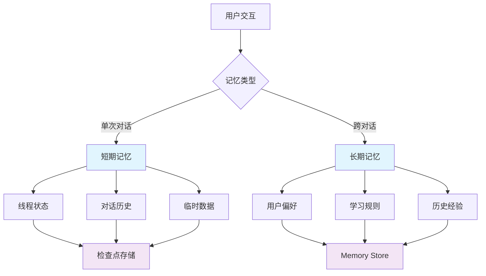
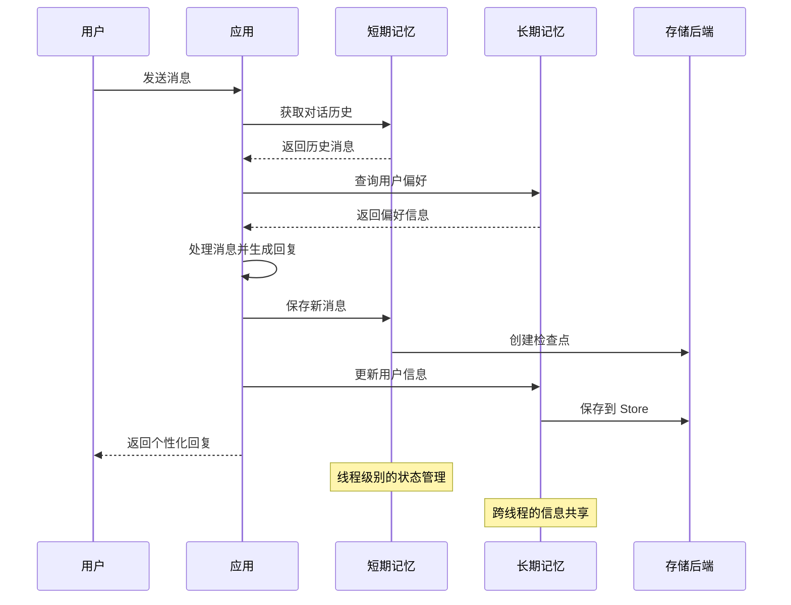

# 🧠 记忆管理

<div class="abs-br m-6 flex items-center">
  <span class="text-xl"> @langgraphjs/memory </span>
</div>

<!--
大家好！今天我很高兴与大家分享 LangGraphJS 中的记忆管理机制。

在构建现代 AI 应用时，记忆管理是一个至关重要的功能。想象一下，如果你的智能助手每次对话都忘记之前说过什么，那将是多么糟糕的用户体验。就像人类能够记住过去的对话和经验一样，AI 应用也需要能够保存和回忆信息。

今天的分享将帮助大家深入理解 LangGraphJS 提供的强大记忆管理机制，学习如何构建具有智能记忆能力的 AI 应用，让你的应用能够在对话中保持上下文，并在不同会话间共享知识。

我们将从基本概念开始，逐步深入到实际应用和最佳实践，相信通过今天的分享，大家都能掌握构建真正智能 AI 应用的核心技术。
-->

---
layout: two-cols
---

# 🎯 记忆管理概述

从前端开发的角度来理解记忆管理：

- **短期记忆** 类似于 `sessionStorage`
- **长期记忆** 类似于 `localStorage`
- **检查点机制** 类似于自动保存功能

<br>

<v-click>

## 核心概念

- 线程级别的状态管理
- 跨线程的信息共享
- 智能化的数据持久化

</v-click>

::right::



<!--
首先让我们来理解什么是记忆管理。

作为前端开发者，我们可以用很熟悉的浏览器存储机制来类比理解 LangGraphJS 的记忆管理。短期记忆就像是浏览器的 sessionStorage，它在单次会话中保持数据，一旦会话结束就清空。而长期记忆则类似于 localStorage，它可以跨会话持久化数据，即使应用重启后数据依然存在。

检查点机制就像是自动保存功能，它会定期保存应用的状态，确保在意外情况下不会丢失重要的对话信息。

现在让我们看看这三个核心概念：

线程级别的状态管理意味着每个对话线程都有自己独立的状态，不同线程之间不会相互干扰。跨线程的信息共享则允许某些信息在不同的对话中被访问和使用。而智能化的数据持久化则确保了数据能够根据重要性进行合理的存储和管理。

右边的流程图清晰地展示了整个记忆管理的架构。用户交互会根据不同的场景选择使用短期记忆还是长期记忆。如果是单次对话中的信息，就会使用短期记忆来管理线程状态、对话历史和临时数据。这些信息最终会存储到检查点存储中。

而如果是需要跨对话共享的信息，比如用户偏好、学习规则和历史经验，就会使用长期记忆，通过 Memory Store 来进行管理。

这种设计让我们的 AI 应用能够真正"记住"用户，提供个性化的智能体验。
-->

---
layout: two-cols
---

# 📝 短期记忆

## Thread-Scoped Memory

基于 LangGraphJS 的检查点机制：

- **对话历史**：保存完整的用户-助手对话记录
- **会话状态**：维护当前对话的状态和进度
- **临时数据**：存储对话过程中的临时信息
- **上下文感知**：基于历史对话提供个性化回复

::right::

## 核心实现

```typescript
// 对话记忆：基于 thread_id 维持对话上下文与历史
import { randomUUID } from 'node:crypto';

const threadId = randomUUID();

// 用户首条消息
await graph.invoke(
  { user: '你好' },
  { configurable: { thread_id: threadId } }
);

// 后续消息继续复用同一 thread_id
await graph.invoke(
  { user: '请帮我推荐一款键盘' },
  { configurable: { thread_id: threadId } }
);
```

<!--
接下来我们详细看看短期记忆，也就是 Thread-Scoped Memory。

短期记忆是 LangGraphJS 基于检查点机制设计的，主要用于管理单次对话线程中的信息。它有四个主要功能：

对话历史保存功能可以完整记录用户和助手之间的所有对话，这样在对话过程中，AI 可以回顾之前说了什么，用户问了什么，从而保持对话的连贯性和逻辑性。

会话状态管理则维护着当前对话的状态和进度，比如我们聊到哪个话题了，讨论进行到什么阶段了，有没有什么待办事项等等。

临时数据存储功能允许我们在对话过程中保存一些临时的信息，比如用户提到的某些参数、中间计算结果等。

最重要的功能是上下文感知，基于历史对话内容，AI 可以提供更加个性化和相关的回复。

右边的代码展示了短期记忆的核心实现方式。我们使用 thread_id 来标识每个对话线程，这样同一对话中的所有消息都会共享同一个 thread_id。

首先我们生成一个唯一的 thread_id，然后用户发送第一条消息时，我们将这个 thread_id 配置传递给图执行器。当用户继续发送消息时，我们使用相同的 thread_id，这样就能在同一上下文中进行对话。

在节点的内部，我们通常会将新的消息追加到状态的消息数组中，这样就能保持对话的完整性。

这种机制确保了在单次对话中，AI 能够记住之前说的内容，提供连贯的对话体验。
-->

---
layout: two-cols
---

# 📝 短期记忆优化

## 对话历史管理

在长对话中智能管理历史：

- **历史裁剪**：保留最重要的对话片段
- **摘要生成**：将长对话压缩为关键信息
- **上下文窗口**：动态调整记忆的范围
- **重要性评分**：识别和保留关键对话内容

::right::

## 优化实现

```typescript
// 对话历史优化：裁剪与摘要
type Message = {
  role: 'user' | 'assistant';
  content: string
};

function trimHistory(
  messages: Message[],
  keepLatest: number = 20
): Message[] {
  if (messages.length <= keepLatest)
    return messages;
  return messages.slice(-keepLatest);
}

async function summarize(
  messages: Message[]
): Promise<Message[]> {
  // 将更早的历史做成一条摘要
  if (messages.length < 40) return messages;
  const older = messages.slice(0, -20);
  const recent = messages.slice(-20);
  const summary = {
    role: 'assistant',
    content: `历史摘要(${older.length}条)`
  };
  return [summary, ...recent];
}
```

<!--
在实际应用中，对话可能会变得很长，这时候我们就需要对对话历史进行智能管理。

左边的列表展示了四种主要的对话历史管理策略：

历史裁剪策略会保留最重要的对话片段，删除那些相对不那么重要的内容。这需要我们建立一套评估机制，判断哪些对话内容更重要。

摘要生成策略则通过将长对话压缩为关键信息，保留对话的精华内容。这对于那些需要回顾整个对话历史的场景特别有用。

上下文窗口策略可以动态调整记忆的范围，根据对话的复杂程度和重要程度来决定保留多少历史信息。

重要性评分策略通过算法识别和保留关键对话内容，确保重要的信息不会被意外删除。

右边的代码展示了具体的实现方式。trimHistory 函数是一个简单的历史裁剪实现，它保留最新的指定数量的消息。当消息数量超过限制时，就只保留最新的几条。

summarize 函数则是一个更高级的策略。当消息数量超过 40 条时，它会把早期的消息压缩成一条摘要，然后保留最近的 20 条消息。这样既保留了历史信息的概要，又确保了最近对话的完整性。

在实际应用中，我们可以结合这些策略，根据应用的具体需求来设计最合适的历史管理方案。比如对于客服机器人，我们可能需要更积极地保留用户的问题；对于聊天助手，我们可能更注重对话的流畅性。

智能的历史管理确保了即使在很长的对话中，AI 依然能够保持高效和高质量的交互。
-->

---
layout: two-cols
---

# 🗄️ 长期记忆

## Cross-Thread Memory

Memory Store 提供跨线程数据管理：

- **命名空间管理**：层次化命名空间组织记忆
- **键值存储**：灵活的键值对存储机制
- **数据持久化**：确保记忆在应用重启后可用
- **查询和搜索**：支持复杂的数据查询和检索

::right::

## Memory Store API

```typescript
// Memory Store：跨线程长期记忆
type MemoryStore = {
  put: (ns: string, key: string, value: unknown) => Promise<void>;
  get: (ns: string, key: string) => Promise<unknown | undefined>;
  list: (ns: string, prefix?: string) => Promise<Record<string, unknown>>;
};

const store: MemoryStore = /* 获取或实现 */ (null as any);

// 命名空间建议：app/user/<userId>/prefs
await store.put(
  'app/user/42/prefs',
  'keyboardLayout',
  'Alice-Like'
);
const pref = await store.get(
  'app/user/42/prefs',
  'keyboardLayout'
);
```

<!--
现在让我们来了解长期记忆，也就是 Cross-Thread Memory。

Memory Store 是 LangGraphJS 提供的跨线程数据管理机制，它有四个核心功能：

命名空间管理功能使用层次化的命名空间来组织不同类型的记忆。就像文件系统有文件夹一样，我们可以把不同类型的数据存储在不同的命名空间中，避免数据混乱。

键值存储机制提供了非常灵活的数据存储方式，你可以用任何字符串作为键名，存储任何类型的数据。这种设计让记忆管理变得简单直观。

数据持久化功能确保记忆在应用重启后依然可用。这对于那些需要长期保存的用户信息和学习结果来说非常重要。

查询和搜索功能支持复杂的数据查询和检索，让我们能够快速找到需要的信息。

右边的代码展示了 Memory Store 的基本 API。它提供了三个主要方法：put 用于存储数据，get 用于获取数据，list 用于列出指定命名空间下的所有数据。

在使用时，我们建议使用层次化的命名空间结构，比如 "app/user/42/prefs" 这样的格式，其中 42 是用户 ID，prefs 表示这是用户的偏好设置。

代码示例展示了如何存储和获取用户的键盘布局偏好。我们使用 store.put 方法将偏好数据存储到指定位置，然后用 store.get 方法来读取这个偏好。

通过长期记忆，应用能够跨会话学习和积累知识，真正实现智能化的个性化服务。比如用户第一次使用时设置了某些偏好，下次再使用时，应用就能记住这些偏好，提供更加贴心的服务。
-->

---
layout: two-cols
---

# 🗄️ 记忆类型与应用

## 记忆类型

### 用户偏好记忆
- 个人喜好和兴趣
- 交互习惯和模式
- 个性化设置

### 学习规则记忆
- AI 行为调整规则
- 用户反馈学习
- 动态策略优化

### 知识库记忆
- 领域专业知识
- 常见问题解答
- 历史经验总结

::right::

## 存储配置

| 环境 | 存储方案 | 特点 |
|------|----------|------|
| 开发 | 内存存储 | 快速开发，数据易失 |
| 本地 | SQLite | 轻量级，文件持久化 |
| 生产 | PostgreSQL | 高可用，高性能 |

```typescript
// 存储配置示例
const config = {
  development: {
    storage: 'memory',
    checkpoint: true
  },
  production: {
    storage: 'postgresql',
    checkpoint: true,
    backup: true
  }
};
```

<!--
长期记忆可以存储多种类型的信息，左边列出了三种主要的记忆类型：

用户偏好记忆主要包括个人的喜好和兴趣，比如用户喜欢的颜色、音乐风格、阅读偏好等。还包括用户的交互习惯和模式，比如用户习惯在什么时间使用应用，喜欢什么样的交互方式等。以及个性化的设置，比如界面语言、字体大小、通知偏好等。

学习规则记忆主要记录 AI 行为的调整规则，比如根据用户反馈调整回复的风格和语气。还包括用户反馈学习，记录用户对某些回复的评价，以便在未来的交互中提供更好的服务。以及动态策略优化，根据用户的实际使用情况不断优化 AI 的行为策略。

知识库记忆则包括领域专业知识，比如特定行业的技术术语、常见问题等。还包括常见问题解答，记录用户经常问的问题和标准答案。以及历史经验总结，从过去的交互中学习到的经验和教训。

右边的表格展示了不同环境下的存储方案选择。在开发阶段，我们通常使用内存存储，这样可以快速开发和测试，但数据是易失的。对于本地应用，SQLite 是一个很好的选择，它轻量级且支持文件持久化。在生产环境中，PostgreSQL 提供了高可用性和高性能，是理想的存储方案。

下面的配置示例展示了如何根据不同环境设置存储配置。开发环境使用内存存储并启用检查点，生产环境则使用 PostgreSQL，同时启用检查点和备份功能。

根据不同的应用场景和环境选择合适的存储方案，能够确保记忆系统的稳定性和可靠性。
-->

---
layout: two-cols
---

# 🎯 实践案例

## 智能客服机器人

结合短期记忆与长期记忆：

```typescript
// 智能客服机器人（简化）
type Ctx = {
  messages: { role: string; content: string }[];
  userId: string
};

async function assistant(ctx: Ctx) {
  // 读取长期记忆中的用户偏好
  const prefs = await store.get(
    `app/user/${ctx.userId}/prefs`,
    'keyboardLayout'
  );

  // 基于对话历史与偏好生成回复
  const lastUser = ctx.messages
    .filter(m => m.role === 'user')
    .at(-1)?.content ?? '';

  return `为你推荐基于偏好(${
    prefs ?? '默认'
  })的键盘方案：……\n你刚才说：${lastUser}`;
}
```

::right::

## 记忆流程图



<!--
现在让我们通过一个具体的实践案例来看看如何结合短期记忆和长期记忆。

左边的代码展示了一个智能客服机器人的简化实现。这个例子很好地展示了如何在实际应用中使用记忆管理。

首先，我们定义了上下文类型 Ctx，它包含了消息数组和用户 ID。在 assistant 函数中，我们首先从长期记忆中读取用户的偏好设置，这里我们读取的是键盘布局偏好。

然后我们从对话历史中获取用户最新的消息内容。这里我们过滤出用户角色为 'user' 的消息，并取最后一条消息的内容。

最后，我们基于用户的偏好和最新的用户消息生成个性化的回复。如果用户有键盘布局偏好，我们就基于这个偏好来推荐键盘方案，否则使用默认方案。同时我们也会在回复中提及用户刚才说的话，这样用户就能感受到机器人确实在认真听他说话。

右边的时序图展示了完整的记忆管理流程：

当用户发送消息时，应用会先从短期记忆中获取对话历史，了解之前聊了什么。然后应用会查询长期记忆中的用户偏好，了解用户的喜好和习惯。

接下来应用会基于对话历史和用户偏好来处理消息并生成回复。生成回复后，应用会将新的消息保存到短期记忆中，并创建检查点。

同时，应用也会更新长期记忆中的用户信息，将新的学习结果保存到 Store 中。最后，应用会向用户返回个性化的回复。

这个流程图中特别重要的是两个注释：短期记忆负责线程级别的状态管理，而长期记忆负责跨线程的信息共享。

通过这样的记忆管理机制，机器人能够提供真正个性化的智能服务，让用户感觉每次对话都是连贯的，而且机器人会"记住"自己的喜好和习惯。
-->

<arg_value>

---
layout: two-cols
---

# ⚡ 性能优化策略

## 智能历史裁剪

```typescript
// 智能历史裁剪：混合裁剪 + 标记重要消息
type Message = {
  role: 'user' | 'assistant';
  content: string;
  important?: boolean
};

function smartTrim(
  messages: Message[],
  keep: number = 16
): Message[] {
  const important = messages.filter(m => m.important);
  const recent = messages
    .filter(m => !m.important)
    .slice(-keep);

  // 去重并按时间保序
  const merged = [...important, ...recent];
  const seen = new Set<Message>();
  return merged.filter(m =>
    (seen.has(m) ? false : (seen.add(m), true))
  );
}
```

::right::

## 后台记忆写入

```typescript
// 后台记忆写入：降低延迟
async function writeMemoryInBackground(
  task: () => Promise<void>
) {
  // 使用队列/任务系统
  setTimeout(() => {
    task().catch((e) =>
      console.error('memory write failed', e)
    );
  }, 0);
}

// 使用示例：
writeMemoryInBackground(async () => {
  await store.put(
    'app/user/42/runtime',
    'lastSeenAt',
    Date.now()
  );
});
```

<!--
在构建高性能的记忆系统时，我们需要考虑一些重要的优化策略。

左边的代码展示了一个智能历史裁剪的实现。这个函数比之前看到的简单裁剪更加智能，它采用了混合裁剪的策略，同时支持标记重要消息。

smartTrim 函数首先会过滤出所有标记为重要的消息，确保这些关键信息不会被删除。然后对于普通消息，它会保留最新的指定数量。接着将重要消息和最新消息合并，最后通过去重确保不会出现重复的消息。

这种策略的优势在于它既保证了对重要信息的保护，又控制了记忆的大小，同时还保持了对话的时间顺序。

右边的代码展示了后台记忆写入的实现。writeMemoryInBackground 函数接收一个异步任务作为参数，然后使用 setTimeout 将这个任务推迟到下一个事件循环中执行。这样可以避免记忆写入操作阻塞主要的响应流程，从而降低用户感知的延迟。

在实际使用中，我们可以把一些不紧急的记忆操作放到后台执行，比如记录用户的最后访问时间、更新使用统计信息等。这些操作不需要立即完成，可以稍后异步处理。

代码示例展示了如何使用这个函数来记录用户最后访问时间。我们将这个操作包装在一个异步函数中，然后传递给 writeMemoryInBackground，这样它就会在后台执行，不会影响用户的体验。

需要注意的是，后台任务可能会失败，所以我们添加了错误处理，在控制台记录错误信息。在生产环境中，你可能需要更完善的错误处理和重试机制。

这些优化策略确保了记忆系统能够高效运行，既保证了性能，又不会影响用户体验。
-->

---
layout: two-cols
---

# 🚨 最佳实践

## 核心原则

::tip:: 记忆管理最佳实践

1. **合理设计命名空间**：使用层次化命名空间
2. **控制记忆大小**：避免存储过大数据对象
3. **定期清理**：实现记忆的过期和清理机制
4. **错误处理**：妥善处理存储失败的情况
5. **隐私保护**：敏感信息要加密存储

::

::right::

## 注意事项

::warning:: 重要提醒

- 短期记忆依赖检查点机制
- 长期记忆需要合理设计命名空间
- 记忆数据可能包含敏感信息
- 定期清理过期记忆
- 考虑加密和隐私保护

::

## 命名空间设计

```typescript
// 推荐的命名空间结构
const namespaces = {
  user: 'app/user/{userId}/prefs',
  session: 'app/session/{sessionId}/data',
  system: 'app/system/config',
  cache: 'app/cache/{category}'
};
```

<!--
最后，让我们总结一下记忆管理的最佳实践和注意事项。

左边的提示框列出了五个核心的最佳实践原则：

合理设计命名空间是非常重要的。我们应该使用层次化的命名空间来组织不同类型的记忆数据，就像文件系统一样。这样可以避免数据冲突，让记忆结构更清晰。

控制记忆大小也很关键。我们应该避免存储过大的数据对象，这会影响性能和存储成本。对于大文件，我们可以考虑存储文件路径而不是文件本身。

定期清理是保持系统健康的重要措施。我们需要实现记忆的过期和清理机制，删除不再需要的数据，防止存储空间无限增长。

错误处理不能忽视。存储操作可能会失败，我们需要妥善处理这些情况，比如重试机制、错误日志记录等。

隐私保护是必须考虑的。敏感信息一定要加密存储，并且要遵守相关的数据保护法规。

右边的警告框强调了几个重要的注意事项：

短期记忆依赖检查点机制，这意味着我们需要正确配置检查点存储，确保数据的持久化。

长期记忆需要合理设计命名空间，避免不同类型的数据相互干扰。

记忆数据可能包含敏感信息，我们要特别注意数据安全和隐私保护。

定期清理过期记忆是必要的，防止系统性能下降。

考虑加密和隐私保护措施，确保用户数据的安全。

右下角的代码展示了推荐的命名空间结构。我们按照功能和数据类型来组织命名空间：

user 命名空间用于存储用户相关的偏好设置
session 命名空间用于存储会话级别的临时数据
system 命名空间用于存储系统配置信息
cache 命名空间用于存储缓存数据

这种层次化的命名空间设计让记忆管理更加有序和可维护。

遵循这些最佳实践，我们就能构建出安全可靠的记忆系统，为用户提供稳定优质的智能服务。
-->

---
layout: center
class: text-center
---

# 🎉 总结

## 记忆管理是构建智能应用的基础能力

通过合理使用**短期记忆**和**长期记忆**，你可以创建出真正智能、个性化的用户体验。

<br>

<div class="grid grid-cols-2 gap-4">
<div>

### 🧠 核心能力
- 上下文感知
- 个性化体验
- 知识积累
- 智能交互

</div>
<div>

### 🚀 应用场景
- 智能客服
- 个性化助手
- 知识管理
- 学习系统

</div>
</div>

<br>

**为构建更复杂的 AI 应用奠定了坚实的基础。**

<!--
最后，让我们对今天的分享做一个总结。

记忆管理确实是构建智能应用的基础能力。通过合理使用短期记忆和长期记忆，我们可以创建出真正智能、个性化的用户体验。

左边的核心能力展示了记忆管理带来的四个关键价值：

上下文感知让 AI 能够理解当前的对话情境，基于历史信息做出更合适的回应。

个性化体验让每个用户都能感受到 AI 为自己量身定制的服务，而不是千篇一律的标准回复。

知识积累让 AI 能够从每次交互中学习，不断改进和优化自己的表现。

智能交互则体现在 AI 能够主动记住用户的偏好，预测用户的需求，提供更贴心的服务。

右边的应用场景展示了记忆管理的实际用途：

在智能客服领域，记忆管理让客服机器人能够记住客户的历史问题和偏好，提供更精准的服务。

作为个性化助手，AI 可以记住用户的习惯和喜好，成为真正懂用户的数字伙伴。

在知识管理方面，记忆系统可以帮助组织和管理大量信息，让知识更容易被检索和利用。

对于学习系统，记忆管理让 AI 能够跟踪学习进度，调整教学策略，提供个性化的学习体验。

通过今天的分享，我们了解了 LangGraphJS 中记忆管理的核心概念、实现方式、优化策略和最佳实践。这些知识为大家构建更复杂的 AI 应用奠定了坚实的基础。

记忆管理让 AI 应用真正变得"智能"。它不仅仅是技术实现，更是连接 AI 与用户的桥梁，让冰冷的算法变得有温度，让标准化的服务变得个性化。

希望今天的分享能够帮助大家在今后的项目中，构建出更加智能、更加贴心的 AI 应用。
谢谢大家！
-->