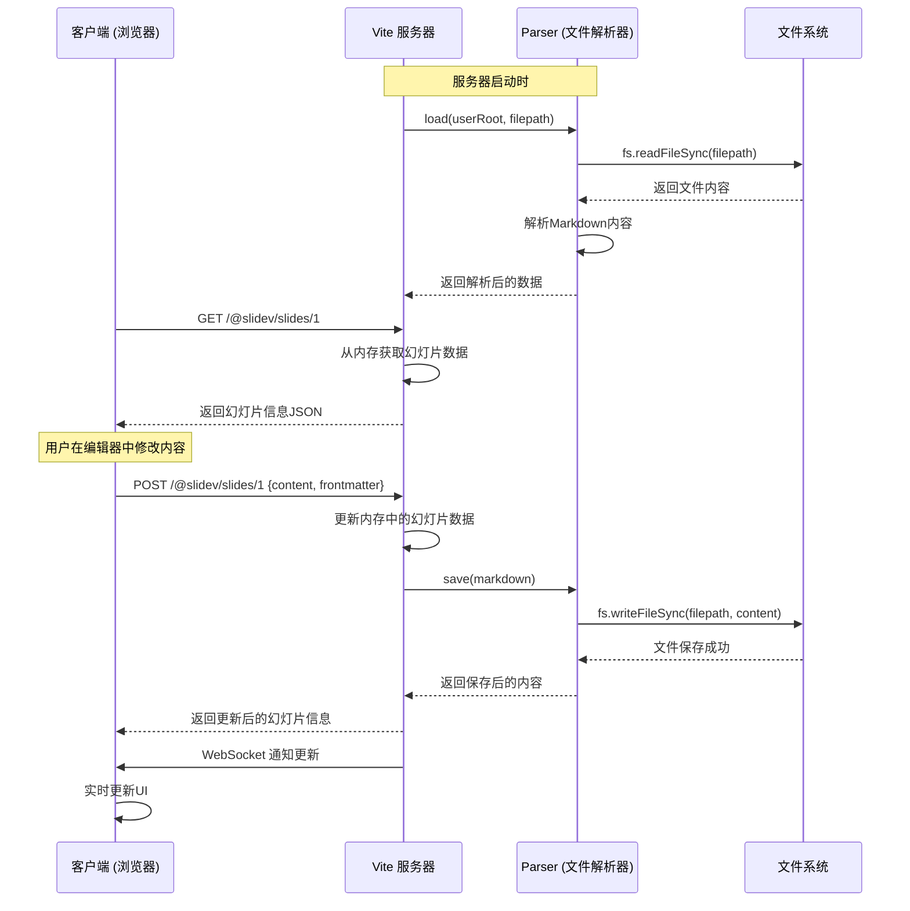

# Slidev 文件读取、传输、修改和保存流程说明

## 概述

本文档详细说明了在Slidev中如何读取Markdown文件,将其传输到前端,在前端进行修改,然后传输到后端并最终保存为文件的完整流程。流程包括关键函数、数据结构和交互方式。

## 流程图



## 详细流程说明

### 1. 启动阶段 - 读取文件

#### 关键函数和文件:

1. **CLI 入口**: `packages/slidev/node/cli.ts`
   - 命令行参数解析和服务器启动

2. **数据加载**: `packages/slidev/node/cli.ts` 中的 `loadData` 函数
   ```typescript
   const loaded = await parser.load(options.userRoot, entry, loadedSource, 'dev')
   ```

3. **文件解析统一入口**: `packages/parser/src/fs.ts`
   - `load()` 函数负责读取和解析Markdown文件

#### 流程步骤:

1. 用户运行 `slidev` 命令启动服务
2. CLI 解析命令行参数并调用 `resolveOptions`
3. 通过 `parser.load()` 读取Markdown文件
4. `load()` 函数调用 `fs.readFileSync()` 读取文件内容
5. 解析Markdown内容,生成幻灯片数据结构
6. 数据存储在内存中供后续使用

### 2. 前端获取数据

#### 关键函数和文件:

1. **前端数据获取**: `packages/client/composables/useSlideInfo.ts`
   - `useSlideInfo()` 函数用于获取特定幻灯片信息

#### 流程步骤:

1. 前端组件调用 `useSlideInfo(no)` 获取幻灯片数据
2. 通过 HTTP GET 请求 `/@slidev/slides/{no}` 获取数据
3. Vite 服务器中间件处理请求并返回幻灯片信息

### 3. 前端修改数据

#### 关键函数和文件:

1. **前端更新请求**: `packages/client/composables/useSlideInfo.ts`
   ```typescript
   const update = async (data: SlidePatch) => {
     return await fetch(
       url,
       {
         method: 'POST',
         headers: {
           'Accept': 'application/json',
           'Content-Type': 'application/json',
         },
         body: JSON.stringify(data),
       },
     ).then(r => r.json())
   }
   ```

#### 流程步骤:

1. 用户在前端编辑器中修改幻灯片内容
2. 前端调用 `update()` 函数发送修改数据
3. 通过 HTTP POST 请求将修改发送到 `/@slidev/slides/{no}`

### 4. 后端处理更新并保存文件

#### 关键函数和文件:

1. **后端请求处理**: `packages/slidev/node/vite/loaders.ts`
   - HTTP 中间件处理 POST 请求

2. **文件保存**: `packages/parser/src/fs.ts`
   - `save()` 函数负责保存文件

#### 流程步骤:

1. Vite 服务器接收 POST 请求
2. 解析请求数据并更新内存中的幻灯片数据
3. 调用 `parser.prettifySlide()` 格式化幻灯片
4. 调用 `parser.save()` 保存更新后的内容
5. `save()` 函数调用 `fs.writeFileSync()` 将内容写入文件
6. 返回更新后的幻灯片信息给前端

### 5. 实时同步 (可选)

#### 关键函数和文件:

1. **实时同步插件**: `packages/slidev/node/vite/serverRef.ts`
   - 使用 `vite-plugin-vue-server-ref` 实现实时状态同步

2. **状态变更处理**:
   ```typescript
   onChanged(key, data, patch, timestamp) {
     if (options.data.config.drawings.persist && key === 'drawings')
       writeDrawings(options, patch ?? data)

     if (key === 'snapshots')
       writeSnapshots(options, data)
   }
   ```

#### 流程步骤:

1. 服务器状态变更时触发 `onChanged` 回调
2. 通过 WebSocket 将变更通知所有连接的客户端
3. 客户端实时更新UI

## 数据结构说明

### SlidevMarkdown (核心数据结构)
```typescript
interface SlidevMarkdown {
  filepath: string           // 文件路径
  raw: string                // 原始文件内容
  slides: SourceSlideInfo[]  // 幻灯片列表
  errors?: any[]            // 解析错误
}

interface SourceSlideInfo {
  frontmatter: Record<string, any>  // 前言数据
  content: string                   // 幻灯片内容
  note?: string                     // 备注
  title?: string                    // 标题
  // ... 其他属性
}
```

### SlidePatch (更新数据结构)
```typescript
interface SlidePatch {
  content?: string              // 修改后的内容
  frontmatter?: Record<string, any>  // 修改后的前言
  frontmatterRaw?: string       // 原始前言字符串
  note?: string                 // 修改后的备注
  skipHmr?: boolean             // 是否跳过热更新
}
```

## 关键函数总结

| 函数名 | 文件位置 | 功能 |
|--------|----------|------|
| `load()` | `packages/parser/src/fs.ts` | 读取和解析Markdown文件 |
| `save()` | `packages/parser/src/fs.ts` | 保存Markdown文件 |
| `useSlideInfo()` | `packages/client/composables/useSlideInfo.ts` | 前端获取和更新幻灯片信息 |
| `createSlidesLoader()` | `packages/slidev/node/vite/loaders.ts` | Vite插件处理幻灯片加载和更新 |
| `createServerRefPlugin()` | `packages/slidev/node/vite/serverRef.ts` | 实现实时状态同步 |

## 架构优势

1. **统一入口**: 所有文件操作都通过 `@slidev/parser` 包处理,便于维护和扩展
2. **清晰分层**: 前端、后端和文件操作逻辑分离清晰
3. **实时同步**: 使用 WebSocket 实现实时状态同步,提升用户体验
4. **热更新**: 支持热更新,修改内容后无需刷新页面
5. **错误处理**: 完善的错误处理和恢复机制

这个流程确保了从文件读取到前端展示,再到修改保存的完整闭环,同时提供了实时同步功能,使用户能够获得流畅的编辑体验。